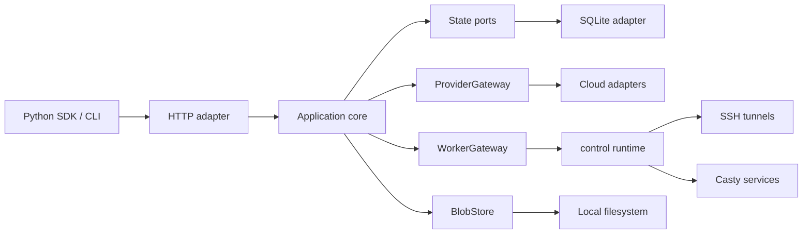
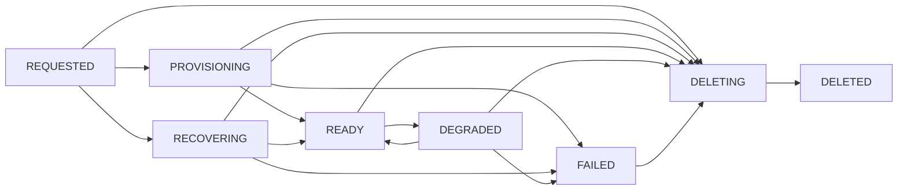
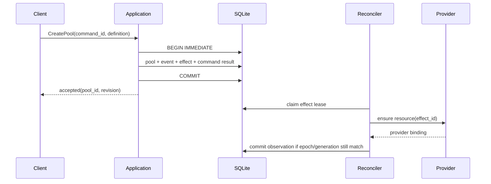

# Arquitetura API-first e hexagonal

Status: **plano proposto**.

## Objetivo

Tornar o controller local do Skyward o control plane autoritativo dos pools que ele
hospeda. Pools, nodes, tasks, attempts, comandos e eventos passam a ter identidade e
estado persistidos; objetos conectados em memória passam a ser representações
efêmeras e reconstruíveis desse estado.

O modo direto continua existindo. `sky.Compute(...)` segue provisionando e controlando
um pool no processo do SDK, sem escrever no banco do controller. `sky.Client` passa a
criar, anexar e operar pools persistidos pelo controller. Os dois modos compartilham a
interface `Pool`, mas não compartilham ownership nem fazem fallback silencioso entre
si.

Este documento define o escopo inicial, as decisões arquiteturais, o modelo de estado,
os contratos, a recuperação e uma migração incremental com critérios verificáveis.

## Decisões fixadas

| Tema | Decisão |
|---|---|
| implantação inicial | controller local, single-user e single-process |
| modo direto | permanece suportado e independente do controller |
| criação remota | `sky.Client().compute(...)` cria pools API-managed |
| pools declarados | `sky.Controller(compute={name: sky.Compute(...)})` garante sua existência eagerly |
| ausência da configuração | não apaga pools declarados anteriormente |
| TTL no controller | lease renovável; expiry desliga instances, mas preserva `desired=RUNNING` |
| lifecycle de `Compute` direto | sair de `with sky.Compute(...)` destrói a infraestrutura, como hoje |
| lifecycle do controller | sair de `with sky.Controller(...)` faz detach; não altera estado desejado |
| resultado incerto | `INDETERMINATE` por padrão; nova tentativa somente por opt-in explícito |
| persistência | SQLite é a fonte de verdade dos pools daemon-backed |
| concorrência do controller | um writer e um processo por banco |
| control plane | classes asyncio comuns; Casty permanece no data plane |
| event sourcing | fora do escopo; eventos duráveis acompanham o estado transacional |

## Escopo e modos de execução

### Modo direto

Construir `Compute` não produz efeitos. Entrar no contexto materializa a definição
localmente:

```python
with sky.Compute(provider=sky.AWS(), nodes=4) as pool:
    result = train(data) >> pool
```

O processo do SDK possui o `Session`, o `control.Pool`, providers, túneis e clients
Casty. A saída do contexto solicita e aguarda a destruição da infraestrutura. O modo
direto não abre o banco do controller e não tenta adotar pools persistidos.

Para permitir o uso declarativo, `Compute` deixa de ser um generator criado por
`@contextmanager`. Construí-lo cria uma facade side-effect free que carrega uma
`PoolDefinition` imutável e inspecionável. Entrar na facade cria o runtime direto e
impede enters concorrentes sobre o mesmo objeto; sair libera esse runtime. O
`Controller` lê somente a definition e nunca entra no `Compute`. A sintaxe pública
acima permanece igual.

### Modo controller

`Controller` é um context manager que inicia o servidor e o runtime em background. Sua
forma inicial é equivalente a:

```python
sky.Controller(
    *,
    compute: Mapping[str, sky.Compute] | None = None,
    host: str = "127.0.0.1",
    port: int = 7590,
    state_dir: Path = Path("~/.skyward/controller"),
)
```

O CLI entra nesse contexto e aguarda sinais; aplicações embutidas mantêm o controller
ativo durante o corpo do contexto:

```python
with sky.Controller(
    compute={
        "training": sky.Compute(provider=sky.AWS(), nodes=(2, 8)),
        "evaluation": sky.Compute(provider=sky.VastAI(), nodes=2),
    }
) as controller:
    run_application(controller.endpoint)
```

`Controller.__enter__` valida toda a configuração, abre e migra o banco, inicia o
adapter HTTP, classifica os registros não terminais e agenda reconciliação. Ele não
aguarda todos os pools ficarem `READY`. `Controller.__exit__` para novos requests,
drena commits em curso, fecha runtimes e faz detach de providers, túneis e Casty. Ele
libera claims locais; leases persistidas apenas expiram ou são fenced pelo próximo
epoch. Ele nunca grava `desired=DELETED` por causa do shutdown do processo.

`sky.Controller()` sem `compute` não cria pools. Ele ainda recupera e reconcilia todos
os pools não terminais já persistidos.

### SDK remoto

`Client` representa uma conexão com o controller. Pools criados por ele sobrevivem ao
fechamento do client e exigem delete explícito:

```python
with sky.Client() as client:
    pool = client.compute(
        name="training",
        provider=sky.AWS(),
        nodes=4,
    )
    result = train(data) >> pool

with sky.Client() as client:
    pool = client.pool("training")
    client.delete_pool("training")
```

Durante a migração, `sky.Client(name="training")` continua anexando diretamente ao pool
para preservar o uso atual. Não existe fallback de controller para modo direto: falha
de conexão é erro, não autorização para provisionar outra infraestrutura.

### Session

Existe um `Session` de runtime por processo `Controller`. Ele possui o event loop, o
registro de runtimes e as subscriptions locais, mas não é agregado persistido nem owner
dos registros. Um restart cria outro `Session`, que reconstrói os pools não terminais
a partir do SQLite.

O modo direto continua criando uma `Session` local como detalhe de implementação de
`Compute`. Não existe tabela `sessions` nem `CreateSession` no protocolo inicial.
Sessões duráveis só serão introduzidas se surgirem ownership em grupo, quotas,
tenancy ou cascatas transacionais entre pools.

## Modelo arquitetural

O sistema é dividido em três contextos:

1. **Client SDK** — preserva operadores, `ContextVar`, callbacks, `Future` e hooks
   `around_client`; no modo remoto, traduz essas operações para o protocolo do
   controller.
2. **Controller** — recebe comandos, persiste intenção, reconcilia recursos e mantém
   runtimes conectados com providers e workers.
3. **Worker runtime** — executa Python, deduplica attempts, retém resultados até ack e
   expõe operações pelo Casty.



O controller é um monólito modular. HTTP, reconciliação e SDK não são serviços
independentes e não mantêm cópias autoritativas do estado.

## Hexágono

O centro contém vocabulário de domínio e casos de uso. Tecnologias externas ficam
atrás de ports implementados por adapters:

```text
inbound adapter -> use case -> domain transition -> outbound port -> adapter
```

### Domínio

O domínio contém valores persistíveis, estados e transições puras:

- `Pool` e `PoolDefinition`
- `Node` e `ProviderBinding`
- `Task`, `TaskAttempt` e `RetryPolicy`
- `Command` e `CommandResult`
- `DomainEvent`
- IDs, revisions, generations e hashes

Um `Pool` de domínio não contém sockets, clients Casty, providers instanciados,
`asyncio.Task`, context managers ou proxies locais. `Cluster` deixa de cumprir o papel
duplo de registro durável e objeto conectado; dados provider-specific ficam em uma
binding persistível e versionada pelo adapter.

Estados fechados são ADTs imutáveis consumidas com `match/case`. Transições recebem o
estado e um comando e retornam o novo estado mais os eventos e efeitos requeridos. I/O
não ocorre dentro da transição.

### Casos de uso

A application layer expõe comandos e queries explícitos:

```text
ApplyConfiguredPools   ApplyPoolDefinition   CreatePool
ResizePool             DeletePool             TransferPool
RetryPool              GetPool                ListPools
SubmitTask             CancelTask             RetryTask
GetTask                ListEvents             ExecuteFileOperation
OpenTaskStream         OperateCollection       ReconcilePool
ReconcileTask          RecoverController       PurgeTask
PurgePool
```

HTTP, CLI, startup declarativo e SDK remoto chamam os mesmos casos de uso. Rotas não
acessam SQLite, providers, `Session` ou `control.Pool` diretamente.

### Outbound ports

Os ports pertencem à application layer e representam capacidades usadas pelos casos
de uso:

```text
PoolStore          NodeStore          TaskStore
CommandLog         EventLog           EffectStore
BlobStore          ProviderGateway    WorkerGateway
Clock
```

Não será criado `Repository[T]`, service locator ou DI container. O composition root
injeta implementações concretas por construtor. Um port documenta também seus erros,
transaction ownership, idempotência e requisitos de concorrência; apenas nomear uma
interface não fecha o boundary.

### Adapters

| Adapter | Papel |
|---|---|
| HTTP/SSE | traduz requests, responses, erros e cursores de evento |
| Python SDK | preserva a API pública sobre o transporte remoto |
| SQLite | persiste estado, commands, effects e eventos |
| providers | observa e altera infraestrutura cloud |
| SSH/Casty | reconstrói runtimes e submete attempts a workers específicos |
| filesystem | armazena payloads e resultados content-addressed |
| console/CLI | projeta snapshots e eventos sem possuir estado |

A application layer não importa Starlette, Uvicorn, SQLite, asyncssh, Casty,
cloudpickle nem SDKs cloud.

## Identidades e ownership

IDs são opacos, globais, imutáveis e serializados como UUIDs completos:

```text
PoolId        NodeId         TaskId        TaskAttemptId
CommandId     EventId        EffectId      BlobId
ControllerId  ControllerEpoch
```

`NodeRank` é um inteiro endereçável pelo usuário e não é identidade. Um replacement
recebe outro `NodeId`, mesmo quando reutiliza o mesmo rank. Provider instance ID e
endereço Casty são bindings externas mutáveis, nunca IDs de domínio.

Nomes de pool são aliases únicos dentro de um banco local. Tombstones reservam o nome
até `PurgePool`; isso impede que eventos atrasados de um pool excluído sejam atribuídos
a outro pool com o mesmo nome.

Pools persistidos possuem um dos seguintes owners:

| `management_mode` | Criação | Alteração e delete |
|---|---|---|
| `API` | `Client.compute` ou REST | comandos explícitos da API |
| `CONFIGURED` | mapa `Controller(compute=...)` | resize declarativo ou comandos de transferência/delete |

Pools diretos não entram nessa tabela porque não pertencem ao controller.

## Definições persistíveis

`Spec`, `Options` e `Plugin` atuais podem conter callables, clients, credenciais e
estado provider-specific. O controller não pode persistir esses objetos por
cloudpickle e esperar reconstrução segura após upgrades.

A migração introduz `PoolDefinition`, uma representação canônica e versionada que
contém somente dados:

- specs e estratégia de seleção;
- bounds de nodes e worker settings;
- imagem, packages, env sem secrets e volumes;
- provider config persistível;
- plugins built-in identificados por nome e parâmetros;
- timeouts e políticas de retry;
- ports e health checks declarativos suportados.

A definição recebe canonical JSON e SHA-256. Secret values, clients SDK e callables não
entram no JSON. Providers resolvem credenciais no ambiente ou profile do processo do
controller. `ttl` no modo controller representa uma lease de segurança renovada pelo
controller, não a vida útil do intent: expiry desliga a instance, e recovery
reprovisiona a capacidade porque `desired=RUNNING` permanece. Configurações com secret
literal, provider client injetado, plugin custom com callable ou health checker não
declarativo são rejeitadas no modo controller. O modo direto continua sendo o escape
hatch para essas composições.

Cada provider e plugin daemon-compatible possui um codec com nome estável, versão e
migração. O hash redigido serve para drift; ele não é uma serialização executável de
credenciais.

## Pools configurados eagerly

`ApplyConfiguredPools` valida o mapa inteiro e registra a observação de configuração em
uma única transação antes de agendar efeitos externos. Uma entrada inválida ou colisão
faz o apply inteiro falhar; nenhuma entrada parcial é adotada.

| Situação | Comportamento |
|---|---|
| nome novo | cria `CONFIGURED`, `desired=RUNNING` e agenda reconciliação |
| definição igual | preserva `PoolId`, generation e recursos existentes |
| mudança apenas de bounds | cria nova generation da definição e reconcilia resize com drain |
| mudança de provider, image, worker, plugin, volume ou port | registra `CONFIG_DRIFT`; mantém a última definição aplicada |
| apply explícito do drift | `ApplyPoolDefinition`; quiesce, drena, apaga a geração antiga e provisiona a nova |
| apply forçado com attempts ativos | marca outcomes não resolvidos como `INDETERMINATE` antes do replacement |
| declaração removida | marca `CONFIG_ABSENT`; mantém `desired=RUNNING` |
| nome colide com pool `API` | rejeita o apply; nunca adota silenciosamente |

Replacement usa o mesmo `PoolId` e incrementa `generation`. O padrão é stop-then-start
para impedir cobrança duplicada. A definição anterior permanece registrada para
rollback explícito se a nova geração falhar.

Um pool `CONFIG_ABSENT` pode receber `TransferPool` para virar `API` sem interrupção ou
`DeletePool` para ser removido. Enquanto o nome ainda aparece no mapa declarativo,
resize, replacement, transferência e delete externos retornam `CONFIG_MANAGED`.
`Controller()` sem mapa não interpreta essa ausência como prune.

## Máquinas de estado

### Pool

Intent e observação são campos separados:

```text
desired:  RUNNING | DELETED
observed: REQUESTED | PROVISIONING | RECOVERING | READY | DEGRADED
          | DELETING | DELETED | FAILED
```

`generation` muda somente quando a definição ou o estado desejado muda.
`observed_generation` avança somente quando a reconciliação confirma a geração.
`revision` muda em toda escrita e sustenta compare-and-swap.



`FAILED` representa falha permanente ou retry budget esgotado. Erros retryable mantêm o
pool em `REQUESTED`, `PROVISIONING`, `RECOVERING` ou `DEGRADED`, com `last_error` e o
próximo effect agendado; eles não transitam para `FAILED` a cada attempt. `RetryPool` ou
uma nova definition tira um pool de `FAILED` por revision explícita. `DELETED` só ocorre
após o provider confirmar ausência dos recursos, não após o envio de `terminate`.

### Node

Cada geração de pool possui nodes com identidade estável e rank único entre nodes não
terminais:

```text
desired:  PRESENT | DELETED
observed: REQUESTED | PROVISIONING | CONNECTING | BOOTSTRAPPING
          | READY | DRAINING | LOST | DELETING | DELETED | FAILED
```

Scale-down muda o node para `DRAINING`, bloqueia novas assignments, espera attempts
conhecidos e só então solicita delete. Replacement de node perdido cria outro `NodeId`;
eventos e attempts do node anterior continuam atribuídos ao tombstone original.

### Task e attempt

Uma task representa a intenção do usuário. Cada execução física é um attempt:

```text
task:    QUEUED | ASSIGNED | RUNNING | CANCEL_REQUESTED
         | SUCCEEDED | FAILED | CANCELLED | TIMED_OUT | INDETERMINATE

attempt: CREATED | ASSIGNED | DISPATCHING | ACCEPTED | STARTED
         | CANCEL_REQUESTED | SUCCEEDED | FAILED | CANCELLED
         | TIMED_OUT | INDETERMINATE
```

As regras são:

1. `SubmitTask` persiste task, payload hash e primeiro attempt antes do dispatch.
2. O scheduler persiste assignment e `DISPATCHING` antes de chamar o worker.
3. `ACCEPTED` significa que o worker gravou a identidade no ledger e assumiu
   responsabilidade por deduplicação; não prova início do código.
4. `STARTED` é gravado imediatamente antes de invocar o código do usuário.
5. Reexecução cria outro `TaskAttemptId`; o `TaskId` não muda.
6. Um único resultado terminal vence por compare-and-swap.
7. Resultado `SUCCEEDED` referencia um blob imutável.
8. Falha de usuário é `FAILED`; perda de conhecimento sobre efeitos é
   `INDETERMINATE`.

O timeout de `PendingFunction` vira um deadline wall-clock calculado quando o controller
aceita a task. Ele cobre fila e execução. `Future.result(timeout=...)` continua sendo
apenas timeout local de espera e não altera o deadline remoto. Expiry antes de
`STARTED` produz `TIMED_OUT` com garantia de que o código não iniciou. Expiry depois de
`STARTED` envia cancel best effort, mantém `CANCEL_REQUESTED` enquanto o attempt é
observável e termina como `TIMED_OUT` somente após confirmação de parada; se essa
confirmação se perde, termina `INDETERMINATE`. Resultado tardio não substitui o terminal
já publicado.

Cancelamento antes de `STARTED` é garantido por CAS e ack do worker. Depois de
`STARTED`, ele é best effort: task e attempt entram em `CANCEL_REQUESTED`, e código
Python em thread/process não é declarado cancelado sem confirmação. Sucesso ou falha
pode vencer a corrida enquanto o código ainda executa; perda de observação termina
`INDETERMINATE`.

### Broadcast e targeting

Broadcast persiste o conjunto de `NodeId`s e ranks uma única vez. Se já existem nodes
`READY`, o snapshot ocorre no commit de `SubmitTask`; caso contrário, ocorre na primeira
admissão do pool e não muda depois. Scale-up posterior não adiciona attempts e
scale-down drena members já incluídos.

Cada member recebe um attempt. O broadcast sucede somente se todos sucedem, preserva a
ordem por rank, falha se algum member falha e fica `INDETERMINATE` se algum resultado é
indeterminado.

Targeting persiste o rank solicitado. Antes de `STARTED`, replacement pode satisfazer o
mesmo rank com outro `NodeId`. Depois de `STARTED`, perda do node segue a política de
resultado incerto.

## Semântica de entrega de tasks

O controller entrega attempts at-least-once, mas o worker deduplica cada identidade:

```text
submit(task_id, attempt_id, payload_hash, payload)
get_result(task_id, attempt_id)
cancel(task_id, attempt_id)
ack_result(task_id, attempt_id, result_hash)
```

Repetir `(task_id, attempt_id, payload_hash)` retorna o estado ou resultado existente.
Repetir IDs com outro hash retorna conflito. Na primeira versão, o ledger do worker é
volátil e retém estado terminal/resultados até `ack_result`, sujeito a um limite de
bytes por worker. Atingir o limite aplica backpressure e rejeita novos attempts antes
de `ACCEPTED`; TTL nunca remove resultado não confirmado. Depois do ack, o worker pode
liberar o resultado porque o controller já o gravou no BlobStore. Se o processo do
worker reiniciar, a perda do ledger segue as regras de indeterminação abaixo.

O padrão de retry é:

- attempts que permaneceram em `CREATED` ou `ASSIGNED` podem ser despachados;
- timeout ou conexão perdida em `DISPATCHING` é ambíguo: o worker pode ter aceitado
  antes de a resposta chegar, portanto o controller reconcilia pelo mesmo ID e não
  cria outro attempt automaticamente;
- `INDETERMINATE` quando a reconciliação não encontra prova conclusiva antes do
  deadline;
- retry de resultado indeterminado somente com opt-in explícito, sempre como novo
  attempt e com indicação de possível duplicação de efeitos.

A opção atual `retry_on_interruption=3` não pode manter o mesmo default sob esse modelo.
A migração introduz uma política tipada, mantém retry seguro sem limite semântico de
duplicação e define retry ambíguo como zero por padrão. O nome antigo é deprecated e
não é reinterpretado silenciosamente.

O ledger do worker permanece em memória na primeira versão. Se o processo reiniciar
sem um registro durável, attempts `CREATED` ou `ASSIGNED` podem ser despachados;
qualquer attempt que chegou a `DISPATCHING` exige reconciliação e termina
`INDETERMINATE` quando o controller não consegue provar que o worker não o aceitou.
Persistência do ledger no worker fica fora do escopo inicial.

## Estado durável e runtime efêmero

| Estado durável | Runtime efêmero |
|---|---|
| pool ID, nome, owner e definitions | objetos provider instanciados |
| desired/observed state e generations | sockets e túneis SSH |
| node IDs, ranks e provider bindings | clients e proxies Casty |
| tasks, attempts, deadlines e resultados | `asyncio.Task` e filas locais |
| commands, effects e event sequence | futures do SDK e subscribers SSE |
| blob metadata e referências | port proxies e contexts de plugins |

O registro de runtime é keyed por `(PoolId, generation)` e possui acquire idempotente,
ownership exclusivo e close determinístico. Cada callback carrega
`ControllerEpoch`, generation e revision; callbacks stale não podem gravar observações
sobre uma geração posterior.

A ordem de detach é: parar admissão local, cancelar tick loops, fechar subscriptions,
fechar proxies Casty, túneis e transports, sair de contexts provider e liberar leases.
Detach não chama APIs destrutivas do provider.

Perder todo o runtime não perde intenção nem identidade. O controller reconstrói o
mínimo necessário lendo o store, observando providers e conectando workers. Runtimes de
pools consultados ou com work pendente podem ser reconstruídos eagerly; demais conexões
podem ser lazy depois que o pool foi classificado.

## Persistência SQLite

Controller ocupa um lock file owner-only ao lado do banco antes de abrir SQLite e o
mantém até o detach terminar. Um segundo processo falha no startup; WAL e busy timeout
não substituem esse fencing. O banco autoritativo fica separado do catálogo de offers
porque possui requisitos de backup, schema e retenção diferentes. A versão inicial usa
uma fila single-writer, WAL, `foreign_keys=ON`, busy timeout e transações curtas.
Provider, SSH, Casty, filesystem e network I/O nunca ocorrem com uma transação aberta.

### Schema mínimo

| Tabela | Conteúdo e constraints principais |
|---|---|
| `schema_migrations` | versão, checksum e instante de aplicação |
| `controller_epochs` | epoch monotônico, controller ID, wall-clock heartbeat e lifecycle |
| `config_applies` | hash do mapa, status, erro e sequence da última observação declarativa |
| `pools` | ID, nome único, owner, desired/observed, generations, revisions, config status e erros |
| `pool_definitions` | `(pool_id, generation)`, JSON canônico, hash e versão |
| `nodes` | ID, pool/generation, rank, estados, binding externa, incarnation e revision |
| `tasks` | ID, pool/generation, mode, target, payload, policy, deadline, state, result e revision |
| `task_attempts` | ID, task, ordinal, node, worker incarnation, payload hash, states e timestamps |
| `task_groups` | ID, mode, ordering, stream cursor e estado agregado |
| `task_group_members` | group, task, position e broadcast node/rank snapshot |
| `commands` | ID, idempotency key, payload hash, status e resultado |
| `effects` | efeito externo, generation, idempotency key, lease, retry e erro |
| `events` | sequence global, event ID, aggregate, type/version, correlação e payload |
| `blobs` | hash, codec, tamanho, path e timestamps |
| `blob_refs` | owner, role e blob hash; evita refcount desincronizado |

Todas as timestamps persistidas usam UTC wall-clock. `time.monotonic()` permanece
restrito a deadlines do processo e nunca é serializado.

State columns têm checks; foreign keys impedem attempt sem task e node sem pool; índices
cobrem nome, estados não terminais, próximo retry, pool event sequence e task por pool.
Uma partial unique index impede dois nodes não terminais com o mesmo rank na mesma
geração.

Metadata, tombstones, eventos e blobs não têm GC automático na primeira versão. Eles
são removidos apenas por `PurgeTask` e `PurgePool`, que validam estado terminal e apagam
referências antes do blob. Essa regra evita perda implícita durante a estabilização; uma
política de retenção automática pode ser adicionada depois com métricas de crescimento
reais.

### Commands, idempotência e eventos

Todo comando possui:

```text
command_id          idempotency_key       command_type
aggregate_id        expected_revision     schema_version
issued_at            correlation_id        causation_id
payload_hash         payload
```

A mesma idempotency key com o mesmo payload retorna o resultado original. A mesma key
com outro hash retorna `IDEMPOTENCY_CONFLICT`. Mutation do agregado, command result,
domain events e effects são gravados na mesma transação.



A tabela `events` não é a fonte usada para reconstruir agregados; ela oferece histórico,
auditoria e SSE replay. Seu envelope contém sequence global crescente, `event_id`,
aggregate type/ID, schema version, command/correlation/causation IDs e UTC timestamp.
Eventos de console e métricas não são confundidos com domain events duráveis.

### Effects e leases

Cada chamada externa nasce como effect persistido na transação da intenção. O
reconciler reivindica o effect com lease contendo controller epoch e expiry UTC,
executa o I/O e confirma o resultado em outra transação. O lock file garante um único
controller local; epoch ainda impede callbacks e work stale do processo anterior.
Commit de resultado exige epoch, generation e revision esperados; um reconciler stale
perde o CAS.

Effects registram attempts, próxima execução, backoff com jitter, erro estruturado e
classificação retryable/permanent. Crash entre a chamada cloud e o commit é resolvido
pela idempotency key do provider ou por lookup de recursos tagged antes de repetir o
create.

### Migrations e backup

Migrations são ordenadas, transacionais e possuem checksum. Startup faz backup antes de
uma migration incompatível, aplica migrations, roda `foreign_key_check` e só então
abre readiness. Um binário antigo recusa schema mais novo em vez de tentar interpretá-lo.

Rollback de código só é permitido dentro da janela de schema declarada. Mudanças que
removem dados exigem restore do backup; down migrations destrutivas não são assumidas.

## Reconciliation e recuperação

O reconciler converge intenção persistida e observação externa. Loops periódicos são
`asyncio.Task`s possuídas pelo `Session`; Casty não participa do control plane.

### Startup

1. adquirir exclusividade sobre o banco e incrementar `ControllerEpoch`;
2. migrar e validar o schema;
3. validar e aplicar atomicamente o mapa de pools configurados;
4. carregar pools, nodes, tasks e effects não terminais;
5. marcar o controller como `RECOVERING` e bloquear comandos conflitantes;
6. consultar providers e localizar recursos por tags/operation IDs;
7. reconstruir bindings, túneis, clients Casty e worker incarnations necessários;
8. reconciliar tasks aceitas e resultados retidos;
9. classificar cada pool como `READY`, `DEGRADED`, `FAILED` ou em convergência;
10. abrir readiness quando todos os registros foram classificados, sem exigir que todo
    provisionamento novo tenha terminado.

Liveness indica que o processo atende. Readiness indica que schema, command writer e
recovery inicial estão utilizáveis. Dependency health e pools degradados aparecem em
endpoint separado; um provider indisponível não derruba liveness.

### Ordem de autoridade

- SQLite define o que deve existir e quais commands foram aceitos.
- Provider observation define se recursos cloud existem e seus atributos atuais.
- Worker observation define status de attempts e resultados retidos.
- Runtime memory é cache/conexão; nunca sobrepõe intent persistida.

Delete converge até ausência externa confirmada. Falha de `terminate` não é engolida e
não remove tombstone, binding nem effect.

### Provider recovery contract

`ProviderGateway` precisa oferecer, direta ou sinteticamente:

```text
ensure_pool_resources(effect_id, definition)
observe_pool(pool_id, generation, binding)
ensure_node(effect_id, node_id, rank, definition)
observe_node(node_id, binding)
delete_node(effect_id, binding)
delete_pool_resources(effect_id, binding)
find_by_tags(controller_id, pool_id, generation)
```

Recursos recebem tags com controller, pool, node, generation e effect IDs. Quando o
provider possui idempotency key nativa, o adapter a usa. Quando não possui, ele busca a
tag antes de criar. O adapter também renova a lease de auto-shutdown antes do expiry;
perder todas as renovações pode desligar a instance, mas não apaga o node ou o pool
duráveis. Provider sem lookup/tag e lease renovável suficientes não suporta modo
controller até implementar uma estratégia equivalente; ele continua disponível no
modo direto.

Toda informação necessária para cleanup — profiles, networks, access keys, snapshots e
IDs auxiliares — entra na binding durável versionada. Estado que existe apenas no
objeto provider em memória viola o contrato.

Orphans tagged mas não referenciados são reportados, nunca adotados ou apagados
automaticamente. Missing node de um pool `RUNNING`, inclusive por expiry da lease durante downtime do
controller, é substituído depois que a ausência é confirmada. Missing pool-level
resource deixa o pool `DEGRADED` e cria effects de reparo. Credenciais ausentes produzem
erro permanent e preservam intenção.

### Worker recovery contract

O worker registra `node_id`, `pool_id`, generation e uma nova `worker_incarnation` a
cada processo. O controller redescobre o member Casty pelo registro, não assume que
endereço ou member ID persistiu.

Para cada attempt não terminal:

- resultado retido é copiado ao BlobStore e confirmado;
- estado accepted/running continua sendo observado;
- attempts em `CREATED` ou `ASSIGNED` podem ser despachados;
- `DISPATCHING` ou posterior sem ledger conclusivo vira `INDETERMINATE`, salvo opt-in
  de retry;
- worker inacessível mantém reconciliation até deadline ou classificação permanente.

## Blobs e wire format

Python functions, args e resultados continuam usando cloudpickle porque essa é a
semântica pública do Skyward. No modo local single-user, o caller é código confiável do
mesmo usuário; aceitar cloudpickle equivale explicitamente a aceitar execução de código
arbitrário no controller e no worker.

O envelope binário é versionado independentemente do HTTP e contém:

```text
magic                 protocol_version      codec
compression           payload_hash          compressed_size
uncompressed_size     media_type             capabilities
```

O hash cobre os bytes serializados antes da compressão. Limites de request,
descompressão e resultado são validados antes de alocação.

Payloads pequenos podem seguir inline. Acima do threshold configurado, o SDK envia o
blob content-addressed primeiro e `SubmitTask` referencia seu hash. O BlobStore inicial
usa filesystem local com escrita temporária, fsync e rename atômico. Results passam
pelo mesmo mecanismo antes do controller marcar `SUCCEEDED`.

A transferência controller-worker deve suportar chunks com checksum para não depender
do limite de uma única mensagem Casty. Blob references são internas ao controller; o
worker nunca recebe path local do daemon.

## Transporte HTTP

A API inicial é `/v1` e usa recursos, não objetos Python vivos:

```text
POST   /v1/pools
GET    /v1/pools
GET    /v1/pools/{pool_id}
PATCH  /v1/pools/{pool_id}/nodes
DELETE /v1/pools/{pool_id}
POST   /v1/pools/{pool_id}/tasks
GET    /v1/tasks/{task_id}
DELETE /v1/tasks/{task_id}
POST   /v1/tasks/{task_id}/retry
GET    /v1/events
PUT    /v1/blobs/{hash}
GET    /v1/blobs/{hash}
GET    /v1/health/live
GET    /v1/health/ready
GET    /v1/health/dependencies
```

Create, resize, delete, submit, cancel e retry aceitam idempotency key. Mutations sobre
recursos existentes aceitam `If-Match` com revision. Lists possuem cursor e limite.
Nomes são resolvidos para IDs no boundary e respostas sempre retornam ambos.

Erros usam envelope estável:

```json
{
  "code": "REVISION_CONFLICT",
  "message": "pool revision changed",
  "retryable": true,
  "request_id": "...",
  "details": {"expected": 4, "actual": 5}
}
```

O SDK mapeia códigos para uma hierarquia pequena de exceptions públicas; ele não tenta
reconstruir arbitrary exception classes vindas do daemon. Exceções da função remota
continuam como `TaskFailed` estruturado com traceback sanitizado.

SDK, controller e worker fazem capability negotiation antes de provisionamento ou
submissão. Incompatibilidade de protocol, codec, plugin ou provider definition falha
antes de efeitos externos.

### SSE

SSE usa o sequence global como `id:`. `Last-Event-ID` faz replay do EventLog e a conexão
só passa a receber eventos live depois que snapshot e cursor foram capturados na mesma
ordem lógica. Como a primeira versão não faz GC automático de eventos, qualquer cursor
válido permanece retomável.

Slow consumers não bloqueiam commits. O adapter fecha a conexão quando sua fila local
atinge o limite; o client reconecta a partir do último ID persistido. Heartbeats não
consomem sequence.

### Streams

Lifecycle SSE, completion streaming de `gather`, input iterators e generator results
são protocolos distintos. Generator/input streaming usa frames binários com flow
control, deadline, cancel e terminal frame; desconexão depois do primeiro elemento é
terminal na primeira versão. Não há resume de generator stream.

Completion streaming pode ser reconstruído consultando tasks do grupo e retomando pelo
sequence de conclusão. O SDK não drena um remote generator para fila local ilimitada;
crédito do consumer controla leitura do worker até o client.

## Segurança local

O controller inicial escuta somente `127.0.0.1` e recusa bind não-loopback. Ele gera um
bearer token no primeiro startup, guarda token, banco e blobs em diretório owner-only e
exige o token em todos os endpoints, inclusive health detalhado, shutdown, blobs,
files, events e task submission. O SDK lê o token do mesmo diretório por padrão.

O protocolo não é browser API e não habilita CORS. Logs não incluem token, credenciais,
env secrets, payload Python, source, args, results nem SSH keys. Provider credentials
são resolvidas pelo processo do controller e não retornam em snapshots.

Unix domain socket pode substituir loopback em plataformas suportadas, mas não altera o
modelo. Remote access, TLS, multi-user auth e tenancy ficam fora do escopo inicial.

## Compatibilidade da API Python

O adapter remoto deve satisfazer o mesmo `Pool` protocol do modo direto:

| Superfície | Implementação remota |
|---|---|
| `>>`, `>`, `@` | durable tasks e attempts |
| `&`, `gather`, `map` | composição de tasks com IDs próprios |
| targeting | rank persistido e binding no assignment |
| `Future[T]` | `RemoteFuture[T]` associado a `TaskId` |
| `snapshot`, `current_nodes`, `resize` | queries e commands versionados |
| output callbacks | eventos correlacionados por task/attempt |
| `around_client` | entra no thread do SDK ao anexar o pool |
| files | operação worker estruturada com resultado por node |
| ports | proxy pertence ao controller local e preserva bind no mesmo host |
| distributed collections | facade SDK chama o controller, que usa o registry Casty |
| generator/input streaming | frames com backpressure end-to-end |

`RemoteFuture.cancel()` chama `CancelTask`; cancelar apenas o future local não basta.
Fechar o client interrompe polling/subscriptions, não cancela tasks e não apaga pools.
Uma `RemoteFuture` não sobrevive como objeto Python ao restart do SDK, mas seu `TaskId`
sobrevive e pode ser reanexado com `client.task(task_id)`.

`around_client` nunca executa no daemon. O remote pool entra nos contexts no thread do
caller e recebe somente uma view sanitizada do cluster. Plugins built-in que dependem
desse hook precisam funcionar sobre o remote `Pool`; plugins client-side custom não
são persistidos pelo controller.

Como o controller é local no escopo inicial, `Port(local=...)` continua abrindo a porta
na máquina do usuário. O registro durável guarda o bind desejado; conflito após restart
deixa o port e o pool degradados em vez de escolher outra porta silenciosamente.

## Distributed collections

Collections continuam no data plane Casty. A definition do pool persiste namespace,
replica count e quorum uma única vez; autoscaling não recalcula a identidade de
replicação em cada worker. O controller usa `replicas=min(3, capacity_configurada)` sem
permitir quorum maior que os members disponíveis para ativação inicial.

O SDK remoto não se conecta diretamente ao cluster: proxies sincronizados chamam
endpoints do controller, e o `WorkerGateway` usa o client Casty já reconstruído. Isso
mantém SSH addresses e certificates fora da API pública.

Sobrevivência à perda total do cluster de workers não é prometida. SQLite preserva a
configuração e namespace, não o estado replicado que desapareceu de todos os members.
Consistency labels que não produzem comportamento diferente devem ser implementados de
fato ou removidos antes de declarar paridade.

## Observabilidade

Domain events, audit, logs, metrics e traces possuem guarantees diferentes:

- domain events são transacionais e replayable;
- audit registra principal local, command, alvo e resultado;
- logs são diagnósticos best effort;
- metrics agregam saúde sem payloads de usuário;
- traces correlacionam request, command, effect, pool, node, task e attempt.

Métricas mínimas:

```text
command latency/failures          sqlite transaction/lock latency
reconciliation lag/retries        effects pending/permanent
pools/nodes degraded              provider calls/rate limits
queue depth/task duration         worker dedup/result retention
SSE reconnect/consumer lag        blob bytes/orphans
```

A `SessionProjection` continua sendo read model para console, mas deixa de se descrever
como fonte de verdade. Snapshots derivam do store e eventos atualizam a projeção sem
substituir o estado persistido.

## Organização proposta

```text
skyward/
├── api/             # contratos públicos, IDs, states, definitions e events
├── application/     # commands, queries, transitions e outbound ports
├── core/            # Compute direto, Client remoto, Controller e facades
├── control/         # runtime conectado asyncio e reconcilers
├── persistence/     # SQLite, migrations e filesystem blobs
├── protocol/        # DTOs e codecs versionados HTTP/worker
├── server/          # adapter HTTP/SSE sem decisões de negócio
├── providers/       # adapters cloud implementando ProviderGateway
├── infra/           # SSH, Casty, streams e transportes
└── distributed/     # facades e bridge Casty
```

Os packages atuais não serão movidos apenas para satisfazer nomes. A migration extrai
boundaries antes de reorganizar arquivos. `core/controller.py` é o composition root do
modo controller e o único módulo que conhece store, use cases, adapters, runtime e
server concretos.

### Regras de dependência

1. `api/` não importa packages internos.
2. `application/` importa somente `api/` e seus próprios ports.
3. Domain transitions não importam asyncio nem adapters.
4. Adapters importam `api/` e `application/`, nunca o contrário.
5. `server/` traduz transporte e chama use cases.
6. `control/` mantém runtime, mas não é fonte de verdade.
7. `core/compute.py` direto não abre o store do controller.
8. `core/client.py` não importa `control/`, providers, asyncssh ou Casty.
9. Providers não importam `core/`; eles implementam ports da application layer.
10. Import-boundary tests falham no CI quando uma direção é violada.

## Invariantes

As seguintes invariantes viram constraints quando possível e testes de propriedade
quando cruzam agregados:

- `nodes.min <= nodes.desired <= nodes.max`;
- nomes e IDs não mudam;
- um provider instance ID não pertence a dois nodes vivos;
- existe no máximo um node não terminal por `(pool, generation, rank)`;
- no máximo um runtime possui `(pool, generation)` por controller epoch;
- generation muda somente com intent; observed generation nunca a ultrapassa;
- pools deleting/deleted não aceitam novas tasks;
- assignments não apontam para nodes draining/deleting;
- uma task possui um único terminal outcome;
- ordinals e attempt IDs não são reutilizados;
- resultado sucedido e seu hash são imutáveis;
- worker rejeita IDs iguais com payload hash diferente;
- delete só termina após ausência externa confirmada;
- daemon shutdown nunca grava delete;
- config ausente nunca implica delete;
- direct mode nunca grava no controller store;
- nenhuma transação SQLite contém I/O externo;
- callback stale não altera generation ou epoch posterior.

## Estado atual que a migração substitui

O código atual possui os seguintes gaps relevantes:

- `core.Session`, `control.Pool`, `ServerState` e `SessionProjection` mantêm visões
  concorrentes em memória;
- routes chamam `Session` e `ComputePool` diretamente;
- handles são escritos somente depois de ready e persistem cloudpickle de provider e
  cluster;
- shutdown gracioso do servidor destrói infraestrutura, enquanto crash faz detach;
- reattach recupera apenas `TaskManager`, não `Reconciler` e `Autoscaler`;
- task queue, executions HTTP e event history são voláteis;
- worker não deduplica submissões e não implementa cancel ou ack;
- resultado HTTP é removido antes de o client confirmar recebimento;
- events não têm sequence, revision ou replay cursor;
- IDs de task e node/rank não são uniformes;
- provider protocol não permite localizar com segurança um create concluído cujo commit
  foi perdido;
- `Client` atual implementa apenas parte do `Pool` protocol.

Esses gaps são baseline e não justificam adapters de compatibilidade permanentes.

## Plano de migração

Cada fase deve terminar com testes verdes e pode ser lançada sem ativar a fase seguinte.
Uma fase não muda ownership antes de seu recovery path passar fault injection.

### Fase 0 — Congelar contratos e comportamento atual

**Entregáveis**

- matriz executável da superfície `Pool` em modo direto;
- testes de lifecycle para `Compute` exit, `Client.close` e server shutdown atual;
- cenários reproduzindo duplicate task, one-shot result, reattach incompleto e retry
  ambíguo;
- inventário de provider state necessário para recovery;
- decisão registrada de quais provider/plugin definitions suportam controller mode.

**Verificação**

- todos os testes existentes passam sem mudança funcional;
- cada método do `Pool` protocol possui ao menos um contract test;
- gaps atuais aparecem como testes `xfail(strict=True)` com referência à fase que os
  remove.

**Rollback**

Somente testes e tipos são adicionados; remover a fase não altera runtime.

### Fase 1 — Vocabulário durável e Compute declarativo

**Entregáveis**

- IDs fortes, ADTs de estado, revisions, generations e transições puras em `api/`;
- `PoolDefinition` e codecs canônicos para componentes built-in;
- facade `Compute` side-effect free na construção, com definition imutável e runtime
  apenas durante o context enter;
- separação explícita entre `NodeId` e `NodeRank`;
- policy tipada para retry seguro e ambíguo;
- conversão da configuração TOML e kwargs por um único caminho.

**Verificação**

- property tests cobrem todas as transições e invariantes;
- canonical encode/decode/hash é estável entre processos;
- direct `with sky.Compute(...)` continua passando a matriz da fase 0;
- definitions não serializam secrets, clients ou callables;
- cada plugin/provider built-in é aceito com codec completo ou rejeitado com erro
  explícito antes de qualquer efeito.

**Rollback**

A facade nova ainda usa o backend direto atual; a representação antiga pode permanecer
internamente até a fase 8.

### Fase 2 — Store transacional

**Entregáveis**

- SQLite schema, migrations, backup e integrity checks;
- stores, command log, effect store, event log e filesystem BlobStore;
- fila single-writer e CAS por revision;
- use cases puros para create, resize, delete, task intent e queries;
- projeções derivadas do store.

Nenhum reconciler novo chama providers nesta fase. O fluxo atual pode dual-write para um
shadow store somente em testes e ambientes opt-in; divergência é reportada, nunca usada
para comandar infraestrutura.

**Verificação**

- contract tests rodam contra adapters SQLite reais;
- restart preserva todas as rows e sequences;
- duplicate commands retornam resultado idêntico e payload divergente conflita;
- concorrência cobre resize/resize, create/delete e cancel/complete;
- migrations são testadas do schema vazio e de cada versão suportada.

**Rollback**

O shadow store pode ser descartado porque ainda não é autoritativo. Nenhum efeito cloud
depende dele.

### Fase 3 — Application core e protocolo `/v1`

**Entregáveis**

- commands, queries e ports na application layer;
- routes `/v1` finas, error envelope, ETag/If-Match e idempotency keys;
- SSE sequenciado com replay;
- capability negotiation e wire envelope versionado;
- autenticação local e health endpoints separados;
- import-boundary tests.

O adapter pode operar inicialmente sobre uma implementação in-memory nos testes de
HTTP, mas nenhuma route chama `Session`, `ComputePool` ou SQLite diretamente.

**Verificação**

- OpenAPI/DTO contract tests para todos os status e erros;
- replay SSE não perde o evento entre snapshot e subscribe;
- slow consumer reconecta pelo cursor;
- requests sem token e binds não-loopback são rejeitados;
- payload incompatível falha antes de qualquer effect.

**Rollback**

As routes atuais continuam disponíveis sob `/compute` durante a transição. `/v1` ainda
não controla produção.

### Fase 4 — Provider effects e pool reconciliation

**Entregáveis**

- `ProviderGateway` application-owned;
- bindings provider-specific versionadas e persistíveis;
- tags/idempotency/lookup e lease renovável de auto-shutdown para cada provider
  habilitado;
- effect leases, backoff e stale fencing;
- reconciler autoritativo para create, resize, node replacement e delete;
- runtime registry generation-aware.

Providers são migrados individualmente. Provider sem recovery contract retorna
`CONTROLLER_UNSUPPORTED_PROVIDER` e permanece disponível em direct mode.

**Verificação**

Fault injection mata o controller:

- antes e depois de `prepare`;
- antes e depois de cada create de recurso e instance;
- após resposta cloud e antes do commit da binding;
- durante bootstrap e worker registration;
- durante resize/drain;
- depois de uma ou mais renovações e depois do expiry da lease;
- após terminate e antes de confirmar ausência.

Em todos os pontos, restart converge sem create duplicado, sem delete indevido e sem
perder cleanup IDs. Delete permanece pendente enquanto o recurso existe.

**Rollback**

Cutover é por provider e por pool novo. Pools ainda não autoritativos continuam no
backend antigo; um pool nunca alterna backend implicitamente.

### Fase 5 — Controller lifecycle e pools configurados

**Entregáveis**

- `sky.Controller` context manager e composition root;
- um `Session` de runtime por controller;
- detach separado de delete;
- startup recovery e readiness gate;
- `ApplyConfiguredPools`, `ApplyPoolDefinition`, drift, absent, transfer e replacement;
- CLI do server refeito sobre `Controller`.

**Verificação**

- SIGTERM e saída normal do contexto não alteram desired state;
- restart recupera pools ready, provisioning, degraded e deleting;
- mapa configurado é aplicado atomicamente;
- remover declaração não apaga recursos;
- collision não adota pool API;
- immutable drift não substitui infraestrutura sem apply explícito;
- restart com `Controller()` recupera pools configurados anteriores.

**Rollback**

O binário anterior não abre schema incompatível. Backup e freeze de reconciliation
permitem voltar sem emitir novos effects; infraestrutura continua descrita no store.

### Fase 6 — Tasks e worker protocol duráveis

**Entregáveis**

- tasks/attempts autoritativos e scheduler reconstruível;
- worker dedup por task/attempt/hash;
- submit, status, cancel e ack idempotentes;
- result BlobStore e retenção até ack;
- deadlines consistentes;
- `INDETERMINATE` e retry opt-in;
- ledger do worker com byte limit/backpressure e retenção até ack;
- broadcast membership e task groups persistidos.

**Verificação**

Fault injection cobre:

- commit da task antes do dispatch;
- dispatch antes/depois de accept ack e start observation;
- execução antes/depois do result;
- result armazenado antes/depois do controller ack;
- cancel concorrente com assignment, start e completion;
- deadline antes e depois de `STARTED`;
- ledger cheio rejeitando antes de `ACCEPTED` sem perder resultados sem ack;
- worker restart em cada estado;
- controller restart com task queued, running e completed.

A suíte prova que o mesmo attempt não executa duas vezes por redelivery. Quando essa
prova não existe, o estado observado é `INDETERMINATE`; retry ambíguo cria outro attempt
e nunca ocorre sem policy explícita.

**Rollback**

Tasks aceitas pelo protocolo durável terminam nele; não são reenviadas ao scheduler
antigo. Cutover acontece apenas quando não há tasks antigas in-flight no pool.

### Fase 7 — Paridade do SDK remoto

**Entregáveis**

- `Client.compute`, `Client.pool`, list/delete e remote pool facade;
- `RemoteFuture` com cancel remoto e reattach por TaskId;
- operators, parallel, map, targeting, snapshots e resize;
- callbacks/output, `ContextVar` e `around_client` no caller thread;
- files, ports e distributed collection facades;
- blob upload, generator/input streams e backpressure;
- compatibilidade temporária de `Client(name=...)`.

**Verificação**

A mesma contract suite `Pool` roda contra direct e controller backends. Testes não
aceitam métodos ausentes, fallback direto nem diferenças silenciosas de lifecycle.
Streams lentos mantêm memória limitada; disconnect produz terminal documentado;
fechar Client não cancela tasks nem apaga pool.

**Rollback**

Direct mode permanece disponível por escolha explícita. O SDK remoto recusa versão
incompatível; não tenta executar localmente.

### Fase 8 — Importar handles e tornar o store autoritativo

**Entregáveis**

- importer idempotente para `~/.skyward/sessions/*.json`;
- classificação de handles como importável, incompleto ou manual;
- persistência de pools importados como `API` com bindings versionadas;
- arquivos originais preservados até validação completa;
- desativação do writer e reattach antigos;
- redirects ou remoção programada das routes `/compute`.

Import falho nunca chama teardown. O pool fica `DEGRADED` com diagnóstico e o handle
permanece intacto. Como o formato legado usa cloudpickle, import só lê arquivos
owner-only do usuário local e não os trata como input remoto.

**Verificação**

- fixtures de todos os formatos legados suportados importam duas vezes sem duplicação;
- pool redimensionado e partial legacy handles não perdem desired bounds;
- falha de provider/SSH durante import não destrói infraestrutura;
- depois do cutover, nenhuma mutation autoritativa ocorre em `ServerState`, handles ou
  `SessionProjection`.

**Rollback**

Handles originais e backup SQLite permanecem disponíveis. O operador congela
reconciliation antes de voltar; não executa backend antigo e novo sobre o mesmo pool.

### Fase 9 — Remover ownership antigo

**Entregáveis**

- routes legadas e `ServerState` removidos;
- session handle store removido depois da janela declarada;
- provider protocols não importam `core`;
- states e events duplicados consolidados;
- documentação e stubs atualizados;
- dashboards usam snapshots/eventos do application core.

**Verificação**

- import-boundary suite cobre todos os packages;
- busca não encontra chamadas de negócio em routes nem state ownership fora do store;
- direct e controller E2E suites passam em Python 3.12, 3.13 e 3.14;
- package build não instala provider SDKs no client-only extra.

**Rollback**

Esta fase só começa após expirar a janela de compatibilidade. Voltar requer release
anterior mais restore compatível, não reativação parcial do código removido.

## Matriz de testes obrigatória

| Nível | Cobertura |
|---|---|
| property | transitions, invariants, idempotência e generation fencing |
| unit | use cases, policies, codecs e error mapping |
| contract | stores, BlobStore, ProviderGateway, WorkerGateway e Pool backends |
| concurrency | commands concorrentes, leases e cancel/complete races |
| fault injection | todos os boundaries commit/efeito/ack |
| integration | SQLite real, HTTP real, Casty cluster real e provider fakes stateful |
| E2E local | controller kill/restart durante cada lifecycle |
| E2E cloud | create, recover, resize, task, delete e ausência confirmada por provider |
| compatibility | API pública idêntica nos dois backends onde a feature é suportada |
| migration | cada schema e handle legado suportado |

Provider fakes precisam modelar timeout após efeito bem-sucedido, resposta duplicada,
eventual consistency, rate limit e delete assíncrono. Mocks que apenas retornam sucesso
não validam recovery.

## Critérios globais de aceite

A arquitetura está concluída quando:

1. um command aceito sobrevive ao crash do SDK e do controller;
2. restart reconstrói todos os pools não terminais sem depender de objetos pickled;
3. nenhum crash point conhecido duplica infraestrutura sem detecção;
4. daemon shutdown e client disconnect não destroem recursos;
5. explicit delete continua até confirmar ausência externa;
6. task redelivery não repete o mesmo attempt;
7. resultado incerto nunca é executado novamente sem opt-in registrado;
8. task succeeded permanece consultável depois de restart até purge;
9. SSE retoma sem gap a partir do sequence confirmado;
10. `Client` satisfaz o `Pool` protocol testado, não apenas os três operadores básicos;
11. direct mode continua funcional e isolado do controller store;
12. providers habilitados passam recovery E2E real;
13. routes, projections e runtimes não são alternate writers;
14. lint, typecheck, unit, integration e E2E suites passam;
15. rollback procedure foi exercitado com backup e reconciliation freeze.

## Fora do escopo inicial

- remote ou multi-user controller;
- active-active controllers ou múltiplos writers SQLite;
- event sourcing completo;
- microservices ou control plane baseado em atores;
- exactly-once para efeitos arbitrários de funções Python;
- ledger de attempts durável no disco do worker;
- sobrevivência de collections à perda de todos os workers;
- resume de generator stream depois de disconnect;
- auto-adoption ou auto-delete de orphan cloud resources;
- GC automático de events, tombstones, tasks e blobs;
- DI container e abstrações genéricas como `Repository[T]`.

## Próximos passos

1. executar a Fase 0 e transformar a superfície atual em uma matriz de compatibilidade;
2. fechar `PoolDefinition` e as ADTs da Fase 1 antes de criar tabelas;
3. implementar o store sem efeitos externos e validar migrations/fault boundaries;
4. habilitar um provider por vez somente depois de seu recovery contract passar E2E.

O plano preserva dois modelos deliberados: `Compute` direto para controle efêmero no
processo e `Controller` para pools duráveis e API-managed. Dentro do controller, SQLite
descreve o que deve existir; adapters observam e alteram o mundo; o reconciler fecha a
diferença; runtime em memória permanece descartável.
