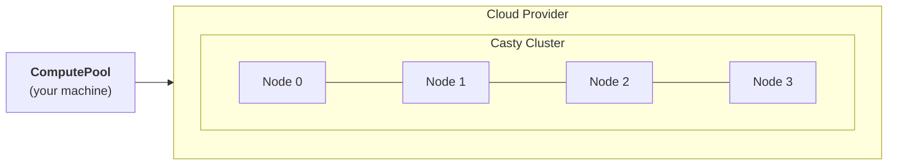

# Clustering

Skyward uses [Casty](https://gabfssilva.github.io/casty/) as its distributed runtime. Casty is an actor-based framework for building clustered systems in Python — think Akka, but for Python 3.12+.

## How It Works

Every compute node in a Skyward pool runs a **ClusteredActorSystem**. When a pool provisions 4 nodes, it creates a 4-node Casty cluster where each node can communicate with every other node through the actor model.

Each node runs:

- A **Casty ClusteredActorSystem** on port 25520 for peer-to-peer clustering
- An **HTTP API** on port 8265 for receiving jobs from the executor
- **Worker actors** that execute your `@sky.compute` functions
- **Broadcast actors** for fan-out execution (`@ pool`)

## Actors, Not Threads

Casty actors are lightweight concurrent entities that communicate via messages. Skyward uses this model throughout:

- The **pool actor** orchestrates the cluster lifecycle
- **Provider actors** manage cloud API calls
- **Worker actors** on each node execute your functions
- The **panel actor** renders the terminal dashboard

Actors never share mutable state. All coordination happens through message passing, which eliminates concurrency bugs and makes the system naturally distributed.

## Distributed Collections

The cluster also powers Skyward's [distributed collections](distributed-collections.md). When you call `sky.dict("cache")`, Casty creates a distributed map that is replicated across the cluster. Every node can read and write to it — Casty handles replication and consistency automatically.

## Why Casty

Skyward needs a runtime that can:

- Form ad-hoc clusters from ephemeral cloud instances
- Execute functions remotely with request-reply semantics
- Provide distributed data structures out of the box
- Handle node failures gracefully (heartbeats, failure detection)

Casty provides all of this with a small footprint and Python-native async support. The alternative would be running a separate coordination service (Redis, etcd, Ray) on every ephemeral cluster — more moving parts for the same result.

## Further Reading

- [Casty Documentation](https://gabfssilva.github.io/casty/) — Full reference
- [Distributed Collections](distributed-collections.md) — Dict, set, counter, queue, barrier, lock
- [Distributed Training](distributed-training.md) — Multi-node training guides
