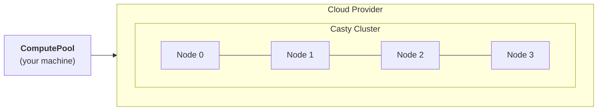

# Clustering

Skyward uses [Casty](https://gabfssilva.github.io/casty/) as its distributed runtime. Casty is an actor-based framework for Python 3.12+ — a lightweight implementation of the actor model, inspired by Akka, built on top of asyncio. Every compute node in a Skyward pool runs a Casty `ClusteredActorSystem`, and together they form a peer-to-peer cluster that handles task execution, distributed state, and inter-node communication without any external coordination service.

This page explains how the cluster is structured and why the actor model is a natural fit for ephemeral cloud orchestration.

## Why actors

The pool lifecycle involves a lot of concurrent, independent activity. Multiple cloud instances boot at different speeds. SSH connections are established in parallel. Bootstrap scripts run simultaneously on different machines. Worker processes start up and begin accepting tasks. Some nodes might fail and need replacement. All of this happens concurrently, and different nodes progress through their state machines at different rates.

The actor model handles this naturally. An actor is an isolated unit of state that communicates exclusively through messages. There are no shared locks, no thread pools coordinating through mutexes, no callbacks mutating global state. An actor receives a message, decides what to do, and optionally sends messages to other actors. When you need to track the lifecycle of 8 nodes — each at a different stage of booting, connecting, and bootstrapping — 8 independent actors with their own state machines are easier to reason about than 8 threads sharing a pool of mutable state.

Both Casty and Skyward are built on asyncio, so actors are cheap and message passing doesn't block threads. The system scales to hundreds of nodes without requiring proportional memory or CPU on your laptop.

## How the cluster forms

When you enter a `ComputePool` context manager, Skyward creates a local Casty actor system on your machine and spawns a **pool actor** — the root of the supervision hierarchy. The pool actor asks the provider to launch instances, and for each one, it spawns a **node actor** to manage that instance's lifecycle.

Each node actor, in turn, spawns an **instance actor** that handles the low-level work: polling the cloud API until the machine is running, opening an SSH tunnel, transferring the bootstrap script, installing dependencies, and starting the worker process. When the worker is ready, the instance actor reports back to the node actor, which reports back to the pool actor. Once all nodes are ready, the pool is open for business.

On the remote side, each worker runs its own `ClusteredActorSystem` on port 25520. The instance actor on your laptop establishes an SSH tunnel — a local port forward to the remote machine's port 25520 — and connects a `ClusterClient` to it. It discovers the worker actor via Casty's service discovery (`ServiceKey("skyward-worker")`) and from that point on, tasks are sent as actor messages over the tunneled TCP connection. There is no HTTP server, no REST API, no message broker — just Casty actor messaging over SSH.

Node 0 plays a special role: it's the **head node**. Once its instance is ready, it broadcasts its address to all other nodes so they can form a cluster. This is how distributed training frameworks (PyTorch DDP, JAX, etc.) discover each other — `MASTER_ADDR` always points to node 0.

## The actor hierarchy

The full hierarchy on your local machine consists of four layers, each with a well-defined responsibility.

The **pool actor** is the state machine that orchestrates everything. It progresses through `idle → requesting → provisioning → ready → stopping`. It holds references to all node actors and the task manager, and it's the entry point for all task submissions.

The **task manager** dispatches tasks to nodes using round-robin scheduling. It handles backpressure through per-node concurrency slots (from the `worker` configuration), preventing the workers from being overwhelmed. When you call `train(10) >> pool`, the task manager picks the next node in the rotation and forwards the task.

**Node actors** — one per instance — track each node's lifecycle: `idle → waiting → active`. If a spot instance is preempted, the node detects the loss, notifies the pool, and requests a replacement from the provider. Tasks that were in flight on the lost node are re-queued.

**Instance actors** are the workhorses. Each one manages a single remote machine through its full lifecycle: `polling → connecting → bootstrapping → ready → joined`. It handles SSH tunnel establishment, bootstrap monitoring, worker startup, and serves as the bridge for task execution. When you send a task with `>>`, the instance actor serializes the function and arguments (cloudpickle + zlib), sends them over the SSH tunnel to the worker actor, waits for the result, and returns it through the reply chain.

Communication between actors uses Casty's `tell` (fire-and-forget) and `ask` (request-reply with timeout) patterns. A `tell` is a one-way message — the sender doesn't wait for a response. An `ask` creates a temporary reply-to reference, sends it along with the message, and blocks until the recipient responds. The full path of a task — from `>> pool` on your laptop to the remote worker and back — is a chain of `ask` calls: pool actor → task manager → node actor → instance actor → remote worker → back through `reply_to` references.

## Distributed state

The cluster also powers Skyward's [distributed collections](distributed-collections.md). When you call `sky.dict("cache")` inside a `@sky.compute` function, Casty creates a distributed map that is replicated across the cluster. Every node can read and write to it, and Casty handles replication and consistency automatically.

This works because the worker processes on each node are part of the same `ClusteredActorSystem`. Distributed data structures are a natural extension of the actor model: each key-value pair (in the case of `sky.dict`) is managed by its own actor, and reads and writes are messages. The same message-passing infrastructure that carries task payloads between your laptop and the workers also carries collection operations between nodes.

## Why Casty

Skyward needs a runtime that can form ad-hoc clusters from ephemeral cloud instances, execute functions remotely with request-reply semantics, provide distributed data structures, and handle node failures through heartbeats and failure detection. Casty provides all of this with a small footprint and Python-native async support.

The alternative would be running a separate coordination service on every ephemeral cluster — Redis for state, a message broker for task routing, a custom protocol for function execution. That's more moving parts, more dependencies to install on each worker, and more failure modes to handle during the brief life of a training job. Casty collapses all of these into a single actor system that starts in milliseconds and communicates over plain TCP. For a cluster that might live for ten minutes to run a training job, that simplicity matters.

## Further reading

- [Casty Documentation](https://gabfssilva.github.io/casty/) — Full reference for the actor framework
- [Distributed Collections](distributed-collections.md) — Dict, set, counter, queue, barrier, lock
- [Distributed Training](distributed-training.md) — Multi-node training with PyTorch, Keras, and JAX
