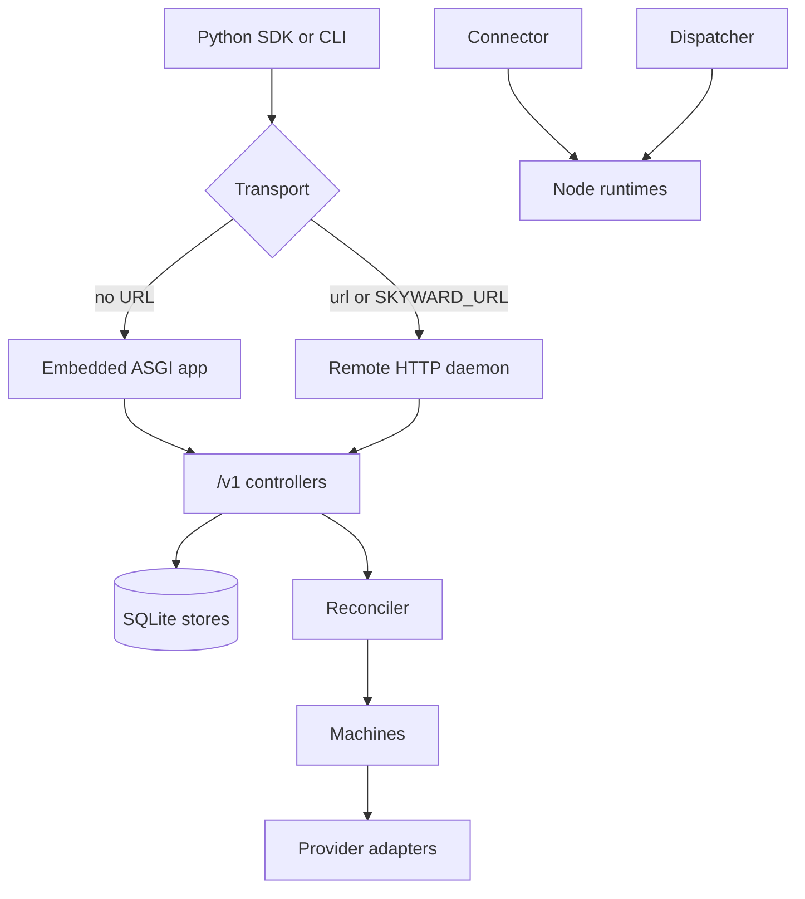
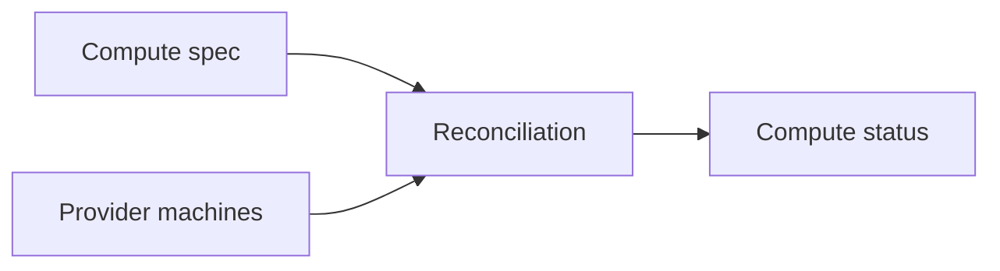
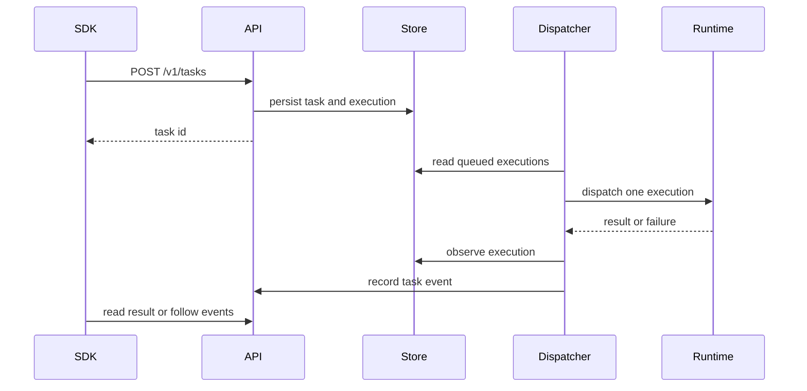

# Architecture

Skyward has one control plane and one node runtime. The control plane stores desired resources and observed state; the node runtime executes user code. The SDK reaches the control plane through the same HTTP-shaped client whether the daemon is embedded or remote.

## Two planes

The **control plane** is an ASGI application at the `/v1` HTTP prefix. It owns SQLite persistence, provider accounts, cached offers, Compute definitions, nodes, tasks, executions, blobs, generations, leases, and events. Its application services are plain asyncio components:

- **Reconciler** compares desired Compute capacity with the nodes recorded in the store.
- **Machines** talks to provider adapters to initialize infrastructure, launch machines, observe them, and terminate them.
- **Connector** turns reachable machines into live SSH connections and node runtimes.
- **Dispatcher** places task executions on ready node slots and reattaches executions after a restart.
- **Meter** publishes live cost and metric samples.
- **Persistence stores** write resources before the corresponding side effect is attempted.

The **node runtime** runs on each machine. It bootstraps the requested image, starts the execution backend, loads plugins, receives task payloads, and returns results or stream frames. When cluster formation is available, the runtimes form a Casty cluster and receive a rank-ordered peer list.


```mermaid
flowchart TB
    SDK[Python SDK or CLI]
    Transport{Transport}
    Embedded[Embedded ASGI app]
    HTTP[Remote HTTP daemon]
    API["/v1 controllers"]
    Store[(SQLite stores)]
    Recon[Reconciler]
    Machines[Machines]
    Connector[Connector]
    Dispatcher[Dispatcher]
    Provider[Provider adapters]
    Nodes[Node runtimes]

    SDK --> Transport
    Transport -->|no URL| Embedded
    Transport -->|url or SKYWARD_URL| HTTP
    Embedded --> API
    HTTP --> API
    API --> Store
    API --> Recon
    Recon --> Machines
    Machines --> Provider
    Connector --> Nodes
    Dispatcher --> Nodes
```

## Embedded and remote mode

With no URL, the SDK builds the Litestar application in the current process, opens the configured SQLite database, and reaches it through an in-process ASGI transport. No listening socket is required.

With `url` or `SKYWARD_URL`, the SDK uses the same routes over HTTP. Nothing above the client transport needs to know which mode is active:

```python
import skyward as sky


with sky.Compute(provider=sky.AWS()) as embedded:
    train(data) >> embedded

with sky.Compute(
    provider=sky.AWS(),
    url="http://127.0.0.1:7590",
) as remote:
    train(data) >> remote
```

The default embedded database is `~/.skyward/skyward.sqlite`. A remote daemon has its own database and owns the resources created through it.

## Resource model

The API has two resource families.

Declarative resources carry intent and observation:

- `compute.spec` is the desired provider, image, node bounds, runtime, and lifecycle;
- `compute.status` is the observed state, ready count, live count, errors, drift, and applied generation;
- `node` is the persisted identity and lifecycle of one machine;
- `generation` is a definition history entry.

Imperative resources record work:

- `task` is one logical function call and the stable SDK handle;
- `execution` is one physical attempt of that task on one node.

There is no operation resource. A Compute creation returns immediately with a requested state. The difference between `generation` and `status.observed_generation`, together with the event stream, describes progress.


```mermaid
flowchart LR
    Desired[Compute spec]
    Reconcile[Reconciliation]
    Observed[Compute status]
    Machines[Provider machines]
    Desired --> Reconcile
    Machines --> Reconcile
    Reconcile --> Observed
```

Writes use revisions and `If-Match`. Idempotent requests use `Idempotency-Key`, so a client can retry a request without creating a second resource or task.

## Compute lifecycle

The SDK creates a Compute in the following order:

1. Provider accounts resolve credentials in the client process.
2. The client registers the account in the selected daemon when the Compute needs it.
3. User-code archives and external volume credentials are uploaded as blobs when required; secrets are not placed in the Compute spec.
4. `POST /v1/computes` persists the desired definition.
5. The SDK claims a lease and renews it while the process owns the Compute.
6. The client follows recorded Compute events until the observed state is ready or terminal.
7. Tasks are submitted after the Compute has ready nodes.
8. On exit, `delete_on_exit=True` marks the Compute for deletion. Otherwise the SDK releases its lease and leaves the resource available for attachment.

```python
with sky.Compute(
    provider=sky.AWS(),
    name="training",
    delete_on_exit=False,
) as compute:
    train(data) >> compute

with sky.Compute.attached("training") as compute:
    evaluate() >> compute
```

An attached client takes the stored definition as truth. It does not create a second Compute or restate its provider and image.

## Reconciliation and machines

The reconciler is the only component that decides how many nodes a Compute should have. It reads the stored Compute and node rows on every pass. A row created before a provider call counts as pending work, so a second pass does not launch a duplicate machine while the first launch is in progress.

For a non-collective Compute, the desired node count is derived from the lower and upper bounds and the outstanding task load:

```text
desired = clamp(ceil(queued_and_running_tasks / slots_per_node), lower, upper)
```

The lower bound is retained when there is no pending work. Nodes that have been idle longer than `Options.autoscale_idle_timeout` can be drained down to that bound. A fixed `nodes=4` definition has equal lower and upper bounds and therefore does not resize.

Collective plugins fix the world size at the requested node count. The reconciler does not shrink or grow a Compute whose runtime depends on every rank remaining present.

The provider adapter is responsible for provider state, not Compute state. `Machines` asks it for offers, initializes shared infrastructure, launches machines, observes machine addresses, and terminates or releases resources. A provider machine that disappears becomes a lost node; the reconciler sees the resulting deficit and requests a replacement when the desired state still requires it.

## Node connection and runtime

`Connector` owns the part that cannot be represented in SQLite: a live SSH connection and the running node runtime. It reconnects to nodes in `ready` state after a daemon restart or after another process attaches to an existing Compute.

The node runtime receives:

- the resolved `Image` and plugin chain;
- the Python source and optional user-code archive;
- the executor type, concurrency, and buffer;
- the node rank and the peer addresses;
- volumes, health settings, and output callbacks.

The task code reads its topology through the standard-library-only runtime API:

```python
@sky.function
def topology() -> dict[str, object]:
    info = sky.instance_info()
    return {
        "node": info.node,
        "rank": info.rank,
        "nodes": info.nodes,
        "peers": info.peers,
        "worker": info.worker,
    }
```

`Info.peers` is rank ordered. `Info.head_addr` and `Info.head_port` provide the rank-zero rendezvous convention expected by distributed libraries. `sky.shard()` uses the same rank and node count to produce aligned data slices.

## Cluster authentication

A worker's casty port executes the payloads it is handed, so whoever opens a TCP connection to it runs code on a machine you are paying for. Placement is the first line of defence — the AWS security group opens 22 and peer traffic inside the group, the GCP firewall opens 22, RunPod maps only 22 — but it is the provider's line, and it says nothing about whatever else shares the private network your nodes were placed on.

So every compute is its own certificate authority. It is minted when the compute is bound, in the same commit as the SSH key, and it lives in `computes.authority` for the same reason the key does: the daemon that reconnects to a fleet is not necessarily the daemon that provisioned it.

From that authority the daemon issues one identity per member. A node gets `node.crt`, `node.key` and `ca.crt` under `/opt/skyward/tls`, written over SSH at launch with the key at mode `600`, and the three paths reach the worker as `SKYWARD_TLS_CERT`, `SKYWARD_TLS_KEY` and `SKYWARD_TLS_CA`. The daemon issues its own into a private directory it deletes when it lets the compute go. Both ends hand the material to casty — `casty.start(tls=...)` on the node, `casty.connect(tls=...)` on the daemon — which verifies in both directions and demands a client certificate, so a node authenticates the daemon exactly as the daemon authenticates the node.

The certificates carry no subject alternative name. Casty checks the authority that signed a member, not the address it answers on, which is what lets the daemon reach a worker through an SSH tunnel on loopback while its peers reach the same worker on the private network.

The scope is deliberate, and it is not a key-rotation story. One authority per compute means a leaked key is one compute's problem and dies with it; a caller signed by any other authority is refused during the handshake, and a member's certificate is good for 90 days and is replaced by replacing the node. Minting costs the daemon a dependency on `cryptography`, which ships with the `server` extra — a node reads three files and gives their paths to the standard library, so nothing was added to what a machine installs.

A compute bound before any of this existed has no authority in its row and its nodes keep speaking plaintext: material a running worker was given cannot be changed underneath it. Recreating the compute is what moves it over.

## Task dispatch

The dispatcher works only with nodes that are ready and have free executor slots. A queued task is not considered accepted by a busy worker: keeping it queued gives reconciliation a visible load signal.


```mermaid
sequenceDiagram
    participant SDK
    participant API
    participant Store
    participant Dispatcher
    participant Runtime

    SDK->>API: POST /v1/tasks
    API->>Store: persist task and execution
    API-->>SDK: task id
    Dispatcher->>Store: read queued executions
    Dispatcher->>Runtime: dispatch one execution
    Runtime-->>Dispatcher: result or failure
    Dispatcher->>Store: observe execution
    Dispatcher->>API: record task event
    SDK->>API: read result or follow events
```

`>>` creates one execution. `@` freezes the ready node set at admission and creates one rank-pinned execution per node. `>` returns a `Future` while the task continues. `@sky.stream` creates a streaming task whose HTTP response pulls one frame at a time from the node.

Tasks and executions survive a daemon restart. When the connector returns to a ready node, the dispatcher asks the node for outcomes of in-flight executions instead of blindly running them again. If the node no longer knows an execution, the control plane marks it `indeterminate` because the user code may have had side effects.

## Events

The event store is the observation channel for the control plane:

- recorded lifecycle, node, task, console, and bootstrap events receive a global sequence;
- `GET /v1/events` serves replay followed by live Server-Sent Events;
- `Last-Event-ID` resumes from a known sequence;
- filters can select a Compute, task, or event type;
- live metrics are published to current subscribers and are not persisted as history.

Events wake the relevant application component, but they are not the source of truth. A periodic daemon tick revisits unsettled Computes and tasks so a lost wakeup, restart, or expired deadline does not leave state permanently untouched.

## HTTP surface

The Litestar application mounts these resource families below `/v1`:

| Area | Routes |
|------|--------|
| Computes | `/computes`, nodes, generations, and leases |
| Tasks | `/tasks`, results, streams, and executions |
| Functions and blobs | `/functions` and `/blobs` |
| Providers | `/provider-kinds`, `/providers`, and `/offers` |
| Observation | `/events` and `/health` |
| Node access | files, shell, command execution, and port forwarding |

The Python SDK and CLI are clients of this surface. The embedded transport uses the same controllers and persistence services as a standalone daemon.

## Further reading

- [Core concepts](concepts.md) — Public Python API and resource semantics
- [Reconciliation and provisioning](provision-controllers.md) — Capacity, node states, and recovery
- [Events](reference/events.md) — Replay and Server-Sent Events
- [Providers](providers.md) — Account configuration and offer catalogs
