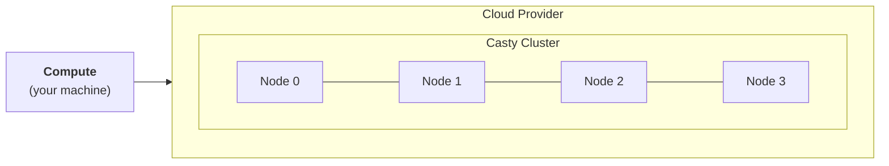
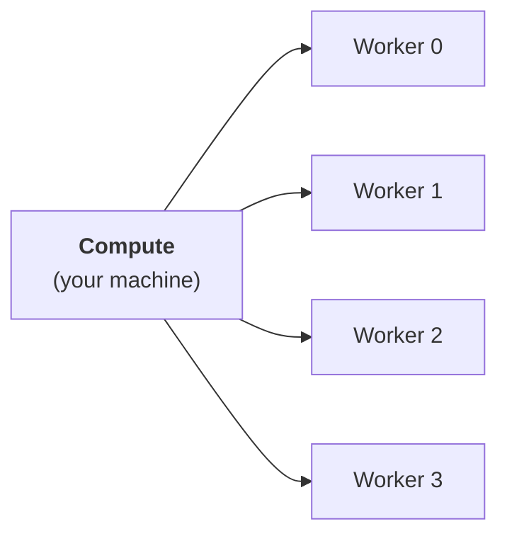

# Clustering

Skyward uses [Casty](https://gabfssilva.github.io/casty/) as its distributed runtime. Casty is a typed, clustered virtual-actor framework for Python 3.12+ — actors are plain classes whose annotated fields are replicated state and whose async methods are the interface, activated on demand across a leaderless cluster. Every compute node in a Skyward pool runs a Casty member, and together they form a peer-to-peer cluster that handles task execution, distributed state, and inter-node communication without any external coordination service.

This page explains how the cluster is structured and how your client reaches it.

## Two planes

Skyward's runtime splits into two halves with different concurrency needs.

The **control plane** runs on your machine: provisioning cloud instances, opening SSH tunnels, running bootstrap scripts, watching for preemption, scaling. It is a single process doing concurrent I/O, so it is written as plain asyncio classes — each `Node` walks a linear `provision()` coroutine (poll the cloud API, connect SSH, bootstrap, start the worker), the `Pool` coordinates them through callbacks, and the task manager, reconciler, and autoscaler are classes with background tick loops. No actor framework is involved.

The **data plane** is the cluster of remote workers — a genuinely distributed problem — and that is where Casty runs. Each worker process is a Casty cluster member hosting the Skyward worker as a `@casty.service`: a stateless, concurrent RPC endpoint whose methods (`run`, `broadcast`, streaming) execute your serialized functions.

## How the cluster forms

When you enter a `Compute` context manager, Skyward's control plane asks the provider to launch instances and, for each one, runs a node lifecycle: polling the cloud API until the machine is running, opening an SSH tunnel, transferring the bootstrap script, installing dependencies, and starting the worker process. When a worker is ready, its node reports back to the pool. Once enough nodes are ready, the pool is open for business.

On the remote side, each worker starts a Casty member on port 25520; node 0 acts as the seed the others join through. Your client connects as a **lite member** — `casty.connect(seeds, address_map=...)` — which joins the membership and routes calls but hosts nothing. The `address_map` rewrites every remote address to the local end of an SSH tunnel, so all traffic between your laptop and the cluster flows through SSH port forwards. Task dispatch is pinned to a specific node with `client.service(WorkerService, at=member)`. There is no HTTP server, no REST API, no message broker — just Casty RPC over SSH.

```mermaid
graph LR
    pool["<b>Compute</b><br/>(your machine)"]
    pool --> provider

    subgraph provider ["Cloud Provider"]
        subgraph cluster ["Casty Cluster"]
            direction LR
            n0["Node 0"] --- n1["Node 1"] --- n2["Node 2"] --- n3["Node 3"]
        end
    end
```

Node 0 plays a special role for distributed training: once its instance is ready, its address is shared with all other nodes. This is how distributed training frameworks (PyTorch DDP, JAX, etc.) discover each other — `MASTER_ADDR` always points to node 0.

## The control plane

The full control plane on your local machine consists of a few plain asyncio classes, each with a well-defined responsibility.

The **pool** coordinates everything. It provisions instances through the provider, owns one `Node` per instance, holds the Casty client(s), and is the entry point for all task submissions.

The **task manager** dispatches tasks to nodes using round-robin scheduling. It handles backpressure through per-node concurrency slots (from the `worker` configuration), preventing the workers from being overwhelmed. When you call `train(10) >> pool`, the task manager picks the next node with a free slot and forwards the task.

Each **node** manages a single remote machine through its full lifecycle — `provision()` is one linear coroutine: poll the cloud API, connect SSH, bootstrap, start the worker. If a spot instance is preempted, the node detects the loss, notifies the pool, and a replacement is provisioned. Tasks that were in flight on the lost node are re-queued.

The **instance monitor** tails a JSONL event stream over SSH from each machine — bootstrap phases, logs, metrics — and turns it into domain events that feed the console and the CLI.

When you send a task with `>>`, the function and arguments are serialized (cloudpickle + lz4) and sent as a Casty RPC to the worker service on the chosen node; the result flows back as the awaited return value.

## Distributed state

The cluster also powers Skyward's [distributed collections](distributed-collections.md). When you call `sky.dict("cache")` inside a `@sky.function` function, Skyward creates a Casty distributed map replicated across `min(3, num_nodes)` physical nodes with quorum-acknowledged writes. Every node can read and write to it, and a node dying does not lose committed state — the collection reactivates on a surviving replica.

Collections are sugar over the same virtual-actor machinery: each collection is a set of shard actors, placed on the ring and replicated like any other actor, behind a typed facade. The same RPC infrastructure that carries task payloads between your laptop and the workers also carries collection operations between nodes.

## Why Casty

Skyward needs a runtime that can form ad-hoc clusters from ephemeral cloud instances, execute functions remotely with request-reply semantics, provide replicated distributed data structures, and handle node failures through gossip-based membership and failure detection. Casty provides all of this with a small footprint and Python-native async support.

The alternative would be running a separate coordination service on every ephemeral cluster — Redis for state, a message broker for task routing, a custom protocol for function execution. That's more moving parts, more dependencies to install on each worker, and more failure modes to handle during the brief life of a training job. Casty collapses all of these into a single runtime that starts in milliseconds and communicates over plain TCP. For a cluster that might live for ten minutes to run a training job, that simplicity matters.

## Standalone mode

The cluster architecture described above assumes nodes can reach each other on private IPs. Providers that don't offer this — RunPod, VastAI, TensorDock, JarvisLabs, Novita, MassedCompute — default to standalone mode in their `default_options()`. On providers with private networking, you can opt out via `Options(cluster=False)`. Either way, Skyward skips cluster formation entirely.

Each worker starts its Casty member without seeds, so it never discovers peers — a one-member cluster per node. The pool creates a separate lite-member client for each worker, each connected through its own SSH tunnel:

```mermaid
graph LR
    pool["<b>Compute</b><br/>(your machine)"]
    pool --> w0["Worker 0"]
    pool --> w1["Worker 1"]
    pool --> w2["Worker 2"]
    pool --> w3["Worker 3"]
```

Task dispatch is unchanged — the task manager still uses round-robin, backpressure still works, spot preemption recovery still replaces individual nodes. What's lost is everything that depends on inter-node communication: distributed collections (`sky.dict`, `sky.counter`, `sky.barrier`, etc.) raise `RuntimeError`, and distributed training frameworks that require NCCL or similar backends won't be able to initialize.

This is a deliberate trade-off. For embarrassingly parallel workloads — hyperparameter sweeps, batch inference, independent data processing — standalone mode works on any provider without requiring private networking. See the [Standalone Workers](guides/standalone-workers.md) guide for a walkthrough.

## Further reading

- [Casty Documentation](https://gabfssilva.github.io/casty/) — Full reference for the framework
- [Distributed Collections](distributed-collections.md) — Dict, set, counter, queue, barrier, lock
- [Distributed Training](distributed-training.md) — Multi-node training with PyTorch, Keras, and JAX
