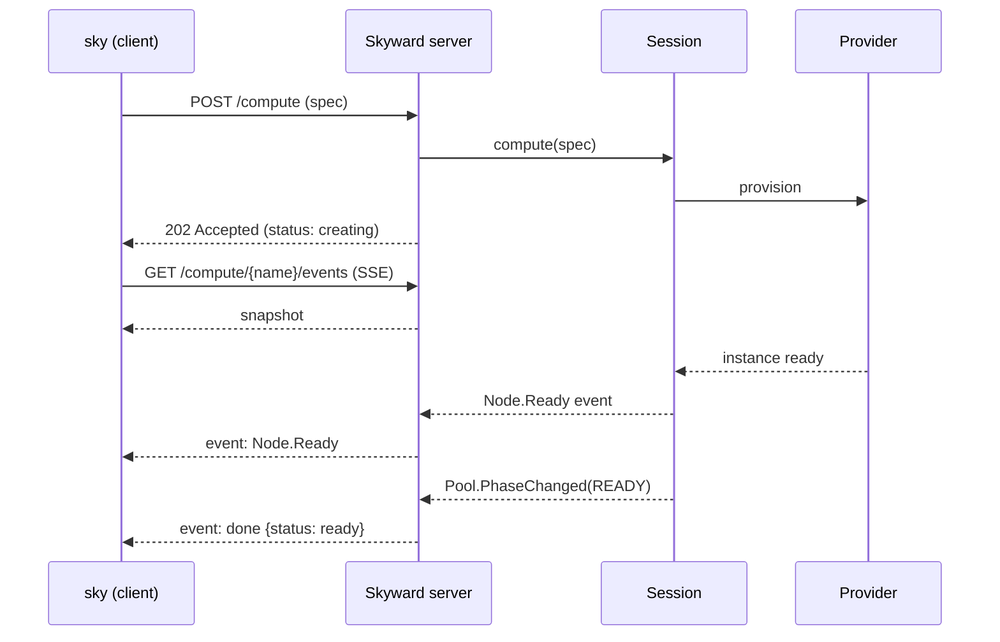

# CLI

Skyward gives you two ways to drive a pool. The first — embedding `Compute` as a context manager inside a Python script — is what every example so far has shown. The second is the **`sky` command-line interface**: a thin HTTP client that talks to a long-lived Skyward server. The two share the same domain model, but they live different lives. A pool created from a Python script dies with the script; a pool created from the CLI lives on the server until you delete it, available to any process that knows the URL.

This page covers when the CLI makes sense, the daemon model that backs it, and every command in the surface.

## When to use the CLI

Most ML scripts are well-served by the embedded API — the pool's lifetime is the job's lifetime, exit codes propagate naturally, and you never think about the server at all. The CLI exists for the cases where that shape doesn't fit:

- **Reusing a pool across scripts.** Provisioning costs measured in minutes don't amortize well across short scripts. With the CLI you spin up the pool once and run multiple scripts against it: `sky compute create demo --watch && sky compute run demo train.py && sky compute run demo evaluate.py`.
- **Detached workflows.** Long training runs that you don't want tied to a terminal. The server is a daemon; the script can finish, your laptop can sleep, and the pool keeps running.
- **Inspection from outside Python.** `sky compute view demo` follows live events from any pool — useful when the script that started it has long since exited, or when you're orchestrating from a different language.
- **A `kubectl`-shaped workflow.** If your team prefers operating compute through a CLI rather than embedding it in code, that style works here too.

The CLI doesn't expose anything the Python API doesn't — it's a transport, not a replacement.

## The client/server model

A single command (`sky server start`) launches a local HTTP server. Every other CLI command is a client that speaks to it. The server holds the actual `Session` — the same one a Python script holds when it enters `Compute` — and exposes pool lifecycle, script execution, and event streams over HTTP and Server-Sent Events.



The server runs as a **detached daemon by default** — `sky server start` spawns `uvicorn` in its own process group, polls `/health` until it answers, and returns to the shell. The PID is written to `~/.skyward/server.pid` and stdout/stderr go to `~/.skyward/server.log`. The terminal isn't held; you can close it. `sky server stop` POSTs `/shutdown` and waits for the daemon to exit.

The default URL is `http://localhost:7590`. Every CLI command accepts a `--url` flag, and the `SKYWARD_SERVER_URL` environment variable applies if set. The resolution order is `--url` → env var → default.

Pool creation is **non-blocking**. `POST /compute` returns `202 Accepted` immediately with `status: "creating"`; the actual provisioning runs as a background asyncio task on the server. This is what makes `sky compute create demo --watch` and `sky compute view demo` two views of the same thing — both consume the same SSE event stream, just from different starting points.

## Quickstart

The full lifecycle, end to end:

```bash
# 1. Start the server (daemon mode)
sky server start
# → Server running at http://127.0.0.1:7590 (pid 41234)

# 2. Create a pool and follow events until ready
sky compute create demo --provider runpod --accelerator A100 --watch
# → renders the same live layout the in-process console actor uses;
#   exits 0 when the pool is ready

# 3. Run a script against the ready pool
sky compute run demo train.py -- --epochs 10

# 4. Inspect, then tear down
sky compute list
sky compute delete demo

# 5. Stop the server when done
sky server stop
```

`--watch` and the standalone `sky compute view <name>` both follow the same event stream — the difference is whether you create the pool in the same command or attach to an existing one.

## Managing the server (`sky server`)

The `sky server` group manages the local HTTP server that backs every other command. Three verbs: `start`, `stop`, `status`.

### `start`

Daemon by default. The server forks into its own process group, redirects output to `~/.skyward/server.log`, writes its PID to `~/.skyward/server.pid`, and the command returns once `/health` answers `200`.

```bash
sky server start                       # daemon on 127.0.0.1:7590
sky server start --port 8080           # custom port
sky server start --host 0.0.0.0        # bind on all interfaces
sky server start --timeout 60          # wait up to 60s for /health
```

For development, use `--foreground` to keep the server attached to the terminal — Ctrl+C stops it. `--reload` enables uvicorn's auto-reload (and implies `--foreground`):

```bash
sky server start --foreground          # blocking, Ctrl+C to stop
sky server start --reload              # foreground + auto-reload on file changes
```

If a PID file exists and the process is alive, `start` refuses with a hint to run `stop` first. If the PID file points to a dead process, it's cleaned up automatically and the new server starts as usual.

### `stop`

Triggers a graceful shutdown via `POST /shutdown` and waits for the daemon to exit. The PID file is cleaned on success.

```bash
sky server stop                        # default 10s wait
sky server stop --timeout 30           # longer wait for in-flight pools to drain
```

If the server is unreachable but the PID file points to a dead process, `stop` cleans the stale PID file and exits successfully — useful when a previous shutdown was abrupt.

### `status`

A health probe. Hits `/health` and prints the URL, version, and live counts of pools and executions:

```bash
sky server status
sky server status --json               # for scripts
```

A non-zero exit code means the server is unreachable.

## Working with pools (`sky compute`)

The `sky compute` group is the heart of the CLI. Six verbs cover the full lifecycle: `create`, `view`, `list`, `get`, `run`, `delete`.

### Creating a pool (`create`)

Two forms. The first uses a **named pool from `skyward.toml`** — the same TOML file `Compute.Named()` reads in Python. This is the recommended workflow when the pool's full spec is part of your project:

```bash
sky compute create demo                # uses [pools.demo] from skyward.toml
```

The second is **inline**, for ad-hoc pools without TOML:

```bash
sky compute create --provider runpod --accelerator A100 --nodes 4
```

Either form accepts overrides — flags layer on top of the resolved spec:

```bash
# TOML pool, but override node count and add a pip package
sky compute create demo --nodes 8 --pip torch --pip transformers
```

Available overrides: `--name`, `--region`, `--nodes`, `--accelerator`, `--allocation`, `--pip` (repeatable, appends), `--apt` (repeatable, appends), `--python`. Inline overrides only work with single-spec pools — multi-spec pools must be defined entirely in TOML.

The command returns immediately with `status: creating`. Two flags change what happens next:

- `--watch` follows live events until the pool is ready (or fails). Same renderer as `sky compute view`. Exits with the pool's terminal status — `0` for ready, `1` for failed.
- `--json` emits the response body as a single line, suitable for scripting.

Without `--watch`, the command prints the pool entry and a hint pointing to `sky compute view`.

### Following events (`view`)

The most useful command for understanding what a pool is doing right now. Connects to `GET /compute/{name}/events` and renders the SSE stream live, using the **same Rich layout the in-process console actor uses** when you embed `Compute` in a Python script. Phase changes, per-node bootstrap progress, task queueing, errors — all of it.

```bash
sky compute view demo
```

Three modes:

- **Default** — Rich live layout. Persists until the pool reaches a terminal status (`ready`, `failed`, `stopping`) or you Ctrl+C. Disconnecting doesn't affect the pool; only the view detaches.
- **`--once`** — render the initial snapshot once and exit. Good for a quick "what's happening?" without committing the terminal.
- **`--json`** — emit NDJSON (snapshot frame plus each subsequent event on its own line). Designed to pipe into `jq` or feed into other tooling. The wire format mirrors Skyward's domain events: `{"event": "Pool.PhaseChanged", "data": {"type": "Pool.PhaseChanged", "fields": {...}}}`.

```bash
sky compute view demo --once
sky compute view demo --json | jq 'select(.event == "Node.Ready")'
```

The exit code reflects the terminal status: `0` on `ready` or normal disconnect, `1` on `failed`, `2` on connection or stream errors.

### Listing and inspecting (`list`, `get`)

`list` shows every pool the server knows about — a tabular view with name, status, node count, concurrency, and active flag. `get` is the same shape for a single pool:

```bash
sky compute list
sky compute get demo
sky compute get demo --json
```

`status` reflects the pool's lifecycle: `creating`, `ready`, `failed`, `stopping`. A `failed` pool keeps its entry until you delete it — that way `view` and `get` can still surface the error.

### Running scripts (`run`)

Runs a local Python script remotely on a ready pool. The script's source is shipped to the server, executed inside a worker (`exec()` inside the worker process, with `sys.argv` set from `args`), and the captured stdout/stderr stream back at the end.

```bash
sky compute run demo train.py
sky compute run demo train.py -- --epochs 10 --lr 1e-4
sky compute run demo setup.py --broadcast       # run on every node, not just one
```

Without `--broadcast`, the script runs on a single node selected by round-robin. With `--broadcast`, the script runs on every node and the output is printed per-node with separators. The CLI's exit code is the script's exit code (or the highest non-zero exit across nodes for broadcast).

Submitting against a pool that isn't `ready` returns `409 Conflict` — wait for `creating` to finish first.

### Tearing down (`delete`)

Tears down the pool — both server-side state and the actual cloud instances. For pools mid-provisioning, `delete` signals the server to stop the in-flight provisioning task; the cloud cleanup runs through the same `Session.stop_pool` path that the Python API uses on `__exit__`.

```bash
sky compute delete demo
```

Returns `204 No Content` on success. `404` if the pool doesn't exist.

## Browsing offers (`sky offers`)

The `sky offers` group queries provider catalogs — useful for picking an accelerator, comparing prices across providers, or scripting against the catalog. Offers are cached locally in DuckDB; `fetch` refreshes the cache, the rest read from it.

```bash
sky offers fetch                                # refresh from all configured providers
sky offers fetch --provider runpod --provider vastai

sky offers list --accelerator H100              # cheapest H100 offers across providers
sky offers list --accelerator A100 --gpus 4 --vram 80 --spot --limit 10

sky offers query "SELECT provider, region, on_demand_price FROM offers WHERE accelerator='H100' ORDER BY on_demand_price LIMIT 5"

sky offers summary                              # rollup by provider/accelerator
```

`list` accepts `--provider` (repeatable), `--accelerator`, `--gpus`, `--vram`, `--spot`, `--sort` (`price`, `vram`, `gpus`), and `--limit`. `query` is a raw SQL escape hatch against the catalog VIEW. `summary` produces a rollup grouped by accelerator.

Every command supports `--json`.

## Configuration and providers

Two utility groups: `sky config` for `skyward.toml` resolution, `sky providers` for cloud credentials.

### `sky config`

```bash
sky config path                                 # global + project config locations
sky config show                                 # merged TOML (global + project)
sky config show --pool demo                     # filter to a single pool
sky config validate                             # check provider refs and types
```

`show` prints the merged result of `~/.skyward/defaults.toml` and `./skyward.toml`, with the project-level overriding the global. `validate` walks the resolved config and verifies that every pool's `provider` field references a defined provider.

### `sky providers`

```bash
sky providers list                              # credential status table for all providers
sky providers check aws                         # deep check: credentials + SDK auth
sky providers check --all
```

`list` is a quick credential check — does it find the env vars or files this provider expects? `check` goes further: it instantiates the config and tries to construct the actual SDK client, which surfaces issues like expired tokens, missing IAM permissions, or wrong region.

## Scripting with `--json`

Every command that produces structured output accepts `--json`, which emits a single JSON line on stdout (or NDJSON for streaming commands like `compute view`). This is the surface for shell scripts, CI pipelines, and tooling that doesn't want to parse Rich tables.

```bash
# Wait for a pool to be ready, with a timeout
until [ "$(sky compute get demo --json | jq -r .status)" = "ready" ]; do sleep 2; done

# Pick the cheapest spot H100 offer
sky offers list --accelerator H100 --spot --json | jq -r '.[0].provider'

# Filter the event stream for failures
sky compute view demo --json | jq 'select(.data.type | endswith("Failed"))'
```

Exit codes follow the usual conventions:

- `0` — success (pool ready, command completed, server reachable).
- `1` — runtime error (pool failed, server unreachable, HTTP error, script exited non-zero).
- `2` — usage error (missing required flag, invalid combination, file not found) or stream/connection error inside `view`.

The `--url` flag and `SKYWARD_SERVER_URL` environment variable both override the default `http://localhost:7590` — useful when running multiple servers on different ports, or pointing at a remote daemon over SSH port-forwarding.

## Next steps

- **[Getting Started](getting-started.md)** — Installation, credentials, and your first remote computation.
- **[Core concepts](concepts.md)** — Pool, operators, runtime, and the model the CLI exposes.
- **[Configuration](reference/config.md)** — `skyward.toml` reference for named pools.
- **[Providers](providers.md)** — Per-provider setup and credentials.
