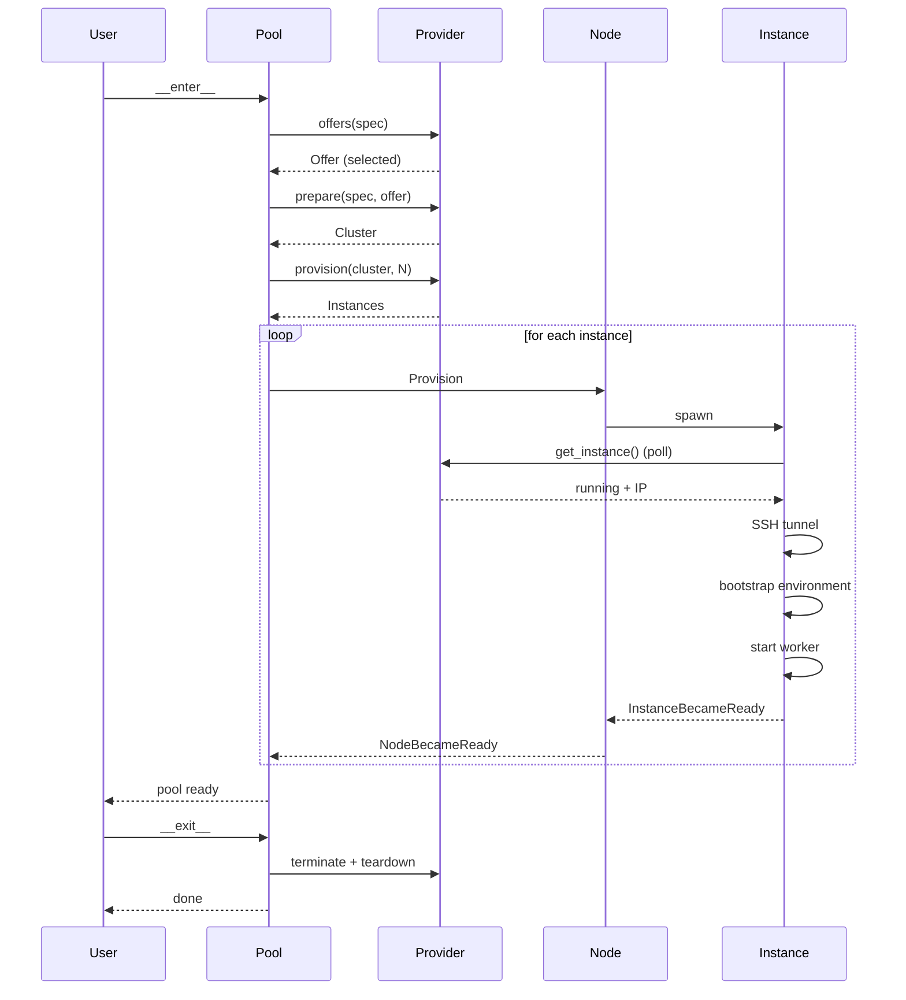
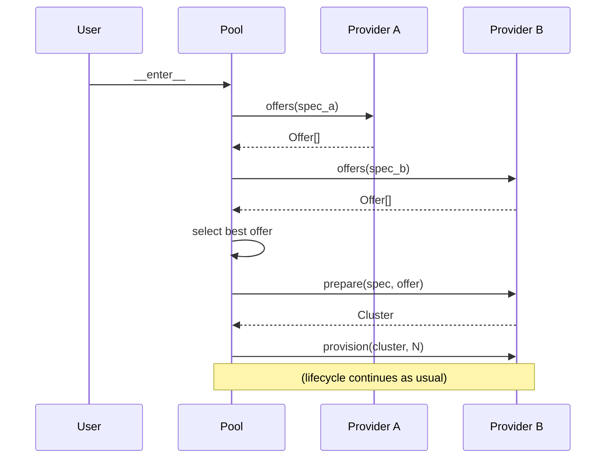

# Core Concepts

Skyward's programming model is built on a simple idea: **computation and location should be separate concerns**. You write ordinary Python functions. You decide where they run — on which cloud, on how many machines, on which accelerators — at the call site, not inside the function itself. This separation is what makes the same code work on a laptop, a single GPU, or a cluster of eight H100s.

This page walks through the concepts that make this possible.

## Lazy Computation

The central abstraction in Skyward is `@sky.compute`. It transforms a regular function into a **lazy computation** — calling the function no longer executes it. Instead, it produces a `PendingCompute` object: a frozen, serializable description of *what* to compute, without committing to *where* or *when*.

```python
import skyward as sky

@sky.compute
def train(epochs: int) -> float:
    model = build_model()
    return model.fit(epochs=epochs)

pending = train(10)   # nothing runs — returns PendingCompute[float]
```

In functional programming, this pattern is known as reifying an **effect**. Calling `train(10)` doesn't produce a result — it produces a *description* of a computation that, when interpreted, will produce a result. The side effects (provisioning a GPU, transferring data, executing remotely) are not performed at the call site. They are deferred to an interpreter — in this case, the pool and its operators. This is the same idea behind `IO` in Haskell, `Effect` in ZIO, or `suspend` in Kotlin: separating the description of a program from its execution so that the runtime can decide how, where, and when to run it.

Because `PendingCompute` is a value — not a running process — it can be serialized, sent over the network, and executed on a remote machine. It can also be composed: combined with other computations via `&`, collected into a `gather()`, or stored and dispatched later. None of this triggers execution. The program you're building is a data structure that only materializes when you commit to a target with `>>` or `@`.

The generic type is preserved throughout — `train(10)` produces `PendingCompute[float]`, and dispatching it returns `float`. Your type checker sees the same types whether the function runs locally or on a remote GPU.

If you need to bypass this and run the original function directly (for testing, debugging, or local profiling), every decorated function exposes the unwrapped version via `.local`:

```python
result = train.local(10)  # executes immediately, returns float
```

## The Pool

A `ComputePool` is a context manager that represents a set of cloud instances with a defined lifecycle. When you enter the block, Skyward provisions the machines, installs dependencies, and establishes connectivity. When you exit — whether normally or through an exception — everything is torn down.

```python
with sky.ComputePool(
    provider=sky.AWS(),
    accelerator="A100",
    nodes=4,
    image=sky.Image(pip=["torch", "transformers"]),
) as pool:
    result = train(10) >> pool
# all instances terminated
```

This is what it means for compute to be **ephemeral**: the infrastructure exists only for the duration of the work. There are no machines to forget about, no environments that drift over time, no idle costs accumulating overnight. The pool's lifetime is the job's lifetime.

This model fits ML workloads naturally. Training runs, fine-tuning jobs, hyperparameter sweeps, batch inference — these are all tasks with a beginning and an end. The pool captures that shape: provision what you need, do the work, release everything.

### Lifecycle

Behind the `with` block, the pool orchestrates a hierarchy of components — each with its own lifecycle — to bring a cluster from zero to ready.

Internally, this orchestration is built on the **actor model** — specifically on [Casty](https://gabfssilva.github.io/casty/), a lightweight actor framework for Python. Each component in the hierarchy (pool, node, instance) is an actor: an isolated unit of state that communicates exclusively through messages. There are no shared locks, no thread pools coordinating through mutexes, no callbacks mutating global state. An actor receives a message, decides what to do, and optionally sends messages to other actors. This makes the concurrent lifecycle of multiple nodes and instances — each progressing through their own state machines at different speeds — straightforward to reason about. Both Casty and Skyward are built on top of asyncio, so actors are cheap and message passing doesn't block threads — the system scales to hundreds of nodes without requiring proportional memory or CPU on your laptop.

Despite being fully asynchronous internally, Skyward exposes a **synchronous API**. The asyncio event loop runs in a background daemon thread, and every public method bridges into it via `run_coroutine_threadsafe`. This means you write normal, blocking Python — `result = task() >> pool` — while the orchestration underneath remains non-blocking and concurrent.

A **pool** actor manages the overall process: it asks the **provider** (AWS, RunPod, VastAI, etc.) to prepare infrastructure and launch instances. Each launched instance becomes a **node** actor, and each node supervises an **instance** actor that handles the low-level work — polling the cloud API until the machine is running, opening an SSH tunnel, bootstrapping the environment, and starting the worker process.

The full sequence looks like this:



The provider is only involved at the boundaries: preparing infrastructure, launching instances, polling status, and tearing down. Everything in between — SSH, bootstrap, worker startup, cluster formation — is handled by the instance actor, which means the same orchestration logic works identically across all providers.

Node 0 plays a special role: it's the **head node**. Once its instance is ready, it broadcasts its address to all other nodes so they can form a cluster. This is how distributed training frameworks (PyTorch DDP, JAX, etc.) discover each other — and Skyward's plugins (`sky.plugins.torch()`, `sky.plugins.jax()`) configure these frameworks using the head node's address automatically.

If a spot instance is preempted, the node detects the loss, notifies the pool, and requests a replacement from the provider. Tasks that were in flight are re-queued. From the user's perspective, the pool self-heals — though of course repeated preemptions will slow things down.

The pool is also the dispatch target for computations. You don't configure job queues or submit YAML — you use Python operators to express how computations should be distributed across the pool's nodes.

## Workers

Each node in the pool runs a **worker** — a long-lived process that receives serialized tasks, executes them, and sends results back. The `Worker` dataclass controls two things: how many tasks a node handles concurrently, and which execution backend runs them.

```python
with sky.ComputePool(
    provider=sky.AWS(),
    nodes=4,
    worker=sky.Worker(concurrency=2),
) as pool:
    result = train(10) >> pool
```

`concurrency` sets the number of task slots per node. Total parallelism across the cluster is `nodes * concurrency` — four nodes with `concurrency=2` means eight tasks running simultaneously.

The `executor` field determines *how* those tasks run. The default is `"process"`: each task executes in a separate OS process via `ProcessPoolExecutor`, which means each has its own Python interpreter and its own GIL. CPU-bound Python code saturates all available cores — a 2-vCPU machine with two concurrent tasks reaches 100% utilization. This is the right choice for numerical computation, data transformation, and training loops.

The alternative is `"thread"`, which runs tasks as threads inside the worker process. Threads share the GIL, so CPU-bound Python code is limited to one core regardless of concurrency. On the same 2-vCPU machine, you'd see ~50% CPU. Threads are the right choice for I/O-bound work (network calls, disk reads) and for C extensions that release the GIL (NumPy, PyTorch inference). Distributed collections (`sky.dict()`, `sky.counter()`, etc.) work with both executors.

For a practical comparison with benchmarks, see the [Worker Executors](guides/worker-executors.md) guide.

## Operators

Most distributed computing frameworks require you to express execution through configuration files, job submission APIs, or method calls like `pool.submit(fn, args)`. Skyward takes a different approach: it uses Python's operator overloading to create a small vocabulary where the syntax itself communicates intent. The expression `train(10) >> pool` reads as "send this computation to the pool" — and that's exactly what it does.

This works because `@sky.compute` returns a `PendingCompute` value, not a result. Operators are defined on `PendingCompute` (via `__rshift__`, `__matmul__`, `__and__`, `__gt__`), and each one triggers a different dispatch strategy on the pool. The pool serializes the function and arguments with cloudpickle, sends the payload to the appropriate worker(s) over SSH, waits for the result, deserializes it, and returns it to the caller.

### `>>` — Execute on one node

The most common operation. Sends the computation to a single worker and blocks until the result is available:

```python
result = train(10) >> pool
```

The pool selects the target node using round-robin scheduling. If you send ten tasks with `>>`, they'll be distributed evenly across the available nodes. This is the right operator for independent tasks that don't need to run on every node — hyperparameter trials, inference on different inputs, or any embarrassingly parallel workload.

### `@` — Broadcast to all nodes

Sends the same computation to every node in the pool. Returns a list with one result per node:

```python
with sky.ComputePool(provider=sky.AWS(), nodes=4) as pool:
    # runs on all 4 nodes, returns list of 4 results
    results = initialize_model(config) @ pool
```

Broadcast is the foundation for distributed training patterns. When combined with `sky.shard()` inside the function, each node receives the full arguments but operates on its own partition of the data. The function body is identical across nodes — the differentiation happens at runtime based on `sky.instance_info()`.

This is also the natural way to run setup or teardown operations that must happen on every machine: loading a model into GPU memory, warming up a cache, or writing checkpoints to local disk.

### `&` — Parallel composition

Combines multiple *different* computations into a group that executes in parallel. Results are returned as a tuple with full type inference:

```python
a, b, c = (preprocess() & train() & evaluate()) >> pool
```

The distinction from broadcast is important: `@` runs the *same* function on all nodes, while `&` runs *different* functions concurrently. Each computation in the group may go to a different node (round-robin), and the group blocks until all of them complete. The types are preserved individually — if `preprocess` returns `DataFrame`, `train` returns `Model`, and `evaluate` returns `float`, the destructured result is `tuple[DataFrame, Model, float]`.

### `>` — Async dispatch

Like `>>`, but returns a `Future[T]` immediately instead of blocking. This lets you overlap remote computation with local work:

```python
future = train(10) > pool
# ... do local work while the remote computation runs ...
result = future.result()  # blocks only when you need the result
```

The `Future` follows Python's `concurrent.futures` protocol, so it integrates with existing code that already works with futures — including `as_completed()`, `wait()`, and executor patterns.

### `gather()` — Dynamic parallelism

`&` works when the number of parallel tasks is known at write time. When it isn't — because you're iterating over a dataset, a list of configurations, or any dynamic collection — `gather` groups an arbitrary number of computations:

```python
tasks = [process(chunk) for chunk in chunks]
results = sky.gather(*tasks) >> pool
```

Under the hood, `gather` creates a `PendingComputeGroup` — the same type that `&` produces — so the dispatch behavior is identical. The difference is purely syntactic: `&` is for a fixed set of typed computations, `gather` is for a dynamic collection.

With `stream=True`, results are yielded as they complete rather than waiting for all of them. This is useful when tasks have variable duration and you want to start processing results early:

```python
for result in sky.gather(*tasks, stream=True) >> pool:
    save(result)
```

By default, streaming preserves the original order (the first yielded result corresponds to the first task). With `ordered=False`, results arrive in completion order — faster overall, but you lose the positional correspondence.

## Image

Remote workers start as bare cloud instances — a fresh OS with no Python, no libraries, no knowledge of your project. The `Image` dataclass describes the full environment that should exist on each worker before any computation runs. It's a declarative specification: you state what you need, and Skyward generates an idempotent bootstrap script that provisions it.

```python
image = sky.Image(
    python="3.13",
    pip=["torch", "numpy", "transformers"],
    apt=["ffmpeg", "libsndfile1"],
    env={"KERAS_BACKEND": "jax"},
    includes=["./my_module/"],
)

with sky.ComputePool(provider=sky.AWS(), image=image) as pool:
    ...
```

Each field maps to a phase of the bootstrap process:

- `python` — The Python version to install. Defaults to `"auto"`, which detects your local version and matches it on the worker. Workers use `uv` as the package manager, so installation is fast.
- `pip` — Python packages to install in the worker's virtual environment.
- `apt` — System-level packages installed before Python setup.
- `env` — Environment variables set before your function executes. Useful for framework configuration (`KERAS_BACKEND`, `HF_TOKEN`, etc.).
- `includes` — Local directories to sync to the workers via SSH. This is how your own code reaches the remote machines without being published as a package.
- `excludes` — Glob patterns to skip during sync (e.g., `["__pycache__", "*.pyc"]`).

The bootstrap script is generated once and runs identically on every instance. Because the `Image` is a frozen dataclass, two pools created with the same image produce the same environment — same Python version, same packages, same system dependencies. This is reproducibility without Docker: the environment specification lives in your Python code, versioned alongside your experiments.

There's also `skyward_source`, which controls how Skyward itself reaches the workers. In most cases the default `"auto"` is what you want: it detects whether you're running from an editable install (development mode) and, if so, copies your local Skyward source to the workers instead of installing from PyPI. This means changes to Skyward's own code are reflected immediately on remote machines during development, without publishing a new version.

## Runtime Context

Skyward operates in two worlds. The **client side** is your local machine — where `ComputePool` runs, where operators dispatch tasks, where results come back. The **worker side** is the remote instance — where your `@sky.compute` function actually executes. These are separate processes on separate machines, connected by SSH tunnels.

Inside a `@sky.compute` function, you're in the worker world. The function has access to the remote machine's resources (GPUs, local disk, network), but it doesn't have a reference to the pool object or the client's memory. What it does have is `sky.instance_info()`: a view of the cluster topology from this node's perspective.

```python
@sky.compute
def distributed_task(data):
    info = sky.instance_info()
    print(f"Node {info.node} of {info.total_nodes}")

    if info.is_head:
        coordinate_others()
    return process(data)
```

`InstanceInfo` is populated from a `COMPUTE_POOL` environment variable that Skyward injects before starting the worker process. It contains the node's index (`node`), the total cluster size (`total_nodes`), whether this is the head node (`is_head`), the head node's address and port (for coordination protocols), the number of accelerators on this node, and a list of all peers with their private IPs.

This is the same mechanism that Skyward's plugins use internally. The `torch` plugin, for example, reads `instance_info()` to configure `MASTER_ADDR`, `WORLD_SIZE`, and `RANK` before calling `init_process_group`. You don't need plugins to access this information — `instance_info()` is always available inside any `@sky.compute` function, whether you're using a plugin or writing raw distributed logic.

### Data Sharding

A common pattern in distributed computing is to send the *same function* to all nodes but have each node operate on a *different slice* of the data. `sky.shard()` automates this: it reads the current node's position from `instance_info()` and returns only the portion of the data that belongs to this node.

```python
@sky.compute
def process(full_dataset):
    local_data = sky.shard(full_dataset)
    return analyze(local_data)

with sky.ComputePool(provider=sky.AWS(), nodes=4) as pool:
    # each node gets 1/4 of the data
    results = process(dataset) @ pool
```

The function receives the *full* dataset as an argument — the serialization cost is paid once — but each node only processes its shard. The sharding algorithm uses modulo striding by default (`indices[node::total_nodes]`), which distributes elements evenly regardless of whether the total is divisible by the node count.

Sharding is type-preserving: lists produce lists, tuples produce tuples, NumPy arrays produce arrays, PyTorch tensors produce tensors. This means you can shard a tensor and immediately pass it to a model without type conversions.

When sharding multiple arrays, indices are aligned — the same positions are selected from each array, so paired data (features and labels, inputs and targets) stays consistent:

```python
@sky.compute
def train(x_full, y_full):
    x, y = sky.shard(x_full, y_full, shuffle=True, seed=42)
    # x[i] still corresponds to y[i]
    return fit(x, y)
```

The `shuffle` parameter randomizes the order before sharding, with a fixed `seed` ensuring all nodes agree on the same permutation. `drop_last=True` switches from striding to contiguous blocks and discards leftover elements, guaranteeing equal shard sizes — useful when your training loop requires fixed batch dimensions.

## Streaming

The patterns above — `>>`, `@`, `&`, `gather` — all follow the same shape: serialize the function and arguments, ship them to a worker, execute, serialize the result, ship it back. The full result materializes on the worker before anything crosses the network. For most workloads this is fine. But some computations produce results incrementally — a training loop that yields metrics every epoch, a data pipeline that emits rows one at a time, a search that finds matches progressively. Waiting for the entire result before returning anything wastes time and memory.

Streaming changes this. If a `@sky.compute` function is a generator — it uses `yield` instead of `return` — Skyward streams the values back to the caller as they're produced. The dispatch expression `task() >> pool` returns a synchronous iterator instead of a single value, and each element arrives as soon as the worker yields it:

```python
@sky.compute
def generate_samples(n: int):
    for i in range(n):
        yield expensive_sample(i)

with sky.ComputePool(provider=sky.AWS(), nodes=1) as pool:
    for sample in generate_samples(1000) >> pool:
        save(sample)  # processes each sample as it arrives
```

The inverse also works: parameters annotated with `Iterator[T]` are streamed *to* the worker instead of being serialized as a single blob. This means a 10GB dataset doesn't need to fit in a single cloudpickle payload — it flows to the worker element by element, and the worker consumes it as a regular `for` loop:

```python
from collections.abc import Iterator

@sky.compute
def process(data: Iterator[dict]) -> int:
    count = 0
    for record in data:
        transform(record)
        count += 1
    return count

result = process(iter(huge_dataset)) >> pool
```

Both directions can be combined: a function that takes an `Iterator` input and yields results creates a bidirectional stream — data flows in, transformed results flow out, and neither side buffers the full dataset in memory.

Under the hood, streaming is built on Casty's `stream_producer` and `stream_consumer` actors, which provide backpressure-aware message passing over the SSH-tunneled TCP connection. If the consumer falls behind, the producer pauses automatically. The detection is fully implicit: Skyward inspects the function at dispatch time — if it's a generator, it wraps the output in a stream; if a parameter has an `Iterator[T]` annotation, it wraps the argument in an input stream. No configuration, no special classes.

For a practical walkthrough with code examples, see the [Streaming](guides/streaming.md) guide.

## Providers

Throughout this page, the `provider` parameter has appeared in every `ComputePool` example — `sky.AWS()`, `sky.RunPod()`, `sky.VastAI()`, `sky.Verda()`, `sky.Container()`. The provider is the bridge between Skyward's orchestration model and a specific cloud's API. It knows how to translate abstract requests ("I need 4 machines with A100 GPUs") into the concrete API calls that each cloud requires.

All providers implement the same protocol — `Provider[C, S]` — which defines six operations that map directly to the pool lifecycle discussed earlier:

- `offers(spec)` — Query available machine types and pricing that match the spec. Returns an async iterator of `Offer` objects — normalized descriptions of hardware and pricing that can be compared across providers. This is what enables cross-provider selection.
- `prepare(spec, offer)` — Set up cluster-level infrastructure for the selected offer: register SSH keys, create VPCs and security groups (AWS), resolve GPU types, configure overlay networks. Returns an immutable `Cluster` context that flows through all subsequent calls.
- `provision(cluster, count)` — Launch the requested number of instances. Returns them in a "provisioning" state — the machines exist, but may not be running yet.
- `get_instance(cluster, id)` — Poll the status of a single instance. The instance actor calls this repeatedly until the machine is running and has an IP address.
- `terminate(cluster, ids)` — Destroy specific instances.
- `teardown(cluster)` — Clean up everything `prepare` created: delete security groups, deregister keys, remove temporary infrastructure.

This protocol is what makes the orchestration layer provider-agnostic. The pool actor, node actors, and instance actors don't know whether they're talking to AWS, RunPod, or a local Docker daemon — they only know the six methods above. Adding a new cloud provider means implementing this protocol; nothing else in the system needs to change.

Provider configs (`sky.AWS()`, `sky.RunPod()`, etc.) are deliberately lightweight. They're plain dataclasses that hold configuration — region, credentials path, API keys — but don't import any cloud SDK at module level. The actual SDK (`boto3`, `aioboto3`, RunPod's GraphQL client, etc.) is loaded lazily when `create_provider()` is called at pool start. This means `import skyward` stays fast regardless of which providers are installed, and you only pay the import cost for the provider you're actually using.

For details on configuring each provider, see the [Providers](providers.md) page.

## Accelerators

The `accelerator` parameter on `ComputePool` tells the provider what hardware you need. You can pass a plain string (`"A100"`) or use the typed factory functions under `sky.accelerators`, which provide IDE autocomplete and carry catalog metadata like VRAM size and CUDA compatibility:

```python
# String — simple, works everywhere
sky.ComputePool(provider=sky.AWS(), accelerator="A100")

# Factory function — type-safe, with defaults from the catalog
sky.ComputePool(provider=sky.AWS(), accelerator=sky.accelerators.A100())
sky.ComputePool(provider=sky.AWS(), accelerator=sky.accelerators.H100(count=4))
sky.ComputePool(provider=sky.AWS(), accelerator=sky.accelerators.A100(memory="40GB"))
```

Both forms produce an `Accelerator` dataclass — a frozen, immutable specification with `name`, `memory`, `count`, and optional `metadata`. The factory functions look up defaults from an internal catalog (VRAM sizes, CUDA versions, form factors), so `sky.accelerators.H100()` already knows it has 80GB of memory without you specifying it.

The recommended approach is the factory function (`sky.accelerators.A100()`), not the string. If an accelerator isn't available as a factory, it means Skyward hasn't mapped it yet — and that mapping matters. Each cloud provider uses its own naming conventions and instance type structures: an "A100" on AWS is a `p4d.24xlarge`, on RunPod it's a pod with a specific `gpuTypeId`, on VastAI it's a marketplace offer filtered by GPU model. The translation from a logical accelerator name to a provider-specific resource isn't a simple string match — it involves resolving instance types, memory variants, multi-GPU configurations, and availability constraints. The catalog centralizes this complexity so that `sky.accelerators.A100(count=4)` resolves correctly on any provider that supports it.

The catalog covers NVIDIA datacenter GPUs (H100, H200, A100, L40S, T4, etc.), consumer cards (RTX 4090 down to GTX 1060), AMD Instinct (MI300X, MI250X), AWS Trainium and Inferentia, Habana Gaudi, and Google TPUs.

For a complete list, see the [Accelerators](accelerators.md) page.

## Allocation Strategies

Cloud providers offer different pricing models for the same hardware. The most important distinction is between **on-demand** instances (guaranteed availability, full price) and **spot** instances (surplus capacity sold at a discount, but reclaimable by the provider with short notice).

Skyward exposes this as an `allocation` parameter on the pool:

```python
# Try spot instances first, fall back to on-demand if unavailable (default)
sky.ComputePool(allocation="spot-if-available")

# Always use spot — cheaper, but can be interrupted
sky.ComputePool(allocation="spot")

# Always on-demand — more expensive, but guaranteed availability
sky.ComputePool(allocation="on-demand")

# Compare all options and pick the cheapest
sky.ComputePool(allocation="cheapest")
```

Spot instances are typically 60-90% cheaper than on-demand. The trade-off is that the cloud provider can reclaim them with short notice. For fault-tolerant workloads — checkpointed training, idempotent batch jobs, embarrassingly parallel inference — spot is a practical default. For time-sensitive or non-resumable work, on-demand is the safer choice.

The default `"spot-if-available"` tries to get the best of both: it requests spot capacity first and falls back to on-demand if none is available. This means your pool always starts, even during periods of high spot demand, without requiring you to handle the fallback logic yourself.

## Resource Selection

The previous sections described choosing a single provider and a single allocation strategy. But accelerator availability and pricing vary across providers and change constantly. An A100 on VastAI might cost $1.50/hr right now while the same accelerator on AWS is $3.00/hr — or VastAI might have no capacity at all. Skyward's resource selection system lets you describe multiple hardware preferences and let the system find the best option.

### Spec

A `Spec` is a frozen dataclass that bundles a provider with hardware preferences into a single, composable unit:

```python
sky.Spec(
    provider=sky.VastAI(),
    accelerator="A100",
    nodes=4,
    allocation="spot",
    max_hourly_cost=2.50,
)
```

It carries the same fields you'd normally pass to `ComputePool` — `accelerator`, `nodes`, `vcpus`, `memory_gb`, `architecture`, `allocation`, `region`, `max_hourly_cost`, `ttl` — but scoped to a specific provider. `ComputePool` accepts multiple `Spec` objects as positional arguments:

```python
with sky.ComputePool(
    sky.Spec(provider=sky.VastAI(), accelerator="A100"),
    sky.Spec(provider=sky.AWS(), accelerator="A100"),
    selection="cheapest",
) as pool:
    result = train(data) >> pool
```

The single-provider form still works — `ComputePool(provider=sky.AWS(), accelerator="A100")` internally creates a single `Spec` and wraps it in a tuple.

### Offers and Instance Types

Cross-provider comparison requires a common representation of what each provider offers. Skyward models this with two types:

- **`InstanceType`** — A normalized, cacheable hardware description: machine name, accelerator, vCPUs, memory, architecture. This is the same across spot and on-demand pricing for the same machine.
- **`Offer`** — Ephemeral pricing and availability on top of an `InstanceType`: spot price, on-demand price, billing unit (second, minute, or hour). Each provider's `offers()` method yields `Offer` objects for a given spec.

Because different providers produce structurally identical `Offer` objects, Skyward can compare an AWS `p4d.24xlarge` against a VastAI marketplace listing against a Verda H100 — all as normalized offers with comparable prices.

### Selection Strategies

The `selection` parameter on `ComputePool` controls how Skyward chooses among the offers from multiple specs:

- **`"cheapest"`** (default) — Queries all specs, collects all available offers, and picks the one with the lowest price. Best when you want cost optimization and don't have a strong provider preference.
- **`"first"`** — Tries specs in the order you listed them, and stops at the first provider with available offers. Best when you have a preferred provider and want deterministic fallback.

### The Selection Flow

Before provisioning anything, `ComputePool` runs a selection phase to determine where to provision:



The key insight is that offer querying is fast (API calls to check availability and pricing) while provisioning is slow (launching machines). By querying all providers before committing to one, Skyward makes an informed decision without wasting time on failed provisioning attempts.

For a practical walkthrough with code examples, see the [Multi-Provider Selection](guides/multi-provider.md) guide.

## Next Steps

- **[Getting Started](getting-started.md)** — Installation, credentials, and first example
- **[Distributed Training](distributed-training.md)** — Multi-node training with PyTorch, Keras, and JAX
- **[Providers](providers.md)** — AWS, GCP, RunPod, VastAI, and Verda
- **[Distributed Collections](distributed-collections.md)** — Shared state across nodes
- **[Streaming](guides/streaming.md)** — Incremental input and output with generators
- **[Multi-Provider Selection](guides/multi-provider.md)** — Cross-provider price comparison
- **[API Reference](reference/pool.md)** — Complete API documentation
