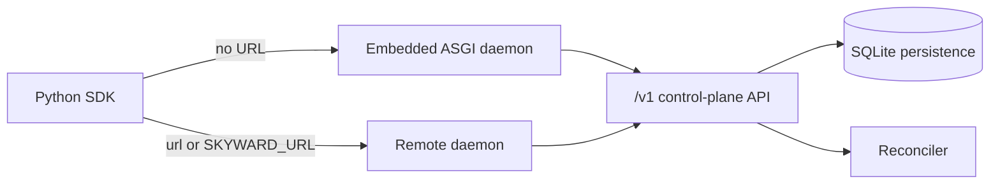

# Core concepts

Skyward separates the description of work from the control plane that runs it. A Python call becomes a value, a `Compute` describes the resources that may run it, and the daemon turns the desired definition into machines and tasks.

## Lazy computation

`@sky.function` changes a function so that calling it creates a `Pending` value instead of executing the function:

```python
import skyward as sky


@sky.function
def train(batch: list[float]) -> float:
    return sum(batch) / len(batch)


pending = train([1.0, 2.0, 3.0])
```

`pending` contains the function, its arguments, keyword arguments, and an optional timeout. It is immutable and serializable. Creating it does not select a provider, allocate a machine, or contact the daemon.

The call becomes a task only when an operator gives it a target:

```python
with sky.Compute(provider=sky.Container()) as compute:
    result = pending >> compute
```

The original function is available through `.local` for unit tests:

```python
assert train.local([1.0, 2.0, 3.0]) == 2.0
```

### Operators

| Expression | Meaning | Result |
|------------|---------|--------|
| `pending >> compute` | Submit one execution and wait | `T` |
| `pending @ compute` | Submit one execution per admitted node | `list[T]` |
| `pending > compute` | Submit without waiting | `Future[T]` |
| `pending_a & pending_b` | Build a group of calls | `Group[T]` |
| `sky.gather(*pending)` | Build a group programmatically | `Group[T]` |
| `pending.with_timeout(seconds)` | Override the call deadline | `Pending[T]` |

`Group` values are also dispatched with `>>`. By default, results are collected in submission order. Set `stream=True` to yield grouped results as they complete, and `ordered=False` to use completion order:

```python
with sky.Compute(provider=sky.Container()) as compute:
    results = sky.gather(
        train([1.0]),
        train([2.0]),
        train([3.0]),
        stream=True,
        ordered=False,
    ) >> compute

    for result in results:
        print(result)
```

Generator functions have a separate `Streaming` value because the result is consumed incrementally:

```python
from collections.abc import Iterator


@sky.stream
def tokens(text: str) -> Iterator[str]:
    yield from text.split()


with sky.Compute(provider=sky.Container()) as compute:
    for token in tokens("one two three") >> compute:
        print(token)
```

The stream is dispatched by the request that reads it. It is not replayable or resumable.

## Compute is the resource definition

`Compute` describes the machines and runtime used by submitted tasks. It is both a synchronous SDK object and a resource stored by the control plane.

```python
with sky.Compute(
    provider=sky.AWS(),
    accelerator=sky.accelerators.H100(),
    nodes=4,
    image=sky.Image(pip=["torch"]),
    plugins=[sky.plugins.Torch()],
    executor=sky.Executor(type="thread", concurrency=2),
    options=sky.Options(ready_timeout=1800),
) as compute:
    train(data) >> compute
```

The main Compute fields are:

- `provider`, `accelerator`, `cpus`, `memory_gb`, and `region` describe a single placement choice;
- one or more `sky.Spec` values describe alternative placement choices;
- `nodes` describes the lower and upper node bounds;
- `allocation` and `selection` choose how matching offers are used;
- `image`, `plugins`, and `executor` describe the node runtime;
- `options` carries SSH, worker, health, and autoscaling settings;
- `ports` and `volumes` configure access to node services and object storage;
- `ttl`, `name`, `url`, `database`, and `delete_on_exit` control lifecycle and transport.

Placement fields belong to `Spec`, not to `Spec`'s node count:

```python
with sky.Compute(
    sky.Spec(
        provider=sky.VastAI(),
        accelerator=sky.accelerators.H100(),
        cpus=16,
        memory_gb=64,
        max_hourly_cost=4.0,
    ),
    sky.Spec(
        provider=sky.AWS(),
        accelerator=sky.accelerators.H100(),
        region="us-east-1",
    ),
    selection="cheapest",
) as compute:
    train(data) >> compute
```

`Spec` contains `provider`, `accelerator`, `cpus`, `memory_gb`, `region`, `disk_gb`, `architecture`, and `max_hourly_cost`. `nodes`, `allocation`, `image`, `plugins`, `executor`, `options`, `ports`, and `volumes` belong to the Compute definition because they apply after one placement has been selected.

### Node bounds

`nodes` accepts an integer, a `(minimum, maximum)` tuple, or `sky.Nodes`:

```python
sky.Compute(provider=sky.AWS(), nodes=4)
sky.Compute(provider=sky.AWS(), nodes=(2, 16))
sky.Compute(provider=sky.AWS(), nodes=sky.Nodes(desired=8, min=4))
sky.Compute(provider=sky.AWS(), nodes=sky.Nodes(desired=4, min=2, max=16))
```

An integer fixes the lower and upper bound. A tuple is shorthand for an elastic range whose lower bound is 2 and upper bound is 16. With `sky.Nodes`, `min` controls the number of ready nodes required before the Compute is ready; `max` controls the upper bound when present. The reconciler uses queued and running task load to choose a count inside those bounds.

Collective plugins freeze the world of a distributed job. A Compute using one cannot be resized while that definition is active.

### Image, executor, and options

`Image` describes bootstrap inputs:

```python
image = sky.Image(
    base="ubuntu:24.04",
    python="3.12",
    pip=["torch", "numpy"],
    apt=["ffmpeg"],
    env={"TOKENIZERS_PARALLELISM": "false"},
)
```

`Executor` selects the local execution backend inside each node runtime:

- `"thread"` is the default and shares the node runtime address space;
- `"process"` uses subprocesses and can disable reuse with `reuse=False`;
- `"loky"` uses a reusable process backend.

`concurrency` sets the number of task slots per node. `buffer` admits additional queued tasks as backpressure. `Options` carries operational settings such as `ssh_timeout`, `worker_timeout`, `autoscale_idle_timeout`, `autoscale_cooldown`, health checks, and client-side `ready_timeout` and `shutdown_timeout`.

## Embedded and remote control planes

The SDK always uses the same HTTP-shaped client. The transport changes, not the resource model:


```mermaid
flowchart LR
    SDK[Python SDK]
    SDK -->|no URL| Embedded[Embedded ASGI daemon]
    SDK -->|url or SKYWARD_URL| Remote[Remote daemon]
    Embedded --> API["/v1 control-plane API"]
    Remote --> API
    API --> SQLite[(SQLite persistence)]
    API --> Recon[Reconciler]
```

With no `url`, `Compute` runs a daemon in the current process against `~/.skyward/skyward.sqlite` by default. With `url` or `SKYWARD_URL`, it uses a remote daemon. Both paths expose the same resources and event stream.

The SDK does not wait for a separate operation resource. Creating a Compute returns its stored definition with `status.state="requested"`; the client follows the Compute's events until the state becomes `"ready"`, `"failed"`, or `"degraded"`.

## Resource lifecycle

The control plane stores intent and observation separately:

- `spec` is the desired definition;
- `status` records the observed Compute state, ready node count, total live node count, generation progress, drift, and the last error;
- `revision` protects writes with `If-Match`;
- `generation` identifies a definition version;
- `lease` identifies the process currently owning the Compute.

The SDK follows this sequence:

1. Resolve provider factories, upload user-code and external storage credentials as blobs when needed, and create the Compute resource.
2. Claim and renew its lease.
3. Wait for reconciliation to make enough nodes ready.
4. Submit tasks through the `/v1/tasks` resource.
5. Follow task and Compute events rather than polling at a fixed application interval.
6. Mark the Compute for deletion on exit when `delete_on_exit=True`, or release only the lease when it is false.

The resource can outlive the process that created it:

```python
with sky.Compute(
    provider=sky.AWS(),
    name="training",
    delete_on_exit=False,
) as compute:
    train(data) >> compute

with sky.Compute.attached("training") as compute:
    evaluate() >> compute
```

`Compute.attached()` takes a name or id and does not restate the definition. It does not delete the resource on exit by default.

## Tasks and executions

A task is one logical function call. It is persisted before dispatch and remains the stable handle returned by the SDK. An execution is one physical attempt of that task on one node.

The task state is derived from its executions:

```text
queued → running → succeeded
                 ↘ failed
                 ↘ cancelled
                 ↘ timed_out
                 ↘ indeterminate
```

`>>` creates a task with one execution. `@` creates one execution per ready node admitted at submission and pins each execution to its rank. A retry creates another execution while keeping the same task id. If the daemon loses contact after code may have run, the execution is `indeterminate`; retrying it requires acknowledging possible duplication.

Streaming tasks use `dispatch="stream"`. The HTTP request that consumes the stream is also what starts the execution, which prevents a daemon from producing items with no consumer.

## Providers and offers

A provider factory is a value containing a provider kind, credentials, configuration, and an optional account name:

```python
aws = sky.AWS(
    region="us-east-1",
    name="training-account",
)
```

The SDK registers the provider account in the selected daemon when a Compute needs it. A `Spec` carries the provider kind and non-secret configuration; the account row supplies credentials to the adapter. Multiple accounts of the same provider kind can coexist under different names.

Providers implement two related capabilities:

- a catalog that yields offers;
- a provisioning adapter that initializes infrastructure, launches machines, reports machine state, terminates machines, and releases shared infrastructure.

Offers are cached per provider account. The provider defines the TTL because a marketplace listing and a fixed instance catalog do not become stale at the same rate. The `/v1/offers` endpoint filters the cache by provider, kind, accelerator, accelerator count, VRAM, and maximum price. A failed refresh leaves stale rows available and records the provider error.

Accelerator names are normalized through one catalog. `sky.accelerators.H100()` and a provider's equivalent offer name resolve to the same canonical accelerator and VRAM value.

## Nodes and runtime information

A node is the control-plane record for one provider machine. Its lifecycle is observed independently from the Compute:

```text
requested → provisioning → connecting → bootstrapping → ready
                                                        ↘ draining → deleting → deleted
                                                        ↘ lost
                                                        ↘ failed
```

The connector owns the live SSH connection and starts the node runtime. The runtime receives the Compute's peer topology and rank. Code running inside a task reads that topology through `sky.instance_info()`:

```python
@sky.function
def topology() -> dict[str, object]:
    info = sky.instance_info()
    return {
        "node": info.node,
        "compute": info.compute,
        "rank": info.rank,
        "nodes": info.nodes,
        "peers": info.peers,
        "worker": info.worker,
        "workers_per_node": info.workers_per_node,
    }
```

`sky.shard()` uses the rank and node count to make a deterministic contiguous partition. `sky.is_head()` is a convenience for `info.is_head`; rank zero is the rendezvous convention used by libraries that require a head address.

## Plugins and distributed state

Plugins are frozen values with a registered `kind` and serializable parameters. They can transform the image, append bootstrap phases, set up the node runtime, wrap each task, or integrate with the client:

```python
with sky.Compute(
    provider=sky.AWS(),
    accelerator=sky.accelerators.H100(),
    plugins=[
        sky.plugins.Torch(),
        sky.plugins.Accelerate(config={"mixed_precision": "bf16"}),
    ],
) as compute:
    train(data) >> compute
```

The node runtime exposes named distributed collections to code running inside a Compute:

```python
counts = sky.counter("processed")
models = sky.registry("checkpoints")

counts.add(1)
models.register("latest", model)
```

Maps, sets, and counters accept `consistency="strong"` or `"eventual"`. Values are serialized; map and set keys must be hashable. Queues, barriers, locks, and registries are shared by name and are available only from a running node task.

## Events and leases

The daemon records lifecycle and task events in one ordered event log. `GET /v1/events` serves Server-Sent Events, supports Compute and task filters, and replays from `Last-Event-ID`. Recorded events have a global sequence and can be replayed. Metrics are live publications and are not persisted as history.

The SDK uses the event stream to observe readiness and task progress. This keeps the resource state in the daemon and lets a client reconnect without losing bootstrap or task transitions.

A lease is the liveness signal for a client that owns a Compute. The SDK claims it after creation or attachment and renews it in the background. Releasing a lease is not deletion. If `delete_on_exit` is true, an abandoned Compute is eligible for reconciliation and teardown; if it is false, the resource remains available for a later attachment.

## Further reading

- [Architecture](architecture.md) — Control plane, persistence, reconciliation, and node runtime
- [Reconciliation and provisioning](provision-controllers.md) — Desired capacity and node recovery
- [Providers](providers.md) — Provider accounts and offer catalogs
- [Distributed training](distributed-training.md) — Multi-node framework setup
- [Events](reference/events.md) — Event stream and replay semantics
