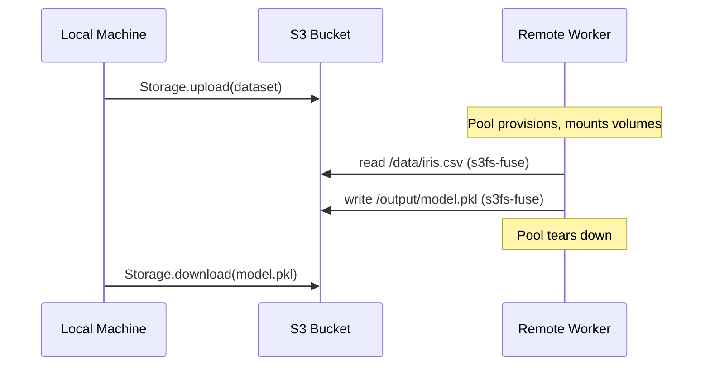

# S3 volumes

This guide walks through a complete volume workflow: upload a dataset from your local machine, train a model on a remote cluster, and download the result — all through S3-compatible object storage. Your local machine talks to S3 via `Storage`, and remote workers see the same data as mounted directories via s3fs-fuse.

## Storage and volumes

A `Storage` object represents an S3-compatible endpoint. Presets like `sky.storage.Hyperstack()` auto-provision ephemeral credentials — no manual key management needed.

A `Volume` maps an S3 bucket (or a prefix within it) to a local path on every worker. You declare two: one read-only for input data, one writable for output artifacts.

```python
--8<-- "guides/17_s3_volumes.py:55:69"
```

The `prefix` scopes each volume to a subfolder within its bucket. `read_only=True` on the data volume prevents accidental writes to the dataset. The model volume is writable so the training function can persist its output to S3.

## The training function

The remote function reads from `/data` and writes to `/output` — regular filesystem paths. It doesn't know about S3, buckets, or object stores. Libraries that expect file paths work without modification.

```python
--8<-- "guides/17_s3_volumes.py:22:48"
```

Imports happen inside the function body because they only need to exist on the remote worker.

## Uploading data with Storage

Before the cluster starts, you upload your dataset from the local machine directly to S3. `Storage` is a context manager that opens an S3 connection. `upload` puts a local file into the bucket at the given key. `ls` lists objects in the bucket. You can also use `download`, `exists`, and `rm`.

```python
--8<-- "guides/17_s3_volumes.py:80:82"
```

## Training on the cluster

With data in S3, you provision a pool with both volumes mounted and dispatch the training function.

```python
--8<-- "guides/17_s3_volumes.py:84:91"
```

The pool mounts both volumes on every worker during bootstrap. When the `with` block exits, the instances are destroyed — but the model checkpoint is already in S3.

## Downloading results

After the pool is torn down, the model persists in the output bucket. A second `Storage` session downloads it back to your local machine.

```python
--8<-- "guides/17_s3_volumes.py:93:107"
```

The downloaded model is a standard pickle file. You can load it locally and verify it works against the original data — no cluster required.

## The full picture

The three phases — upload, train, download — decouple your local environment from the remote cluster. Your local machine never needs the GPU libraries, and the remote workers never need your local filesystem. S3 is the bridge between both.



## Why not rely solely on `@sky.function` input and output?

You could pass a NumPy array as an argument to a `@sky.function` function and return the trained model directly. For small payloads that works — cloudpickle serializes the arguments, lz4-compresses them, and ships them over SSH. But the approach breaks down as data grows.

The problem is both size and contention. Skyward communicates with remote workers through Casty actors — when you send a large payload as a function argument, the worker actor is busy deserializing and processing that message for the entire transfer. No other task can be dispatched to that worker until the operation completes. A 2 GB dataset as input and a 500 MB model as output means the worker is effectively unavailable for the duration of both transfers. Multiply that by several nodes and the coordination overhead dominates actual compute time.

Volumes sidestep this entirely. Instead of pushing data through actor messages, you place it in S3 and let workers read it locally via FUSE. The function receives a *path*, not the data itself — a string costs bytes, not gigabytes. The actor channel stays free for what it's designed to carry: lightweight task coordination. Outputs written to a writable volume persist in S3 immediately, surviving instance preemption and pool teardown.

The rule of thumb: if it fits comfortably in a return value (a metric, a small dict, a summary), pass it through `@sky.function`. If it's a couple hundred MBs dataset, a model checkpoint, or anything you'd rather not push through actor messages — use a volume.

## Run the full example

```bash
git clone https://github.com/gabfssilva/skyward.git
cd skyward
uv run python guides/17_s3_volumes.py
```

---

**What you learned:**

- **`sky.Volume`** maps an S3 bucket to a local path on every worker — read or read-write.
- **`sky.Storage`** manages data outside the cluster — upload before training, download after.
- **s3fs-fuse** handles the mounting transparently — no SDK, no download step, just file paths.
- **Three-phase workflow** — upload, train, download — decouples local and remote environments through S3.
