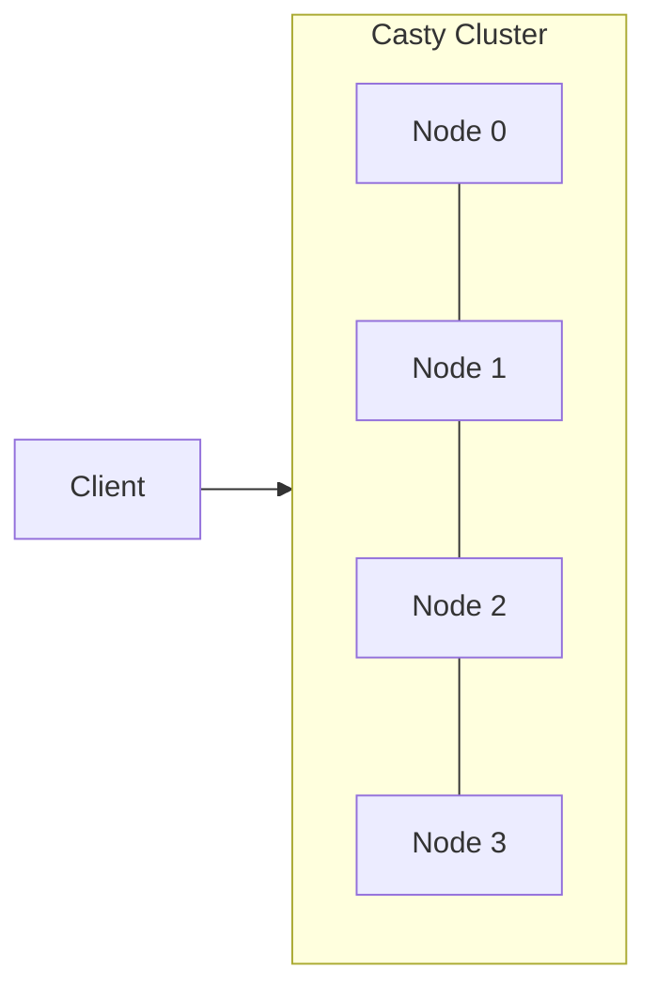
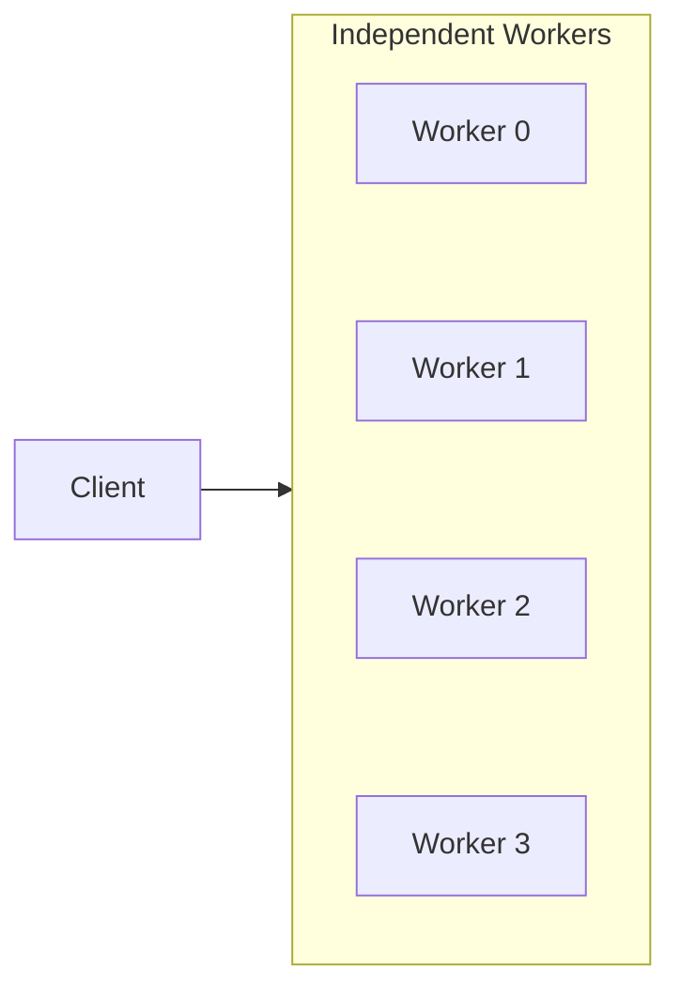

# Standalone workers

Some cloud providers launch instances as isolated pods or VMs without private networking between them. RunPod individual pods, for example, have no shared VLAN — nodes cannot reach each other on internal addresses. Skyward's default cluster mode requires intra-node connectivity to form a Casty mesh, so these providers need a different topology. Standalone worker mode (`Options(cluster=False)`) disables cluster formation entirely, running each worker as an independent process that communicates only with your client machine.

## The topology

In cluster mode, all nodes form a Casty cluster and communicate directly with each other. Your client connects through a single `ClusterClient`:



This cluster is what powers distributed collections, distributed training coordination, and features like `sky.barrier` and `sky.lock`. But it requires that nodes can open TCP connections to each other on their private addresses.

In standalone mode, the topology collapses to a star. Your client opens an independent SSH tunnel to each worker, and workers have no knowledge of each other:



There is no head election, no seed broadcasting, no cluster join. Each worker runs its own `ClusteredActorSystem` without seed nodes, so it never discovers peers and operates in isolation. Task dispatch goes directly from the client to each worker over its own SSH tunnel. Round-robin scheduling, broadcast, and parallel execution all work unchanged — the task manager on the client side still routes tasks to workers the same way.

## The function

Your compute function does not change. The `@sky.function` decorator, lazy evaluation, and operator dispatch all work identically in standalone mode:

```python
--8<-- "examples/guides/21_standalone_workers.py:function"
```

The function runs on a single node, receives its arguments via cloudpickle, and returns its result over SSH. `sky.instance_info()` still works — each worker knows its own node index, accelerator info, and total node count. The difference is purely in how workers relate to each other: they don't.

## Disabling the cluster

Pass `Options(cluster=False)` to your `Compute` context manager:

```python
--8<-- "examples/guides/21_standalone_workers.py:pool"
```

Behind the scenes, this changes two things. First, each worker starts its `ClusteredActorSystem` without seed nodes, so it never joins a cluster and operates in isolation. There is no head election and no seed broadcast — every node is an island. Second, the pool actor creates a separate `ClusterClient` per worker, each connected through its own SSH tunnel, rather than sharing one client across the cluster.

Task dispatch is unaffected. `>>` sends to one node (round-robin), `@` broadcasts to all nodes, `&` runs tasks in parallel, `>` returns a future. `sky.gather` distributes work across all available workers. The operators are client-side constructs — they don't depend on inter-node communication.

## What you lose

Standalone mode disables all features that require inter-node communication:

**Distributed collections.** Calling `sky.dict()`, `sky.counter()`, `sky.set()`, `sky.queue()`, `sky.barrier()`, or `sky.lock()` inside a `@sky.function` will raise `RuntimeError`. These collections are backed by Casty's distributed actor system, which requires the cluster mesh. Without it, there is no replication layer and no way to share state between workers.

**Distributed training.** Frameworks like PyTorch DDP, JAX multi-host, and NCCL-based training need `MASTER_ADDR` and peer discovery, both of which come from cluster formation. The `sky.plugins.torch(backend="nccl")` plugin will fail to initialize in standalone mode because workers cannot reach each other for collective operations (all-reduce, all-gather, broadcast).

**Inter-node coordination patterns.** Code that uses `is_head` to run setup on a single node still works — node 0 still returns `True` for `sky.instance_info().is_head`. But patterns that depend on the head node communicating results to other workers (via distributed collections, shared files, or NCCL) will fail because workers cannot reach each other.

## When to use standalone mode

**Providers without private networking.** RunPod individual pods, some VastAI configurations, and any provider that launches instances into separate networks without a shared VLAN. If nodes cannot open TCP connections to each other on private IPs, cluster mode will hang during seed broadcast. Standalone mode avoids this entirely.

**Embarrassingly parallel workloads.** Data processing, batch inference, hyperparameter sweeps, Monte Carlo simulations — any workload where each task is independent and doesn't need to coordinate with other tasks. If your tasks don't call any distributed collection or training API, cluster mode is unnecessary overhead.

## Run the full example

```bash
git clone https://github.com/gabfssilva/skyward.git
cd skyward
uv run python examples/guides/21_standalone_workers.py
```

---

**What you learned:**

- **`Options(cluster=False)`** disables Casty cluster formation — workers run as independent processes connected only to your client via SSH.
- **Star topology** replaces the cluster mesh — the client opens per-node tunnels, and workers have no knowledge of each other.
- **All operators work unchanged** — `>>`, `@`, `&`, `>`, and `sky.gather` dispatch tasks from the client without relying on inter-node communication.
- **Distributed collections and distributed training are unavailable** — they require the cluster mesh for replication and peer discovery.
- **Use it for providers without private networking** (RunPod pods, isolated VMs) or embarrassingly parallel workloads that need no shared state.
