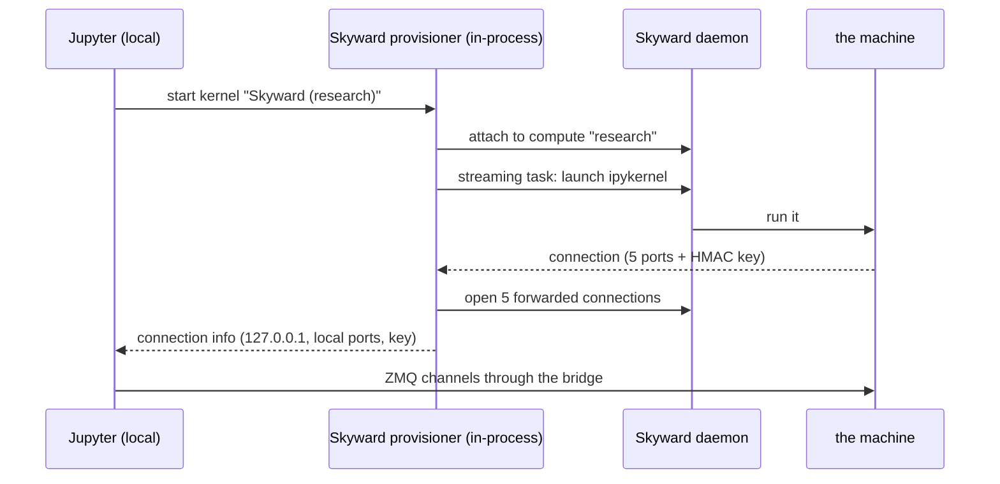

# Jupyter notebooks

Skyward can act as a **Jupyter kernel provisioner**: your Jupyter runs locally, but the kernel — the process that executes every cell — runs on a Skyward machine. You open a notebook, pick the Skyward kernel, and each cell executes on a cloud GPU box as ordinary Python. The notebook needs no `import skyward`, no decorators, no operators. The document, its outputs, and your Jupyter extensions all stay local; only execution moves.

This inverts the usual shape. The embedded API and the CLI ship *functions* to remote machines; the kernel ships *you*.

## Installation

```bash
pip install "skyward[notebook]"
```

That extra brings `jupyter-client`, `traitlets` and `ipykernel`, and registers the provisioner under the name `skyward` in the `jupyter_client.kernel_provisioners` entry-point group. It is client-side only — `skyward.notebook` is not part of `import skyward as sky`, because a machine runs functions and has no business importing a kernel provisioner to do it.

The **machine** needs `ipykernel` too, and that is yours to put there:

```python
image=sky.Image(pip=["ipykernel"])
```

Without it the kernel refuses to start and says so.

## How it works

The provisioner runs inside your Jupyter process and owns two things: a task on the compute that *is* the kernel, and five loopback ports that reach it.

1. **Attaches to the compute** the kernelspec names, with `Compute.attached(...)`.
2. **Starts the kernel** as a streaming task. The task picks five free ports and an HMAC key on the machine, writes a connection file, launches `ipykernel_launcher`, waits for all five channels to bind, and yields the connection back. Then it blocks on the process — so the stream is alive for exactly as long as the kernel is, and closing the stream is what kills it.
3. **Bridges the channels.** One `TcpProxy` per ZMQ channel — shell, iopub, stdin, control, heartbeat — from an ephemeral local port to the kernel's remote port, over the daemon's port forwarding.
4. **Hands Jupyter a connection** pointing at `127.0.0.1` and the kernel's own HMAC key, so signed messages validate on both ends.



Nothing here opens an SSH connection. The client speaks HTTP to the daemon and the daemon owns the machines, so the ZMQ channels ride the same port-forwarding bridge `sky.Port` uses.

## Binding a kernel to a compute

There is no `sky notebook` CLI command. Install the kernelspec from Python:

```python
from skyward.notebook import install_kernelspec

install_kernelspec("research")                              # embedded daemon
install_kernelspec("research", url="http://localhost:7590")  # a running daemon
```

That writes a user-level kernelspec named `skyward-research`, displayed in Jupyter as **Skyward (research)**. The `compute` argument is a compute name or id; `url` is recorded in the spec, and leaving it empty lets the provisioner resolve `SKYWARD_URL` or run the daemon in the Jupyter process.

To remove it:

```python
from skyward.notebook import remove_kernelspec

remove_kernelspec("research")
```

Both take an optional `directory=` to write to or remove from a specific tree instead of the user-level location.

## The compute must already exist

The provisioner **attaches**; it does not provision. The compute has to exist and be ready before you start the kernel:

```python
import skyward as sky

with sky.Compute(
    provider=sky.AWS(),
    accelerator=sky.accelerators.A100(),
    nodes=1,
    name="research",
    image=sky.Image(pip=["ipykernel"]),
    delete_on_exit=False,
) as compute:
    ...
```

Or from the CLI:

```bash
sky compute create --provider aws --accelerator A100 --name research
```

— though the CLI's `create` cannot set an image, so a compute made that way will not have `ipykernel` on it.

## Limitations

- **Exactly one ready node.** The streaming task and the forwarded connections are routed by the daemon independently, round-robin. On one ready node those agree; on more than one they do not, and the kernel would end up on a different machine from the ports reaching it. The provisioner refuses that shape rather than producing it. For genuinely distributed work, use the embedded API's `@` broadcast.
- **The compute is not provisioned for you.** A missing or not-ready compute is an error at kernel start, not a cold start.
- **`ipykernel` must be in the image.**
- **In-memory state is ephemeral.** A restart — yours, or a crashed cell's — loses Python state. Long-lived artifacts belong on disk or in object storage, not in notebook globals.

## The kernel lifecycle

**Interrupt** goes down the control channel as a message — the kernelspec declares `interrupt_mode: message` — and lands in your cell as an ordinary `KeyboardInterrupt`. No signals cross the network; there is no signal path to a process the daemon owns.

**Restart** closes the stream, which kills the remote kernel, then starts a fresh one and re-bridges. The compute and its environment survive; in-memory state does not.

**Shutdown** ends the kernel and closes the bridges, but **the compute keeps running**. Closing a notebook does not tear down a cloud machine. Delete it when you are done:

```bash
sky compute delete research
```

## Next steps

- **[CLI](cli.md)** — the daemon and the compute commands
- **[Getting started](getting-started.md)** — installation, credentials, first remote computation
- **[Providers](providers.md)** — per-provider setup
