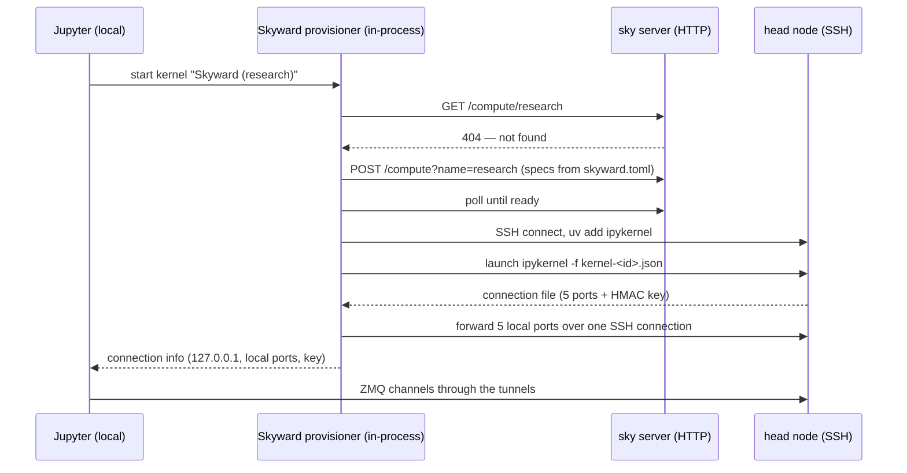

# Jupyter notebooks

Skyward can act as a **Jupyter kernel provisioner**: your Jupyter runs locally, but the kernel — the process that executes every cell — runs on a Skyward node. You open a notebook, pick the "Skyward" kernel, and each cell executes on a cloud GPU box as ordinary Python. The notebook itself needs no `import skyward`, no decorators, no operators; from the notebook's point of view it is plain Python that happens to have an A100 attached. The document, its outputs, and your Jupyter extensions all stay local — only execution moves.

This inverts the usual Skyward shape. The embedded API and the CLI ship *functions* to remote machines; the kernel ships *you*. It is the Colab model with your own infrastructure underneath: any provider, any accelerator, your own `skyward.toml`.

## How it works

Jupyter delegates kernel process management to a pluggable component called a kernel provisioner. Installing `skyward[notebook]` registers one (entry point `skyward` in the `jupyter_client.kernel_provisioners` group), and a kernelspec created by `sky notebook install` binds it to a named session. When you start that kernel, the provisioner — running inside your local Jupyter process — does the work a `LocalProvisioner` would do with `subprocess.Popen`, except over the network:

1. **Ensures the session exists** over the Skyward server's HTTP API, provisioning it on demand (next section).
2. **Fetches the head node's SSH coordinates** from `GET /compute/{name}/nodes` and opens its own SSH connection to it.
3. **Ensures `ipykernel`** is present in the node's worker virtualenv (`/opt/skyward/.venv`), installing it with `uv` on first launch.
4. **Launches the kernel remotely** with a fresh connection-file path. The kernel binds five ZMQ sockets on ports it picks itself, generates an HMAC signing key, and writes both to the file; the provisioner reads it back over SFTP.
5. **Opens five SSH tunnels**, one per ZMQ channel — shell, iopub, stdin, control, heartbeat — from ephemeral local ports to the kernel's remote ports, and hands Jupyter a connection file pointing at `127.0.0.1`.



From Jupyter's perspective nothing unusual happened: it connects ZMQ channels to `127.0.0.1` and signs messages with the key it was given. The HMAC key is the kernel's own, read back from the node, so signed messages validate on both ends of the tunnel. Cell output streams back over the iopub tunnel; the heartbeat channel keeps the kernel registered as alive across idle gaps.

## Setup

The client side needs `jupyter_client` (your Jupyter installation already ships it) and the entry point registered at install time:

```bash
pip install "skyward[notebook]"
```

The kernel provisioner talks to a running Skyward server — the same daemon the CLI uses:

```bash
sky server start
```

Then bind a kernelspec to a session name:

```bash
sky notebook install --session research
```

This writes a kernelspec named `skyward-research` into your user Jupyter kernels directory. Open Jupyter as you always do — `jupyter lab`, VS Code, whatever fronts your kernels — and pick **Skyward (research)** from the kernel list. Without `--session`, the command targets the current session (the one your last `sky new` created).

## Sessions on demand

The session does not need to exist before you open the notebook. On kernel start the provisioner checks `GET /compute/{name}`: if the session is already running, it is reused as-is; if it is missing, the provisioner creates it from the **named pool in `skyward.toml` whose name matches the session** and waits for it to become ready. Opening the notebook is the only step.

```toml
[providers.aws]
type = "aws"

[pools.research]
provider = "aws"
accelerator = "A100"
nodes = 1
```

With this file in the directory Jupyter runs from, starting the "Skyward (research)" kernel provisions an A100 machine, bootstraps it, and lands your first cell on it — a cold start costs the usual provisioning minutes, visible in Jupyter's kernel-starting indicator. Subsequent kernel starts against the live session connect in seconds.

For local, cost-free experimentation the container provider works the same way. On macOS this includes Apple's `container` CLI:

```toml
[providers.local]
type = "container"
binary = "container"   # Apple container CLI; "docker" on other setups

[pools.scratch]
provider = "local"
nodes = 1
```

If the session is missing *and* no matching pool exists in `skyward.toml`, kernel start fails with guidance: create the session first (`sky new research`) or add the `[pools.research]` entry.

Dependencies live in the node's virtualenv, not your laptop's. Install them into the live session from a terminal with `sky install research numpy torch` — every cell sees them immediately, no kernel restart required.

## The kernel lifecycle

The three kernel actions you know from Jupyter map onto the remote process like this:

**Interrupt** sends a message over the control channel tunnel — the kernelspec declares `interrupt_mode: message` — and lands in your cell as an ordinary `KeyboardInterrupt`. No signals cross the network.

**Restart** kills the remote kernel process, launches a fresh one on the same node, and re-tunnels. The SSH connection survives; the session and its virtualenv survive; installed packages survive. What does not survive is in-memory state — variables, loaded models, open handles — exactly as a Colab runtime restart behaves.

**Shutdown** terminates the remote kernel and closes the tunnels, but **the session keeps running**. Closing a notebook does not tear down a cloud machine; that would make an accidental tab close expensive. The pool lives until you delete it:

```bash
sky stop research          # or: sky compute delete research
```

If you drop to zero nodes instead of deleting — a pool created with `min=0` that scaled to zero, for instance — the next kernel start refuses with an explanation rather than silently hanging: waking a slept pool from the provisioner is not supported yet.

## Limitations

The kernel transport rides on direct SSH from the machine running Jupyter to the node, which imposes the same boundaries as `sky console` and `sky repl`:

- **Co-located client and server.** Jupyter must run on the same host as `sky server`: the provisioner reads the cluster's SSH private key from the path the server reports, and key bytes never cross HTTP. Pointing at a remote server is not supported.
- **Key-based auth only.** Nodes that expose only password authentication are refused for the same reason — no password is returned over the API.
- **Single node.** Cells execute on the head node (rank 0). A multi-node session works, but the kernel sees one machine; use the embedded API's `@` broadcast for genuinely distributed work.
- **In-memory state is ephemeral.** Kernel restarts — yours, or a crashed cell's — lose Python state. Long-lived artifacts belong on disk or in object storage, not in notebook globals.

## Next steps

- **[CLI](cli.md)** — the server daemon and session commands the kernel builds on
- **[Getting started](getting-started.md)** — installation, credentials, and your first remote computation
- **[Local containers](guides/local-containers.md)** — the container provider the `scratch` example uses
- **[Providers](providers.md)** — per-provider setup for the pools your kernels provision
