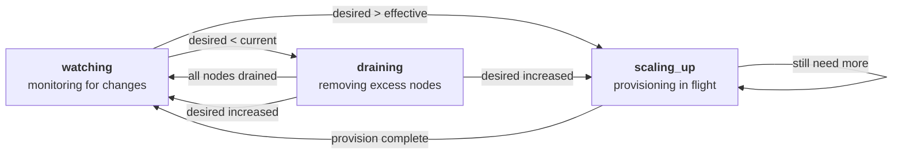
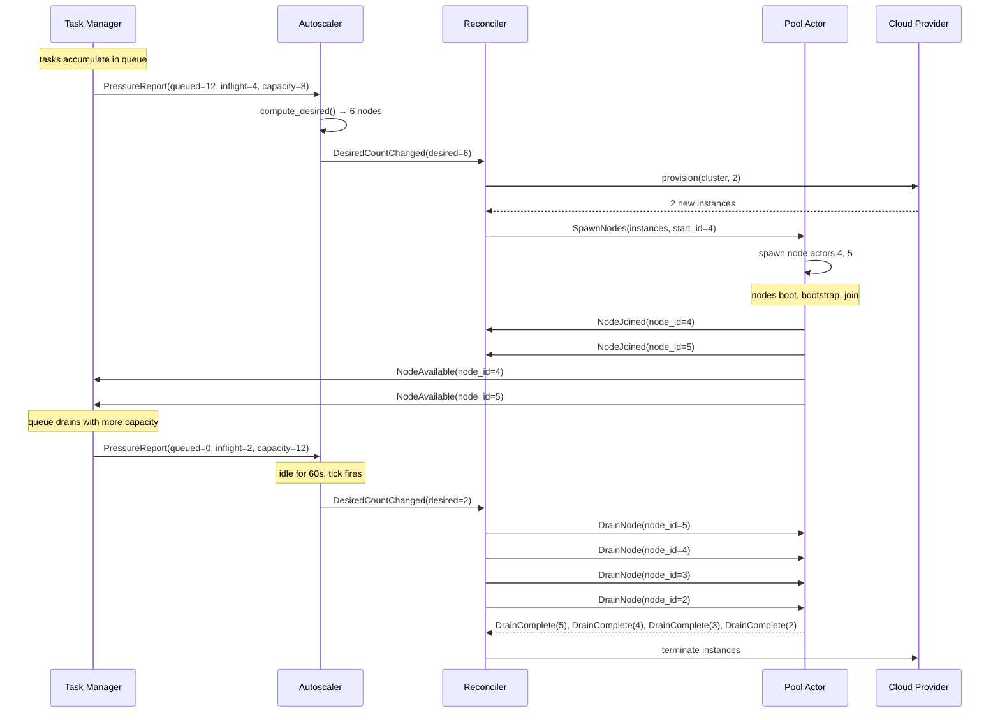

# Provision Controllers

A fixed-size pool works well when you know in advance how much compute you need. But many workloads don't have that property. A hyperparameter sweep might start with a burst of 200 trials and taper off as early stopping kills the losers. An inference service might see ten requests per second at noon and zero at midnight. A data pipeline might have phases — heavy preprocessing, then light aggregation — where the ideal cluster size changes mid-job.

Skyward handles this with **elastic pools**: pools whose node count adjusts automatically based on workload pressure. Two actors make this work — the **autoscaler** and the **reconciler** — and they are designed around a clean separation: the autoscaler is a pure policy engine that decides *how many* nodes are needed, while the reconciler is the actuator that provisions and terminates cloud instances to match that decision. Neither knows about the other's internals. They communicate through a single message: `DesiredCountChanged`.

## Enabling Elastic Pools

Pass a tuple instead of an integer for the `nodes` parameter:

```python
import skyward as sky

with sky.ComputePool(
    provider=sky.AWS(),
    accelerator="A100",
    nodes=(2, 16),  # min 2, max 16
    image=sky.Image(pip=["torch"]),
) as pool:
    results = sky.gather(*tasks) >> pool
```

The pool starts with the minimum number of nodes (2 in this case) and can grow up to the maximum (16) based on demand. When the workload decreases, it shrinks back down — but never below the minimum.

The two tuning knobs are `autoscale_cooldown` and `autoscale_idle_timeout`:

```python
sky.ComputePool(
    provider=sky.AWS(),
    nodes=(2, 16),
    autoscale_cooldown=30.0,         # minimum seconds between scaling decisions
    autoscale_idle_timeout=60.0,     # seconds of idleness before scaling down
    reconcile_tick_interval=15.0,    # seconds between drift-check ticks
)
```

`autoscale_cooldown` prevents rapid oscillation — the autoscaler won't change its mind more than once every 30 seconds. `autoscale_idle_timeout` controls how patient the system is before releasing idle capacity — a cluster with no inflight tasks must stay idle for 60 seconds before the autoscaler decides to shrink it. `reconcile_tick_interval` sets how often the reconciler checks for drift between the desired and actual cluster size — lower values detect failures faster but add more overhead.

## The Autoscaler

The autoscaler receives **pressure reports** from the task manager and translates them into scaling decisions. A pressure report is a snapshot of the task manager's state: how many tasks are queued, how many are currently running, what the total capacity is, and how many nodes exist. The task manager emits a report on every state change — task submitted, task completed, node added, node removed — so the autoscaler always has a current picture.

The scaling logic is a pure function. It takes the current pressure, the current desired count, and the configuration parameters, and returns a new desired count. No cloud API calls, no side effects, no internal state beyond what's passed in. This makes the algorithm trivially testable — and trivially replaceable, if you ever need a different policy.

### The Decision Tree

The autoscaler evaluates these conditions in priority order:

**Scale up — queued tasks.** If tasks are waiting in the queue with no available slots, the cluster needs to grow. The autoscaler computes how many additional nodes would be needed to drain the queue (`ceil(queued / slots_per_node)`) and adds that many to the current count, capped at `max_nodes`. This is the only condition that scales aggressively — it reacts immediately to demand rather than waiting for a cooldown cycle.

**Scale down — fully idle.** If no tasks are running (`inflight == 0`) and the cluster has been idle for longer than `autoscale_idle_timeout`, collapse to `min_nodes`. This is the steady-state response: when there's genuinely no work, release everything that isn't in the minimum set.

**Scale down — low utilization.** If there's no queue but utilization is below 30%, the cluster is over-provisioned for the current workload. The autoscaler computes the minimum number of nodes that would handle the current inflight tasks (`ceil(inflight / slots_per_node) + 1`, with a +1 buffer) and scales down to that. This catches the case where a burst of work has finished but a trickle remains — you don't need 16 nodes for 3 running tasks.

**Steady state.** If none of the above conditions are met, the desired count stays the same. The cluster is appropriately sized for its current workload.

### Cooldown and the Timer Tick

Two mechanisms prevent the autoscaler from thrashing:

The **cooldown window** (default 30 seconds) suppresses decisions. If the last scaling action was less than `cooldown` seconds ago, incoming pressure reports are stored but not acted upon. This gives the cluster time to absorb the effects of a previous scaling decision — new nodes need time to boot, and tasks need time to migrate — before the autoscaler re-evaluates.

The **timer tick** fires every `cooldown` seconds and replays the most recent pressure report. This is essential for scale-down: if the cluster becomes idle and no new tasks arrive, there are no pressure reports to trigger a re-evaluation. The tick ensures that the "fully idle" condition is eventually detected even in the absence of new activity. Without it, an idle cluster would stay at its current size forever.

## The Reconciler

The reconciler translates the autoscaler's decisions into infrastructure changes. It tracks three sets of nodes — `current` (active and healthy), `pending` (provisioning in flight), and `draining` (being removed) — and progresses through three states to bring the actual cluster size in line with the desired count.



The key metric is **effective count**: `len(current) + len(pending)`. Nodes that are still booting count toward the total, which prevents the reconciler from over-provisioning while instances are starting up.

### Watching

The default state. The reconciler monitors for three kinds of events:

- **`DesiredCountChanged`** — The autoscaler decided the cluster should be a different size. If the desired count exceeds the effective count, transition to `scaling_up`. If it's less than the current count, transition to `draining`. Otherwise, nothing to do.
- **`ReconcilerNodeLost`** — A node died (spot preemption, network failure, crash). Remove it from the active set and, if the cluster is now below the desired count, transition to `scaling_up`.
- **`NodeJoined`** — A previously pending node finished booting and is now active. Move it from `pending` to `current`.

### Scaling Up

The reconciler calls `provider.provision(cluster, count)` to launch new instances. When the call returns, it tells the pool actor to spawn node actors for the new instances (`SpawnNodes`), moves their IDs into the `pending` set, and checks whether the effective count now meets the desired count. If not — because the desired count changed mid-flight, or because the provider returned fewer instances than requested — it issues another provision call. Once the effective count meets or exceeds the desired count, it returns to `watching`.

If provisioning fails (cloud quota exceeded, API error, transient failure), the reconciler logs the error and returns to `watching`. It doesn't retry immediately — the reconcile tick (described below) will catch the drift and try again on the next cycle. This avoids hammering a failing API.

### Draining

When the cluster needs to shrink, the reconciler selects victim nodes — highest ID first — and asks the pool actor to drain them. Node 0 (the head node) is explicitly excluded from victim selection, because distributed training frameworks depend on the head node's address for coordination.

Draining is **cooperative**. The reconciler sends `DrainNode` to the pool actor, which removes the node from the task manager's rotation (so no new tasks are dispatched to it) and replies with `DrainComplete`. For each drained node, the reconciler issues `provider.terminate` to destroy the cloud instance. Termination is fire-and-forget — the reconciler doesn't wait for the cloud API to confirm the instance is gone.

If the desired count increases while draining is in progress (new tasks arrived, the autoscaler changed its mind), the reconciler can abort the drain. It clears the draining set and, if the new desired count exceeds the effective count, transitions directly to `scaling_up`. This means the system responds to new demand even in the middle of scaling down.

### The Reconcile Tick

Periodically (every `reconcile_tick_interval` seconds — 15 by default), the reconciler checks for **drift**: is the effective count below the desired count? If so, it initiates a scale-up. This is the self-healing mechanism — if a provisioning call failed, if a node crashed between ticks, if the cloud provider returned fewer instances than requested, the tick catches the discrepancy and corrects it. The reconciler doesn't need explicit retry logic because the tick provides implicit, periodic retries.

## Always-On Reconciliation

The reconciler is spawned for **every** pool — not just elastic ones. In a fixed-size pool (`nodes=4`), the reconciler starts with `min_nodes = max_nodes = 4` and the autoscaler is never created. No `DesiredCountChanged` messages arrive, so the reconciler stays in the `watching` state permanently.

But the reconcile tick still fires, and `ReconcilerNodeLost` messages still arrive. If a node dies in a fixed pool, the reconciler detects that the effective count (3) is below the desired count (4) and provisions a replacement. The pool self-heals without any elastic configuration — the reconciliation loop handles node replacement as a natural consequence of keeping `effective == desired`.

## How They Interact

The full interaction involves four actors: the **task manager** observes workload pressure, the **autoscaler** decides the right cluster size, the **reconciler** makes it happen, and the **pool actor** manages node lifecycles.



The flow is fully event-driven. The task manager doesn't know about the autoscaler — it just emits pressure reports to whoever registers as an observer. The autoscaler doesn't know about the cloud provider — it just tells the reconciler what the desired count should be. The reconciler doesn't know about task scheduling — it just brings the infrastructure in line with the desired count. Each actor has a single, well-defined responsibility, and communication happens through typed messages.

## Design Decisions

**Policy and mechanism are separate.** The autoscaler is a pure function wrapped in a thin actor. It has no cloud SDK dependency, no async I/O, no state beyond a few numbers. The reconciler does all the infrastructure work. This means you can reason about scaling policy by reading a single function (`_compute_desired`), and you can reason about infrastructure orchestration by reading the reconciler's state machine — without either concern polluting the other.

**Pending nodes count toward effective.** When the reconciler calls `provision()`, the new node IDs are added to the `pending` set and counted in the effective total. This prevents the autoscaler from seeing a gap (desired 6, effective 4) and triggering another provision call while the first batch is still booting. Over-provisioning wastes money; counting pending nodes prevents it.

**The head node is protected.** Drain victim selection sorts nodes by ID in descending order and explicitly excludes node 0. This guarantees that the head node — whose address is used as `MASTER_ADDR` for distributed training frameworks — survives any scale-down event. Removing the head mid-training would break every framework's coordination protocol.

**Drains are abortable.** If the autoscaler raises the desired count while a drain is in progress, the reconciler clears the draining set and scales up immediately. This avoids the pathological case where the system scales down and immediately scales back up — the in-progress drain is simply cancelled, and the surviving nodes absorb the new work.

**The reconcile tick provides implicit retries.** Rather than implementing explicit retry logic with exponential backoff, the reconciler checks for drift every `reconcile_tick_interval` seconds (default 15). If a provision call fails, the next tick detects that `effective < desired` and tries again. This is simpler, more robust, and naturally rate-limited.

## Further Reading

- **[Core Concepts](concepts.md)** — Lazy computation, operators, and the pool lifecycle
- **[Architecture](architecture.md)** — The actor hierarchy and cluster formation
- **[Providers](providers.md)** — Cloud provider configuration and protocols
