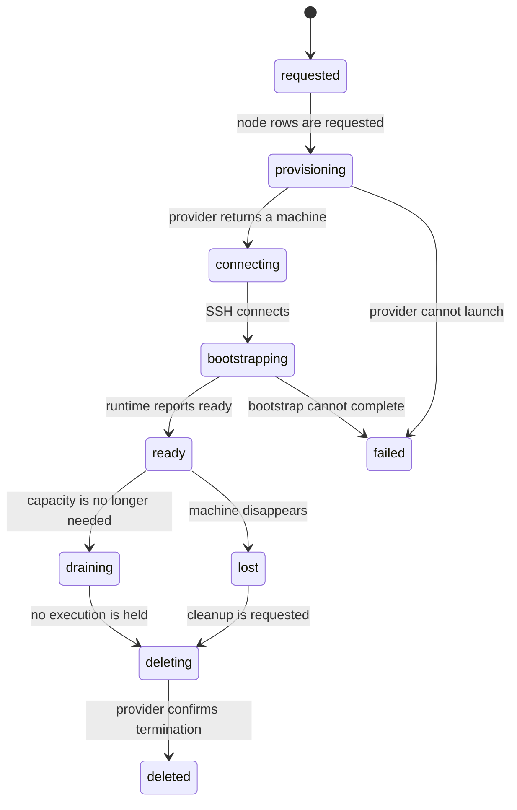
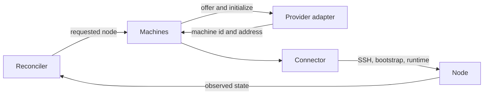
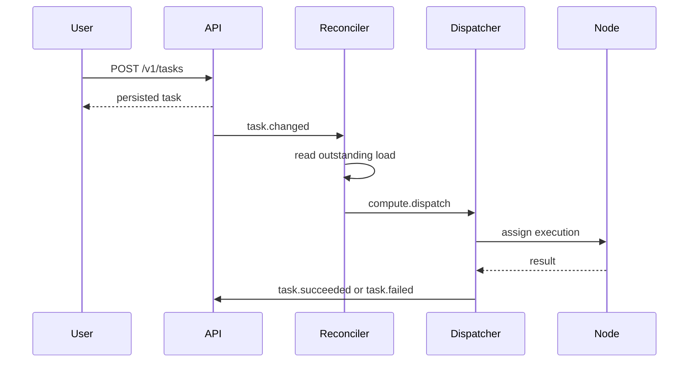

# Reconciliation and provisioning

Skyward treats capacity as desired state. A Compute definition says which provider and runtime are allowed and how many nodes may be used. The daemon stores that definition, observes the nodes it owns, and repeatedly closes the difference.

There is no separate submission operation to track. Compute creation writes the resource and wakes reconciliation; node and task events wake the relevant pass again. A periodic daemon tick revisits unsettled resources when an event or deadline was missed.

## Node bounds

`nodes` accepts a fixed count, a range, or explicit `sky.Nodes` bounds:

```python
import skyward as sky


sky.Compute(provider=sky.AWS(), nodes=4)
sky.Compute(provider=sky.AWS(), nodes=(2, 16))
sky.Compute(provider=sky.AWS(), nodes=sky.Nodes(initial=8, min=4))
sky.Compute(provider=sky.AWS(), nodes=sky.Nodes(initial=4, min=2, max=16))
```

The forms mean:

| Definition | Opening request | Lower bound | Upper bound | Readiness |
|------------|-----------------|-------------|-------------|-----------|
| `nodes=4` | 4 | 4 | 4 | Four ready nodes |
| `nodes=(2, 16)` | 2 | 2 | 16 | Two ready nodes |
| `Nodes(initial=8, min=4)` | 8 | 4 | 8 | Four ready nodes |
| `Nodes(initial=4, min=2, max=16)` | 4 | 2 | 16 | Two ready nodes |

`initial` is requested once per generation, counted against the node rows the request created rather than against the machines that survived: a launch that failed is not retried, because the pool already stands on what it does have. An omitted `min` defaults to `initial`, which is why `nodes=4` is self-healing and `Nodes(initial=8, min=4)` is not.

The lower bound is the number of ready nodes required before `status.state` becomes `"ready"`, and the count reconciliation holds the pool to afterwards. The upper bound limits demand-driven growth. With no outstanding work, reconciliation retains what it has; it does not provision the upper bound merely because it is available, and it gives nodes back only when a `max` made the Compute elastic.

## Demand and capacity

For a non-collective Compute, the reconciler reads the number of queued and running task attempts and the executor's per-node slot count:

```text
target = clamp(ceil(outstanding_attempts / slots_per_node), lower, upper)
```

It then compares `target` with the live node rows, and with whatever remains of the opening request. A definition without a `max` is not elastic: demand says nothing, the target is the lower bound, and nothing is drained above it. An elastic definition grows when queued work requires more free slots and shrinks toward its lower bound after nodes have been idle for `Options.autoscale_idle_timeout`.

The executor determines the denominator:

```python
with sky.Compute(
    provider=sky.AWS(),
    nodes=sky.Nodes(initial=4, min=2, max=16),
    executor=sky.Executor(concurrency=4, buffer=2),
    options=sky.Options(autoscale_idle_timeout=60),
) as compute:
    run_batch() >> compute
```

Each ready node has four execution slots in this example. The buffer admits work ahead of the slots and supplies the task-load signal used for growth.

Collective plugins make the world size part of the runtime contract. A Compute using a collective keeps its requested node count fixed while that definition is active; reducing one rank would leave the other ranks waiting for a peer that no longer exists.

## The reconciliation pass

The reconciler reads the store rather than relying on in-memory history. A pass is safe to repeat after a crash or a duplicate wakeup.


```mermaid
stateDiagram-v2
    [*] --> requested
    requested --> provisioning: node rows are requested
    provisioning --> connecting: provider returns a machine
    connecting --> bootstrapping: SSH connects
    bootstrapping --> ready: runtime reports ready
    ready --> draining: capacity is no longer needed
    draining --> deleting: no execution is held
    deleting --> deleted: provider confirms termination
    ready --> lost: machine disappears
    lost --> deleting: cleanup is requested
    bootstrapping --> failed: bootstrap cannot complete
    provisioning --> failed: provider cannot launch
```

The pass performs these decisions:

1. If the Compute is already deleted, it does nothing.
2. If its lease is abandoned and `delete_on_exit=True`, it changes the desired state to deleted.
3. It asks the provider adapter to resolve the machines behind existing node rows.
4. It calculates the target count from bounds and outstanding work.
5. It creates `requested` node rows for a deficit.
6. It marks idle surplus nodes as `draining`.
7. It re-offers requested, connecting, bootstrapping, ready, lost, failed, and deleting rows to the component responsible for the next transition.
8. It writes the observed Compute status and generation progress.

Rows are created before provider side effects. A node that is already requested or launching counts toward the desired capacity, so another pass does not launch a duplicate machine.

## Provider and machine control

The reconciler does not call a cloud SDK directly. `Machines` resolves the provider account and owns provider-specific infrastructure:


```mermaid
flowchart LR
    Reconciler -->|requested node| Machines
    Machines -->|offer and initialize| Provider[Provider adapter]
    Provider -->|machine id and address| Machines
    Machines --> Connector
    Connector -->|SSH, bootstrap, runtime| Node[Node]
    Node -->|observed state| Reconciler
```

The adapter may create shared infrastructure such as a network, security group, keypair, or container network. The binding is persisted with the Compute because the daemon may restart or a later process may attach to the resource.

When the provider reports a machine as gone, the corresponding node becomes `lost`. The reconciler deletes the old node after cleanup and creates a replacement if the Compute still needs the capacity. Provider calls are written to tolerate retries and already-completed operations.

## Connection and readiness

`Connector` is responsible for the live connection that cannot be stored in SQLite. It reconnects every node whose row says it is connecting, bootstrapping, or ready. This is required after a daemon restart and when a second process attaches to a Compute created elsewhere.

The connector starts the runtime as soon as the machine can be logged into. The runtime receives the rank-ordered peer list, image, plugins, executor settings, user-code blob, and mounted volumes. It reports bootstrap phases and readiness back to the control plane.

The Compute becomes ready when the number of ready nodes reaches the lower bound. The remaining nodes may join later if the target count is higher. A task broadcast is admitted against the ready set at submission; later nodes do not receive executions for that task.

## Dispatch and scale-up

The dispatcher places work only on ready nodes with free slots. A queued task stays queued when no slot is available. That queue is visible to the reconciler and can cause the target count to grow within the configured upper bound.


```mermaid
sequenceDiagram
    participant User
    participant API
    participant Reconciler
    participant Dispatcher
    participant Node

    User->>API: POST /v1/tasks
    API-->>User: persisted task
    API->>Reconciler: task.changed
    Reconciler->>Reconciler: read outstanding load
    Reconciler->>Dispatcher: compute.dispatch
    Dispatcher->>Node: assign execution
    Node-->>Dispatcher: result
    Dispatcher->>API: task.succeeded or task.failed
```

When a task finishes, the dispatcher wakes reconciliation and dispatch again. The daemon tick also re-offers queued work after a restart or lost event.

## Drain and scale-down

When the target is below the number of live nodes, the reconciler marks idle nodes as `draining`. A draining node is removed from new task placement but remains available until executions already assigned to it finish. Once it holds no work, the connector disconnects and `Machines` asks the provider to terminate it.

Compute deletion skips the idle wait: its desired node count becomes zero and all nodes are drained and terminated. The Compute reaches `status.state="deleted"` only after provider resources and shared infrastructure have been released.

## Generations

The API treats the Compute definition as versioned state. A `PATCH` can change `spec.nodes` in place and creates a new generation for the resize. Every other field of the definition is fixed for the life of the compute: a different image or provider is a different compute.

An earlier definition can be made current again, as a new generation:

```text
POST /v1/computes/{id}/generations   {"source": 2}
```

Nothing is replaced by it. A size that differs is reconciled the way a resize is, and a machine bought from then on is built to the definition now current; the machines already up stay as they were built.

Revisions protect concurrent changes. Reads return an `ETag`; writes send it back as `If-Match`. Idempotency keys make repeated create, delete, and generation requests safe to retry.

## Leases and abandoned resources

A lease records which client process is actively using a Compute. The SDK claims it after creating or attaching and renews it in the background:

```python
with sky.Compute(
    provider=sky.AWS(),
    name="long-running",
    delete_on_exit=False,
) as compute:
    train() >> compute
```

Releasing the lease is a detach, not a delete. A process that stops renewing leaves the Compute ownerless. If its definition has `delete_on_exit=True`, the reconciler eventually marks it for deletion; if false, it remains available to `Compute.attached()`.

## Events and recovery

Controller writes emit wakeups, and lifecycle transitions are recorded in the event store. The event stream is not the source of truth: the reconciler and dispatcher reread persistence on each pass.

Recorded events have a global sequence and are replayed by `GET /v1/events`. Clients use `Last-Event-ID` to resume. A live metric sample may be published without a row because a gauge has no replay value.

This division gives the daemon restart behavior without an outbox protocol:

- persisted node rows tell the connector which runtimes to reattach;
- persisted in-flight executions tell the dispatcher which outcomes to query;
- persisted task deadlines are checked by the periodic tick;
- persisted Compute definitions let the reconciler rebuild missing capacity;
- persisted events let SDK clients reconstruct the lifecycle they missed.

## Further reading

- [Core concepts](concepts.md) — Public Python API and resource semantics
- [Architecture](architecture.md) — Control-plane components and node runtime
- [Events](reference/events.md) — Event filters and replay
- [Providers](providers.md) — Provider accounts and offers
