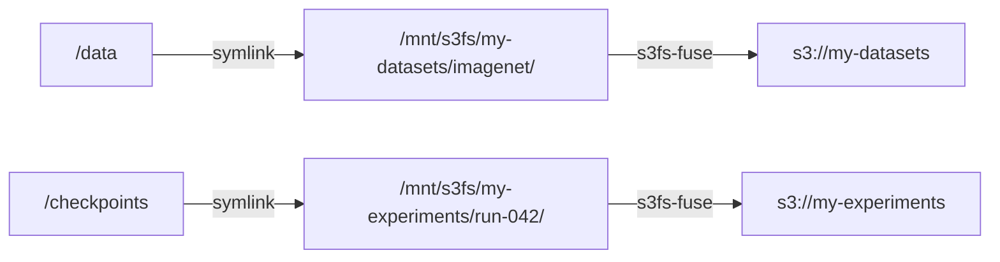

# Volumes

Cloud instances are ephemeral — when the pool exits, the machines are gone. But data isn't ephemeral. Training datasets, model checkpoints, experiment artifacts — these need to outlive the compute that produced or consumed them. Volumes bridge this gap: they mount cloud storage (S3, GCS, or any S3-compatible API) as a local filesystem on every worker, so your `@sky.compute` functions read and write to familiar paths like `/data` or `/checkpoints` while the actual bytes live in a durable object store.

The key idea is that **storage and compute have different lifecycles**. A dataset in S3 exists before the pool starts and persists after it's torn down. Checkpoints written during training survive instance preemption. Multiple pools — even across different providers — can mount the same bucket. Volumes make this separation explicit: you declare what storage you need, and Skyward mounts it before your code runs.

## The Volume Dataclass

A `Volume` is a frozen dataclass with four fields:

```python
sky.Volume(
    bucket="my-datasets",       # S3 bucket (or GCS bucket, or RunPod volume ID)
    mount="/data",              # where it appears on the worker
    prefix="imagenet/train/",   # subfolder within the bucket (optional)
    read_only=True,             # default — prevents accidental writes
)
```

`bucket` is the storage identifier — an S3 bucket name on AWS, a GCS bucket name on GCP, or a network volume ID on RunPod. `mount` is the absolute path where the volume appears on workers. `prefix` scopes the mount to a subfolder within the bucket, so you don't expose the entire bucket when you only need one directory. `read_only` defaults to `True` because most volumes are input data — you opt into writes explicitly.

Validation is immediate: mount paths must be absolute, and system paths (`/`, `/root`, `/tmp`, `/opt`) are rejected at construction time.

## Using Volumes

Pass volumes to `ComputePool` as a list. Inside `@sky.compute` functions, the mount paths are regular directories:

```python
import skyward as sky

@sky.compute
def train(data_dir: str, checkpoint_dir: str) -> float:
    dataset = load(data_dir)
    model = fit(dataset)
    torch.save(model, f"{checkpoint_dir}/model.pt")
    return model.accuracy

with sky.ComputePool(
    provider=sky.AWS(instance_profile_arn="auto"),
    nodes=4,
    volumes=[
        sky.Volume(bucket="my-datasets", mount="/data", read_only=True),
        sky.Volume(bucket="my-experiments", mount="/checkpoints", read_only=False),
    ],
) as pool:
    accuracy = train("/data", "/checkpoints") >> pool
```

The function doesn't know it's reading from S3 or writing to S3. It sees `/data` and `/checkpoints` as local directories. This means existing code — scripts that read from disk, libraries that expect file paths, frameworks that save checkpoints to a directory — works without modification.

## How It Works

Under the hood, Skyward uses [s3fs-fuse](https://github.com/s3fs-fuse/s3fs-fuse) to mount S3-compatible buckets as FUSE filesystems. The mounting happens during the bootstrap phase, after system packages and Python dependencies are installed but before the worker starts accepting tasks.

The process has three steps:

1. **Endpoint resolution.** The pool actor asks the provider for its S3-compatible endpoint and credentials. AWS returns the regional S3 endpoint with IAM role authentication (no explicit credentials). GCP returns the GCS S3-compatible endpoint with HMAC keys. RunPod returns its datacenter-specific S3 API endpoint with the API key as credentials.

2. **Bucket mounting.** Each unique bucket is mounted once at `/mnt/s3fs/<bucket>` via s3fs. If multiple volumes reference the same bucket, Skyward deduplicates — one FUSE mount serves all of them. If any volume on a bucket needs writes, the entire bucket is mounted read-write.

3. **Symlink creation.** Each volume's `mount` path is created as a symlink pointing to the appropriate location inside `/mnt/s3fs/<bucket>/<prefix>`. This is why you see `/data` instead of `/mnt/s3fs/my-datasets/imagenet/train/` — the implementation detail is hidden behind a clean path.



## Provider Support

Volumes work with any provider that implements the `Mountable` protocol — a single method that returns an S3-compatible endpoint with optional credentials.

| Provider | Endpoint | Authentication |
|----------|----------|----------------|
| **AWS** | `s3.{region}.amazonaws.com` | IAM role (no explicit credentials) |
| **GCP** | `storage.googleapis.com` | HMAC keys (generated during `prepare()`) |
| **RunPod** | `s3api-{datacenter}.runpod.io` | API key |

On AWS, the cleanest setup is an instance profile with S3 permissions — pass `instance_profile_arn="auto"` to `sky.AWS()` and no credentials are written to disk. On GCP, Skyward generates HMAC keys automatically from your service account during cluster preparation. On RunPod, the existing API key doubles as S3 credentials.

Providers that don't implement `Mountable` (VastAI, Verda, Container) will fail fast with a clear error if you pass volumes.

## Deduplication

When multiple volumes share a bucket, Skyward mounts it once:

```python
volumes=[
    sky.Volume(bucket="my-data", mount="/train", prefix="train/", read_only=True),
    sky.Volume(bucket="my-data", mount="/val", prefix="val/", read_only=True),
    sky.Volume(bucket="my-data", mount="/output", prefix="results/", read_only=False),
]
```

This creates one FUSE mount at `/mnt/s3fs/my-data` (read-write, because `/output` needs writes) and three symlinks: `/train → /mnt/s3fs/my-data/train/`, `/val → /mnt/s3fs/my-data/val/`, `/output → /mnt/s3fs/my-data/results/`. The mode is coerced upward: if any volume on a bucket is writable, the bucket mounts as read-write.

## TOML Configuration

Volumes can also be declared in `skyward.toml` or `~/.skyward/defaults.toml`:

```toml
[pool]
provider = "aws"
nodes = 2

[[pool.volumes]]
bucket = "my-datasets"
mount = "/data"
prefix = "imagenet/"
read_only = true

[[pool.volumes]]
bucket = "my-experiments"
mount = "/checkpoints"
read_only = false
```

This is equivalent to passing the same `Volume` objects in Python. TOML configuration is useful for separating infrastructure concerns from code — the same script can mount different buckets in different environments by swapping the config file.

## Next Steps

- **[S3 Volumes Guide](guides/s3-volumes.md)** — Step-by-step walkthrough with a working example
- **[Providers](providers.md)** — Provider-specific configuration and authentication
- **[Core Concepts](concepts.md)** — Image, bootstrap, and the pool lifecycle
