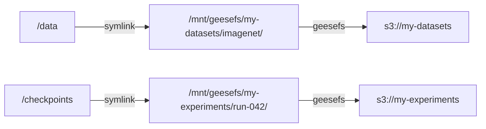

# Volumes

Cloud instances are ephemeral — when the pool exits, the machines are gone. But data isn't ephemeral. Training datasets, model checkpoints, experiment artifacts — these need to outlive the compute that produced or consumed them. Volumes bridge this gap: they mount cloud storage (S3, GCS, or any S3-compatible API) as a local filesystem on every worker, so your `@sky.function` functions read and write to familiar paths like `/data` or `/checkpoints` while the actual bytes live in a durable object store.

The key idea is that **storage and compute have different lifecycles**. A dataset in S3 exists before the pool starts and persists after it's torn down. Checkpoints written during training survive instance preemption. Multiple pools — even across different providers — can mount the same bucket. Volumes make this separation explicit: you declare what storage you need, and Skyward mounts it before your code runs.

## The Volume dataclass

A `Volume` is a frozen dataclass with five fields:

```python
sky.Volume(
    bucket="my-datasets",       # S3 bucket (or GCS bucket, or RunPod volume ID)
    mount="/data",              # where it appears on the worker
    prefix="imagenet/train/",   # subfolder within the bucket (optional)
    read_only=True,             # default — prevents accidental writes
    storage=sky.storage.S3(),   # explicit storage endpoint (optional)
)
```

`bucket` is the storage identifier — an S3 bucket name on AWS, a GCS bucket name on GCP, or a network volume ID on RunPod. `mount` is the absolute path where the volume appears on workers. `prefix` scopes the mount to a subfolder within the bucket, so you don't expose the entire bucket when you only need one directory. `read_only` defaults to `True` because most volumes are input data — you opt into writes explicitly. `storage` optionally binds the volume to a specific `Storage` endpoint — when omitted, the pool's provider supplies credentials automatically.

Validation is immediate: mount paths must be absolute, and system paths (`/`, `/root`, `/tmp`, `/opt`) are rejected at construction time.

## Using volumes

Pass volumes to `Compute` as a list. Inside `@sky.function` functions, the mount paths are regular directories:

```python
import skyward as sky


@sky.function
def train(data_dir: str, checkpoint_dir: str) -> float:
    dataset = load(data_dir)
    model = fit(dataset)
    torch.save(model, f"{checkpoint_dir}/model.pt")
    return model.accuracy


with sky.Compute(
    provider=sky.AWS(instance_profile_arn="auto"),
    nodes=4,
    volumes=[
        sky.Volume(bucket="my-datasets", mount="/data", read_only=True),
        sky.Volume(bucket="my-experiments", mount="/checkpoints", read_only=False),
    ],
) as compute:
    accuracy = train("/data", "/checkpoints") >> compute
```

The function doesn't know it's reading from S3 or writing to S3. It sees `/data` and `/checkpoints` as local directories. This means existing code — scripts that read from disk, libraries that expect file paths, frameworks that save checkpoints to a directory — works without modification.

## Storage

`Storage` is a frozen dataclass that represents an S3-compatible object storage endpoint. It doubles as a context manager for local CRUD operations — uploading data before the cluster starts, downloading results after it's torn down.

### Presets

Factory functions return pre-configured `Storage` instances for common providers:

```python
# AWS S3
storage = sky.storage.S3(region="us-east-1", access_key="...", secret_key="...")

# Google Cloud Storage (S3-compatible HMAC)
storage = sky.storage.GCS(access_key="...", secret_key="...")

# Cloudflare R2
storage = sky.storage.R2(account_id="...", access_key="...", secret_key="...")

# Wasabi
storage = sky.storage.Wasabi(region="us-east-1", access_key="...", secret_key="...")

# Backblaze B2
storage = sky.storage.Backblaze(region="us-west-004", key_id="...", app_key="...")

# Hyperstack (auto-provisioned ephemeral credentials)
storage = sky.storage.Hyperstack()
```

Or construct a `Storage` directly for any S3-compatible endpoint:

```python
storage = sky.Storage(
    endpoint="https://s3.us-east-1.amazonaws.com",
    access_key="...",
    secret_key="...",
    path_style=False,
)
```

### CRUD operations

`Storage` is a context manager. Open it to upload, download, list, check, or delete objects:

```python
storage = sky.storage.Hyperstack()

with storage:
    storage.upload("my-bucket", "/local/data.csv", key="data.csv")
    storage.upload("my-bucket", "/local/output/")  # uploads entire directory

    storage.download("my-bucket", "model.pkl", "/local/model.pkl")

    keys = storage.ls("my-bucket", prefix="experiments/")

    if storage.exists("my-bucket", "model.pkl"):
        storage.rm("my-bucket", "model.pkl")
```

Each `with` block opens an S3 session and closes it on exit. All operations are synchronous from the caller's perspective.

### Callable credentials

Credentials accept strings, sync callables, or async callables — useful for deferred or dynamic credential resolution:

```python
import os

storage = sky.Storage(
    endpoint="https://s3.example.com",
    access_key=lambda: os.environ["MY_ACCESS_KEY"],
    secret_key=lambda: os.environ["MY_SECRET_KEY"],
)
```

The `Hyperstack()` preset uses this internally: it creates an ephemeral access key via the Hyperstack API on first use and deletes it when the context manager exits.

### Binding storage to volumes

By default, volumes inherit credentials from the pool's provider. The `storage` field lets you override this per-volume — useful when your data lives in a different provider than your compute:

```python
r2 = sky.storage.R2(account_id="...", access_key="...", secret_key="...")

with sky.Compute(
    provider=sky.AWS(),
    accelerator="A100",
    volumes=[
        # This volume uses R2 credentials, not AWS
        sky.Volume(bucket="my-r2-data", mount="/data", storage=r2),
        # This volume uses AWS credentials from the provider
        sky.Volume(bucket="my-s3-output", mount="/output", read_only=False),
    ],
) as compute:
    train("/data", "/output") >> compute
```

This enables heterogeneous volumes — different storage providers in the same pool.

## How it works

Each provider implements `Mountable.mount_plan(cluster, volumes)` and returns a `MountPlan` — two things the rest of the pipeline consumes:

- **`deploy_hints`** — opaque key/value pairs fed into the cloud-provision call *before* SSH opens. The only current consumer is RunPod, which uses them to attach a native network volume to the pod at creation time.
- **`bootstrap`** — a shell op injected into the `"volumes"` phase of the bootstrap script, *after* SSH opens. For FUSE providers this installs geesefs and mounts each bucket; for native attachments this is a handful of `ln -sfn` calls against the pre-mounted base.

This lets providers pick their own strategy without leaking that choice into the user API.

### FUSE strategy (AWS, GCP, Hyperstack)

Skyward uses [geesefs](https://github.com/yandex-cloud/geesefs) to mount S3-compatible buckets as FUSE filesystems during the `"volumes"` bootstrap phase — after system packages and Python dependencies, before the worker starts accepting tasks.

1. **Endpoint resolution.** For each volume, Skyward resolves storage credentials. If the volume has an explicit `storage=` field those credentials are used; otherwise the pool's provider supplies them (AWS → regional S3 + IAM role; GCP → HMAC keys from the service account; Hyperstack → ephemeral access keys).
2. **Bucket mounting.** Each unique bucket is mounted once at `/mnt/geesefs/<bucket>` via geesefs. Multiple volumes on the same bucket share the mount — if any needs writes, the whole mount is read-write.
3. **Symlink creation.** Each volume's `mount` path becomes a symlink into `/mnt/geesefs/<bucket>/<prefix>`.


```mermaid
graph LR
    A["/data"] -->|symlink| B["/mnt/geesefs/my-datasets/imagenet/"]
    C["/checkpoints"] -->|symlink| D["/mnt/geesefs/my-experiments/run-042/"]
    B -->|geesefs| E["s3://my-datasets"]
    D -->|geesefs| F["s3://my-experiments"]
```

### Native-attachment strategy (RunPod)

FUSE does not work inside RunPod pods — the container sandbox withholds `CAP_SYS_ADMIN` and blocks `/dev/fuse`. RunPod instead exposes **network volumes**: persistent block storage that the host runtime bind-mounts at `/workspace` *before* the container starts.

Skyward maps the generic `Volume` onto that primitive:

1. **Resolve the volume.** `Volume.bucket` is treated as either a network volume id (`aqsojarpxt`) *or* a human-readable name (`my-checkpoints`). Skyward calls `GET /v1/networkvolumes` on pool startup and matches by id first, then by name. Cross-DC attachments are rejected upfront with the DC mismatch spelled out.
2. **Attach at provision time.** The resolved id is injected as `networkVolumeId` into the pod-create payload (both GraphQL and REST paths), so the RunPod host mounts the volume at `/workspace` when the pod boots.
3. **Symlink at bootstrap.** Inside the container, the `"volumes"` phase runs a tiny script that creates each volume's `mount` path as a symlink into `/workspace/<prefix>`. No install, no FUSE.

RunPod only supports **one** network volume per pod. Multiple `Volume` entries must share the same `bucket`, projected into different subdirectories via `prefix`:

```python
with sky.Compute(
    provider=sky.RunPod(data_center_ids=("EU-RO-1",)),
    accelerator="RTX_4090",
    nodes=2,
    volumes=[
        sky.Volume(bucket="my-checkpoints", mount="/data", prefix="datasets", read_only=True),
        sky.Volume(bucket="my-checkpoints", mount="/ckpt", prefix="ckpt", read_only=False),
    ],
) as compute:
    train() @ compute
```

If you pass two different buckets you get a clear error at pool startup. If you pass an unknown name the error lists the volumes actually available in your account so you can copy the right one.

## Provider support

| Provider | Strategy | `bucket` means | Notes |
|----------|----------|----------------|-------|
| **AWS** | FUSE (geesefs) | S3 bucket name | IAM role (no explicit credentials) via `instance_profile_arn="auto"`. |
| **GCP** | FUSE (geesefs) | GCS bucket name | HMAC keys generated during `prepare()`. |
| **Hyperstack** | FUSE (geesefs) | Hyperstack bucket name | Ephemeral access keys provisioned on `prepare()`, cleaned up on `teardown()`. |
| **RunPod** | Native attachment | Network volume id **or** name | One NV per pod. NV must be in the same DC as the pod. |

Providers that don't implement `Mountable` (VastAI, Verda, Container) fail fast with a clear error if you pass volumes — unless every volume has an explicit `storage=` field (which forces the FUSE path locally).

## Deduplication

When multiple volumes share a bucket, Skyward mounts it once:

```python
volumes=[
    sky.Volume(bucket="my-data", mount="/train", prefix="train/", read_only=True),
    sky.Volume(bucket="my-data", mount="/val", prefix="val/", read_only=True),
    sky.Volume(bucket="my-data", mount="/output", prefix="results/", read_only=False),
]
```

This creates one FUSE mount at `/mnt/geesefs/my-data` (read-write, because `/output` needs writes) and three symlinks: `/train → /mnt/geesefs/my-data/train/`, `/val → /mnt/geesefs/my-data/val/`, `/output → /mnt/geesefs/my-data/results/`. The mode is coerced upward: if any volume on a bucket is writable, the bucket mounts as read-write.

## TOML configuration

Volumes can also be declared in `skyward.toml` or `~/.skyward/defaults.toml`:

```toml
[pool]
provider = "aws"
nodes = 2

[[pool.volumes]]
bucket = "my-datasets"
mount = "/data"
prefix = "imagenet/"
read_only = true

[[pool.volumes]]
bucket = "my-experiments"
mount = "/checkpoints"
read_only = false
```

This is equivalent to passing the same `Volume` objects in Python. TOML configuration is useful for separating infrastructure concerns from code — the same script can mount different buckets in different environments by swapping the config file.

## Next steps

- **[S3 Volumes Guide](guides/s3-volumes.md)** — Step-by-step walkthrough with a working example
- **[Providers](providers.md)** — Provider-specific configuration and authentication
- **[Core Concepts](concepts.md)** — Image, bootstrap, and the pool lifecycle
